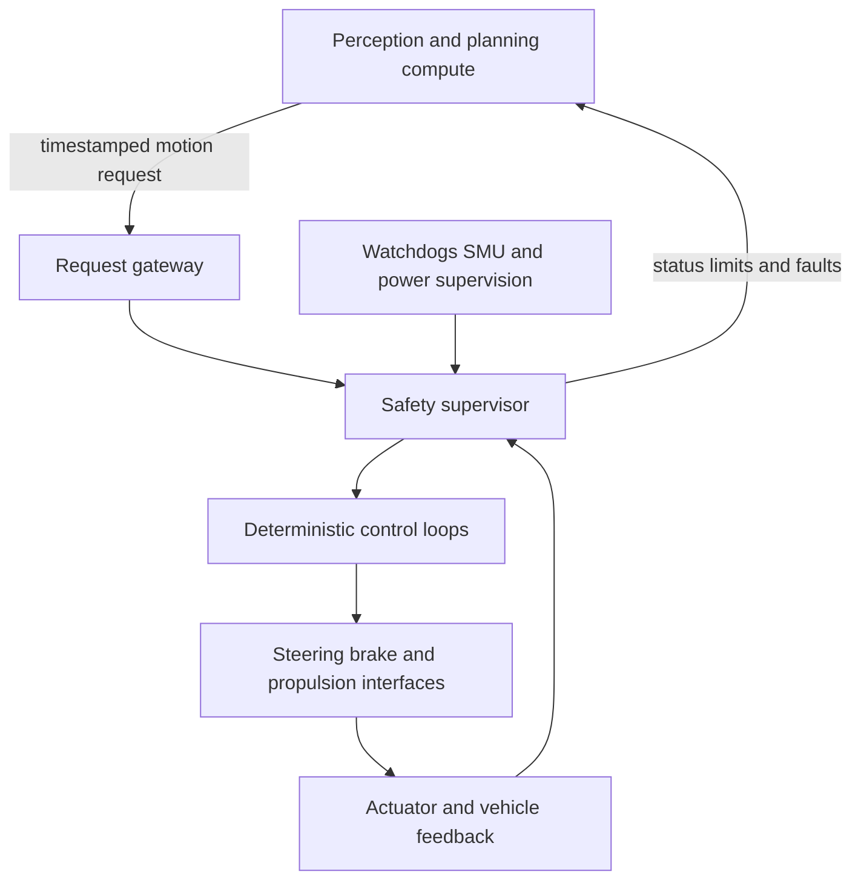
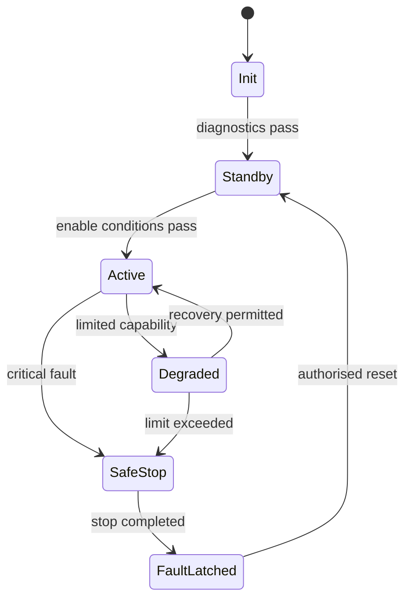

An autonomous-driving computer may produce a trajectory, steering request, or acceleration request, but the final path to an actuator needs different qualities: bounded timing, explicit operating states, independent monitoring, deterministic fault reactions, and evidence that the implementation behaves correctly when inputs or hardware fail.

That is where an Infineon AURIX microcontroller can fit. It should not be treated as a smaller perception processor. A more useful mental model is a **deterministic control and safety island** between high-level vehicle intelligence and the physical actuators.



The exact partition is a vehicle-level safety decision. The diagram is deliberately generic: it explains responsibilities without describing a particular product architecture.

## Why an AURIX-class MCU belongs in the control path

The TC3xx family combines multicore TriCore CPUs with safety and control-oriented hardware. Depending on the selected device, relevant building blocks include lockstep-capable cores, ECC-protected memories, the Safety Management Unit (SMU), watchdogs, timer and capture/compare resources such as GTM, analog conversion, CAN/CAN FD, Ethernet, and hardware security support.

These blocks are useful only when the software architecture assigns them clear jobs:

| Building block | Practical control use |
|---|---|
| Lockstep-capable CPU | Detect certain CPU execution faults in safety-relevant software |
| SMU | Collect safety alarms and drive a defined reaction policy |
| Watchdogs | Detect stalled, late, or incorrectly sequenced software |
| ECC-protected memory | Detect or correct supported memory faults and report residual events |
| GTM and timer peripherals | Generate, capture, and measure time-critical actuator signals |
| EVADC/EDSADC | Acquire analog feedback where the hardware design requires it |
| CAN FD / Ethernet | Receive commands and exchange status with bounded communication contracts |
| HSM | Support secure boot, keys, and authenticated communication policies |

Do not select an MCU from the feature list alone. Match the exact part, package, temperature grade, safety documentation, errata, toolchain, memory budget, peripheral routing, and external power/monitoring concept to the item’s requirements.

## Start with a command contract

Avoid passing an unqualified floating-point steering value across the compute boundary. Define a versioned message contract containing enough evidence to decide whether a request is usable:

- command type and coordinate convention;
- monotonic sequence counter;
- producer timestamp and validity duration;
- requested value, rate, and optional feed-forward terms;
- operating mode and authority level;
- bounded units and scaling;
- end-to-end protection such as a CRC, counter, or authentication when required;
- producer health and source identifier.

The receiver should reject duplicates, stale data, impossible transitions, incompatible modes, values outside the vehicle envelope, and rates that exceed physical or safety limits.

```c
typedef struct {
    uint32_t sequence;
    uint32_t timestamp_ms;
    int32_t  steering_mdeg;
    int32_t  accel_milli_ms2;
    uint8_t  mode;
    uint16_t crc;
} MotionRequest;

typedef enum { REQUEST_OK, STALE, BAD_SEQUENCE, BAD_RANGE, BAD_CRC } RequestStatus;

RequestStatus validate_request(const MotionRequest *r,
                               uint32_t now_ms,
                               uint32_t previous_sequence) {
    if (!crc_is_valid(r, sizeof(*r))) return BAD_CRC;
    if ((now_ms - r->timestamp_ms) > REQUEST_MAX_AGE_MS) return STALE;
    if (r->sequence != previous_sequence + 1U) return BAD_SEQUENCE;
    if (!steering_is_plausible(r->steering_mdeg) ||
        !acceleration_is_plausible(r->accel_milli_ms2)) return BAD_RANGE;
    return REQUEST_OK;
}
```

This is a design pattern, not production code. Real code must address counter rollover, clock synchronisation, message serialization, concurrency, diagnostic coverage, and the safety requirements allocated to the communication path.

## Make the operating state explicit

A control ECU should never infer authority from “messages are arriving.” Use an explicit state machine with guarded transitions.



Each transition needs entry conditions, timeout, owned outputs, diagnostic events, and a rule for recovery. “Safe stop” is not universally the safe state; at speed, abruptly removing every output may create a greater hazard. The vehicle-level safety concept must define controlled degradation and the minimum-risk behaviour.

## Separate control from supervision

The control loop computes the desired actuator command. The supervisor decides whether that command may be applied.

Useful independent checks include:

1. command freshness and sequence;
2. absolute value and rate limits;
3. consistency between steering, yaw response, wheel speed, and requested motion;
4. actuator tracking error over a bounded time window;
5. sensor electrical range and frozen-value detection;
6. task deadline and execution-sequence monitoring;
7. power, clock, memory, communication, and peripheral alarms;
8. disagreement between primary and independent calculations.

Independence is an architectural property, not a second copy of the same function. A monitor that shares the same input, algorithm, assumptions, memory, and scheduling failure can reproduce the same error.

## Design the real-time schedule before writing tasks

For every periodic activity, define period, deadline, worst-case execution time, jitter allowance, priority, core affinity, data ownership, and overrun reaction. Then analyse interference from interrupts, DMA, communication bursts, flash access, diagnostic services, and lower-criticality work.

```text
Input acquisition -> validation -> state estimation -> control -> supervision -> output update
```

Measure end-to-end age, not only individual task runtime. A 1 ms control task can still operate on old data if buffering and communication are uncontrolled.

## Startup and shutdown are part of control

Before enabling authority, establish a known state:

- verify reset reason and retained fault information;
- initialise clocks, memory, watchdogs, SMU reactions, and I/O safely;
- run the required startup diagnostics;
- keep actuator outputs inhibited until configuration is complete;
- validate calibration integrity and compatibility;
- establish communication freshness;
- check feedback sensors and external power supervision;
- permit transition to `Active` only through the safety state machine.

Shutdown should likewise leave outputs, diagnostic records, and network state in a defined condition. Test brownout, repeated reset, interrupted flash update, and one controller rebooting while its peers continue to operate.

## Fault-injection tests that reveal architecture problems

Do not stop at nominal Hardware-in-the-Loop tests. Inject failures at interfaces and internal boundaries:

| Injection | Expected evidence |
|---|---|
| Freeze the command counter | Request rejected within the allocated fault-tolerant time |
| Delay or reorder messages | Stale/reordered data detected; no uncontrolled output step |
| Corrupt one protected field | End-to-end protection detects the corruption |
| Hold actuator feedback constant | Frozen signal or tracking monitor reacts |
| Exceed a task deadline | Watchdog or deadline monitor drives the specified reaction |
| Trigger a recoverable memory event | Alarm is logged and handled according to the safety concept |
| Reset the high-level compute | MCU transitions through the defined degraded behaviour |
| Disturb supply or clock | External/internal supervision prevents uncontrolled actuation |

Record detection time, reaction time, peak unintended output, state transition, diagnostic event, and recovery behaviour. Pass/fail alone hides the most important timing evidence.

## A practical implementation sequence

1. Define the vehicle-level safe and degraded behaviours.
2. Allocate safety requirements to compute, MCU, network, power, and actuator elements.
3. Freeze command and feedback contracts.
4. Design operating states and authority arbitration.
5. Map control, monitoring, communication, and diagnostics to hardware resources.
6. Build a timing model and memory/partitioning strategy.
7. Configure startup diagnostics, SMU reactions, watchdogs, and output inhibition.
8. Implement the simplest closed loop and independent supervisor.
9. Add fault injection before feature complexity grows.
10. Reconcile code, configuration, analysis, tests, safety manual assumptions, and silicon errata for every release.

The central principle is simple: high-level intelligence proposes motion; the control island decides whether that proposal is timely, plausible, authorised, and physically trackable—and always retains a defined reaction when it is not.

## Official references

- [Infineon AURIX TC3xx family](https://www.infineon.com/products/microcontroller/32-bit-tricore/aurix-tc3xx)
- [Infineon AURIX TC3xx functional safety overview](https://documentation.infineon.com/aurixtc3xx/docs/owq1745576218449)
- [Infineon TC3xx functional blocks](https://documentation.infineon.com/aurixtc3xx/docs/ajd1702558801172)
- [Infineon TC3xx Safety Management Unit](https://documentation.infineon.com/aurixtc3xx/docs/yon1710387612789)

