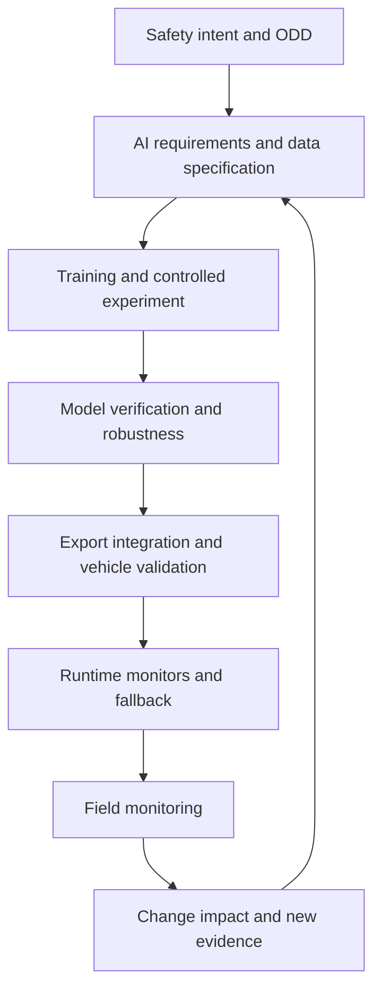

A model with excellent benchmark accuracy can still fail unsafely. It may be confidently wrong in an underrepresented condition, sensitive to a harmless image change, poorly calibrated after quantisation, temporally unstable, or silently outside the data distribution that justified its use.

Automotive AI safety therefore cannot be reduced to “test the neural network.” It needs a lifecycle argument connecting the vehicle-level safety intent to data, learning, model properties, integration, runtime controls, field evidence, and every subsequent change.

ISO/PAS 8800:2024 describes safety-related properties and assurance considerations for AI in road vehicles. ISO/IEC TR 5469:2024 covers the relationship between AI and functional safety more generally. They complement—not replace—the vehicle’s functional-safety and SOTIF activities.

## Keep the three safety lenses distinct

| Lens | Central question | Typical example |
|---|---|---|
| Functional safety | What if an E/E element malfunctions? | corrupted memory changes an output |
| SOTIF | What if fault-free intended functionality is insufficient? | valid sensor data is misinterpreted in glare |
| AI safety assurance | What evidence makes this learned component acceptable in its safety context? | dataset gaps, calibration, robustness, export equivalence, drift |

One event can involve all three. Use the lenses to avoid gaps, not to create organisational silos.



## 1. Give the AI component a safety contract

Before choosing an architecture, specify:

- input signals, units, timing, synchronization, quality indicators, and valid range;
- output semantics, uncertainty representation, update rate, and maximum age;
- ODD and operational assumptions inherited from the vehicle function;
- hazardous errors, required detection, and downstream tolerance;
- performance requirements sliced by safety-relevant conditions;
- behaviour for missing, degraded, inconsistent, or out-of-distribution input;
- runtime resources, latency, memory, thermal, and numerical constraints;
- change categories that require renewed analysis or validation.

“Detect pedestrians accurately” is not a safety contract. It omits distance, occlusion, pose, environment, time-to-event, confidence behaviour, and what the consumer must do when evidence is weak.

## 2. Treat data as engineered safety evidence

Track where data came from, why it is permitted for use, the sensor and software version, scenario/ODD attributes, transformations, annotation process, quality review, known gaps, and relationship between train, validation, and test partitions.

Useful data questions include:

- Which safety-relevant ODD dimensions are covered, and how densely?
- Are rare but severe conditions intentionally represented?
- Do collection policies hide near misses or failed sensor states?
- Are labels ambiguous where human experts disagree?
- Can train/test leakage occur through route, fleet, time, sequence, or derived frames?
- Does synthetic data preserve the physical cues needed by the task?
- Are preprocessing and coordinate conventions identical in training and deployment?

Dataset size is not a coverage argument. A smaller, traceable scenario matrix can reveal more than millions of correlated frames.

## 3. Evaluate properties beyond mean accuracy

Break results down by safety-relevant scenario and operating range. Depending on the task, evaluate:

- calibration and selective performance when low-confidence outputs are rejected;
- robustness to weather, lighting, occlusion, corruption, timing skew, and sensor degradation;
- temporal stability, state reset, and recovery after missing observations;
- distance-, speed-, and time-to-event-dependent errors;
- rare-class, open-set, and unknown-object behaviour;
- sensitivity to plausible transformations that should preserve meaning;
- disagreement across models, sensor paths, or repeated observations;
- worst-case latency, memory, numerical stability, and thermal throttling;
- effect of each error on prediction, planning, control, and safety margin.

An explanation method can help debug a model, but a colourful heatmap is not by itself evidence that the model will remain safe.

## 4. Add runtime guardrails outside the learned function

Where the safety concept requires it, use simple, independently justified monitors for input quality, timing, geometry, dynamics, temporal consistency, and output plausibility.

```python
from enum import Enum, auto


class Decision(Enum):
    ACCEPT = auto()
    DEGRADE = auto()
    REJECT = auto()


def guard_ai_output(output, context, limits) -> Decision:
    if context.input_age_ms > limits.max_input_age_ms:
        return Decision.REJECT
    if context.sensor_quality < limits.min_sensor_quality:
        return Decision.DEGRADE
    if output.uncertainty > limits.max_uncertainty:
        return Decision.DEGRADE
    if not limits.physical_envelope.contains(output.state):
        return Decision.REJECT
    if not temporally_consistent(output.state, context.previous_state):
        return Decision.DEGRADE
    return Decision.ACCEPT
```

The thresholds and reactions must come from system safety requirements. A guard that rejects too frequently can create a different hazard; a guard that shares the model’s blind spot creates false confidence.

## 5. Verify every deployment transformation

The trained PyTorch model is not the vehicle artifact. Export, graph rewriting, operator substitution, quantisation, partitioning, compiler optimization, accelerator execution, and post-processing can change behaviour.

For every target build:

1. identify model weights, preprocessing, post-processing, compiler, runtime, and hardware;
2. compare reference and target outputs on representative and boundary datasets;
3. evaluate task-level outcomes after thresholding, decoding, tracking, and fusion;
4. inspect unsupported operators and CPU/accelerator partitions;
5. stress dynamic shapes, invalid inputs, numeric extremes, and repeated stateful execution;
6. measure latency distribution, warm-up, throttling, contention, and memory pressure;
7. retain binary hashes, tool versions, logs, and acceptance results.

Numerical closeness alone is insufficient. A small score change around a decision threshold can change vehicle behaviour.

## 6. Design degradation before deployment

Runtime uncertainty needs an action. Options may include:

- preserve greater distance or reduce speed;
- suppress a specific capability while retaining others;
- rely on an independently justified sensing or logic path;
- request human intervention with a realistic response window;
- transition to a minimum-risk behaviour;
- prevent activation outside validated prerequisites.

Define who consumes the health signal, how quickly, with what hysteresis, and what happens if health repeatedly crosses the boundary. Test the whole transition, including user communication and actuator response.

## 7. Monitor the field without turning it into an uncontrolled experiment

Collect safety-relevant signals with privacy, cybersecurity, bandwidth, and retention controls. Useful triggers include:

- monitor activation and degraded-mode entry;
- disagreement between independent evidence sources;
- high uncertainty or poor calibration indicators;
- ODD boundary encounters;
- near miss, intervention, or unusual control response;
- novel clusters in representation or scenario space;
- sensor/software configuration not represented in validation.

Field monitoring should feed a governed process: triage, reproduce, assess safety impact, update the limitation catalogue, decide mitigation, add regression coverage, and update the assurance argument.

## Change control is the hidden safety problem

A change to labels, augmentation, architecture, compiler, threshold, sensor calibration, map schema, or downstream consumer can invalidate previous evidence. Maintain a change-impact matrix:

| Change | Evidence to reconsider |
|---|---|
| New data or labels | provenance, coverage, leakage, bias, regression results |
| New model architecture | failure modes, robustness, calibration, runtime behaviour |
| Quantisation/compiler update | output equivalence, partitions, latency, numerical edge cases |
| Sensor revision | input distribution, calibration, preprocessing, degradation logic |
| ODD expansion | requirements, scenario coverage, SOTIF analysis, field monitors |
| Threshold or planner change | end-to-end safety metrics and degraded behaviour |

“Same benchmark score” does not mean “same safety argument.”

## A practical AI safety case should contain

- vehicle-level safety intent and allocated AI requirements;
- model role, limits, ODD assumptions, and hazardous-error analysis;
- data specification, provenance, coverage, quality, and partition evidence;
- reproducible training configuration and experiment decisions;
- scenario-sliced performance, calibration, robustness, and uncertainty evidence;
- target-runtime equivalence and resource results;
- independent monitors, degradation, and fallback validation;
- traceable anomalies and residual-risk rationale;
- field-monitoring plan and governed change process.

AI safety is not a claim that a model is universally safe. It is a bounded argument that a specific learned component, build, integration, and operating context have adequate evidence—and that the system can recognize and manage important limits at runtime.

## Official references

- [ISO/PAS 8800:2024 — Road vehicles — Safety and artificial intelligence](https://www.iso.org/standard/83303.html)
- [ISO/IEC TR 5469:2024 — Artificial intelligence — Functional safety and AI systems](https://www.iso.org/standard/81283.html)

