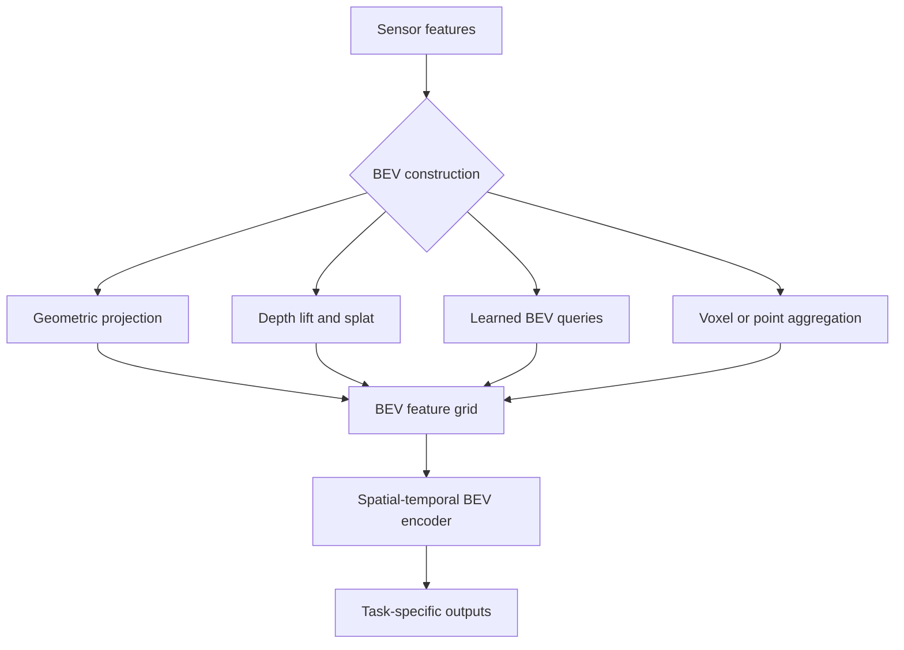

A bird’s-eye-view representation expresses evidence in a ground-aligned coordinate system. It can make spatial relationships, map alignment, motion history, and multi-view fusion easier to reason about. BEV is a representation—not one model.

The central question is how sensor evidence is transformed into that coordinate system.



## Why BEV is useful

- Common coordinate system for several views or modalities.
- Direct representation of ground-plane distance and orientation.
- Natural interface for occupancy, map, motion, and planning-related features.
- Easier temporal alignment using ego pose.
- Clearer geometric consistency checks.

BEV also introduces discretisation, bounded spatial coverage, calibration dependence, and memory cost proportional to grid size and channel count.

## Major construction families

### Inverse perspective mapping

Pixels are projected onto an assumed ground surface using calibration. This is simple and interpretable, but objects above the ground and non-flat terrain violate the assumption.

### Depth lifting and splatting

Image features are distributed along predicted depth, transformed into 3D, and accumulated into a BEV grid. This introduces explicit geometry but depends on depth quality and can create a large intermediate volume.

### Query-based BEV Transformers

Learned BEV queries attend to image or sensor features using calibration and learned offsets. They can gather information flexibly without materialising every depth sample. Attention sampling, training stability, and backend support become important.

### Voxel- or point-derived BEV

3D points or sparse voxels are aggregated vertically into a BEV feature map. This naturally preserves measured geometry but depends on the density and coverage of the source sensor.

### Hybrid BEV

Several paths may contribute evidence to one grid—for example, geometry-derived features combined with learned queries or temporal memory. Hybrid systems offer flexibility but require disciplined ownership of coordinates, confidence, and duplicates.

## Selection matrix

| Constraint or objective | Family to investigate first |
|---|---|
| Flat-region geometric baseline | Inverse perspective mapping |
| Explicit camera depth reasoning | Lift-and-splat |
| Flexible multiview contextual sampling | Query-based BEV |
| Strong direct 3D measurements | Voxel or point aggregation |
| Mixed sensor evidence | Hybrid with confidence-aware fusion |
| Tight activation-memory budget | Sparse or query-sampled alternatives |

This matrix guides experiments; it does not select a production architecture.

## Generic point-to-BEV scatter

```python
import torch


def scatter_to_bev(points_xy, point_features, bounds, resolution):
    """Average point features into a generic BEV grid."""
    x_min, y_min, x_max, y_max = bounds
    width = int((x_max - x_min) / resolution)
    height = int((y_max - y_min) / resolution)

    x = torch.floor((points_xy[:, 0] - x_min) / resolution).long()
    y = torch.floor((points_xy[:, 1] - y_min) / resolution).long()
    valid = (x >= 0) & (x < width) & (y >= 0) & (y < height)

    x, y = x[valid], y[valid]
    features = point_features[valid]

    bev = torch.zeros(height, width, features.shape[-1])
    count = torch.zeros(height, width, 1)
    bev.index_put_((y, x), features, accumulate=True)
    count.index_put_((y, x), torch.ones_like(features[:, :1]),
                     accumulate=True)
    return (bev / count.clamp_min(1.0)).permute(2, 0, 1)
```

Production implementations use bounded memory, deterministic reduction, batching, valid-height handling, and accelerator-friendly scatter or pooling operations.

## Grid design

BEV memory approximately scales with:

`height_cells × width_cells × channels × bytes_per_value`

Reducing cell size increases spatial precision but quadratically increases the number of cells across a fixed area. Coverage need not be symmetric, and multiresolution grids may allocate detail where it matters most.

Grid choice should follow the smallest structure that must be represented, localisation uncertainty, sensor resolution, task output, and memory budget.

## Temporal BEV

Past BEV features can be transformed into the current ego frame and fused with current evidence. This makes BEV a useful memory surface, but quality depends on:

- pose accuracy and timestamp alignment;
- handling dynamic objects separately from static structure;
- decay or confidence of old evidence;
- state reset and map discontinuities;
- bounded history and runtime memory.

## How to select responsibly

Build a comparison table for candidate approaches across:

- calibration sensitivity;
- depth or geometry supervision requirements;
- spatial resolution and coverage;
- activation memory and bandwidth;
- supported operators and quantisation;
- temporal alignment strategy;
- robustness to missing views or modalities;
- uncertainty and visibility modelling;
- ease of debugging geometric errors;
- compatibility with downstream outputs.

The best BEV approach is not the one with the most elaborate projection. It is the one whose assumptions, error modes, data requirements, and runtime behaviour match the product’s operating domain.
