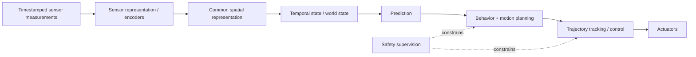

An autonomous-driving stack is best understood as a sequence of **state transformations with explicit contracts**, not as “camera in, steering out.” Each stage reduces one kind of uncertainty while introducing assumptions that the next stage must understand.

The useful high-level chain is:



The central engineering question at every boundary is:

> **What state is represented, at what time, in which coordinate frame, with what uncertainty, and what assumptions made it valid?**

If those answers are not explicit, later model sophistication cannot repair the architecture.

## 1. Sensor acquisition produces measurements, not a world

A camera image, LiDAR sweep, radar detection list and IMU packet do not describe exactly the same instant.

A useful sensor record is closer to:

```text
measurement payload
sensor identity
capture timestamp / exposure interval
sequence number
calibration revision
sensor health / quality metadata
coordinate frame
```

For camera and spinning LiDAR, “timestamp” itself may need semantics: exposure midpoint, scan start, scan end or per-row/per-point time.

At vehicle speed `v`, temporal skew creates physical displacement:

$$\Delta x = v\Delta t$$

At 25 m/s, a 40 ms skew corresponds to 1 m of ego translation before rotation is considered. Therefore **time alignment is geometry**, not bookkeeping.

## 2. Calibration is a transform graph

Every sensor begins in its own coordinate frame. A production stack should model transforms explicitly:

```text
sensor frame
   -> sensor mounting / extrinsic
   -> vehicle/ego frame
   -> local/world/map frame
```

For a rigid transform:

$$p_B = R_{B\leftarrow A}p_A+t_{B\leftarrow A}$$

The transform must be associated with the measurement time if the vehicle pose changes.

Calibration should also carry revision/validity. Replacing a bumper, camera bracket or sensor module can change the transform without changing software binaries.

## 3. Preprocessing defines the actual model input

The neural network does not receive “the camera.” It receives a tensor created by a preprocessing contract:

```text
ISP output
 -> crop / rectify
 -> resize
 -> color conversion
 -> normalization
 -> tensor layout / precision
```

If a 1920×1080 image is cropped and resized to 448×256, the effective intrinsics must be transformed accordingly. A correct camera calibration used with the wrong crop/scale is still a wrong geometric model.

The same principle applies to LiDAR voxel size, radar filtering thresholds and IMU unit conventions.

## 4. Sensor encoders create learned evidence, not objects

A camera backbone transforms pixels into image-space features:

```text
[B, Ncam, 3, H, W]
      ↓
shared encoder
      ↓
[B, Ncam, C, Hf, Wf]
```

LiDAR may become sparse voxel features; radar may become point or range-Doppler features.

These tensors are **representations of evidence**, not yet a physically coherent world state. Their coordinates and timestamps still matter.

This distinction is important: a feature map can have strong semantic content while still being tied to a camera perspective.

## 5. A common spatial representation removes viewpoint fragmentation

For driving, it is useful to express evidence in an ego/world-aligned coordinate frame. Bird’s-eye view is one common choice.

For a camera pixel `p=[u,v,1]^T` with depth `d`:

$$P_{cam}=dK^{-1}p$$

and then:

$$P_{ego}=T_{ego\leftarrow cam}P_{cam}$$

Camera-to-BEV methods differ mainly in how they obtain/sample depth and how they aggregate image features into the BEV grid.

LiDAR/radar already provide metric range evidence, but still need timestamp-aligned transforms into the same reference frame.

The BEV contract should define:

```text
origin / axes
metric bounds
cell resolution
reference timestamp
feature channels
visibility/validity semantics
```

## 6. Fusion is evidence reconciliation, not concatenation

Suppose camera says “vehicle-like appearance,” LiDAR gives a 3D surface, and radar gives a radial velocity return. Fusion should preserve the different measurement semantics.

Three common levels are:

```text
early:  raw/low-level features fused before task reasoning
mid:    modality encoders -> common BEV -> learned fusion
late:   independent detections/tracks -> object-level fusion
```

Early/mid fusion can exploit complementary evidence more deeply but is sensitive to calibration and time alignment. Late fusion is modular and debuggable but loses information that earlier stages discarded.

A robust fusion layer should also handle **missing or degraded modalities** rather than assuming every sensor is always valid.

## 7. Temporal perception requires ego-motion compensation

Past BEV features refer to an earlier ego pose. Static scene structure can be aligned using the ego transform:

$$T_{current\leftarrow past}=T^{-1}_{world\leftarrow current}T_{world\leftarrow past}$$

Warping past BEV into the current frame aligns static geometry.

Dynamic objects do not obey ego motion alone. Their residual movement remains and must be represented by tracking, scene flow, object motion or learned temporal reasoning.

A temporal memory therefore needs explicit lifecycle semantics:

```text
state timestamp
pose used for alignment
maximum age
confidence/decay
reset conditions
sensor-gap behavior
```

## 8. Perception heads convert shared state into task evidence

Once a common representation exists, task heads can infer quantities such as:

- 3D objects: position, dimensions, heading, velocity, class;
- semantic occupancy: class per grid cell/voxel;
- free space / drivable area;
- lane/topology elements;
- traffic lights/signs;
- motion fields or flow;
- uncertainty/quality.

A mature stack should avoid a single “confidence” number doing too much. Classification confidence, localization covariance, existence probability and sensor/model quality are different concepts.

## 9. Detection and occupancy answer different questions

Object detection represents the world as entities:

```text
vehicle #17: position, size, heading, velocity
pedestrian #8: ...
```

Occupancy represents space directly:

```text
cell (x,y,z): occupied / free / unknown / semantic class
```

Boxes are compact and convenient for tracking/prediction. Occupancy captures irregular obstacles, overhangs, vegetation and unclassified geometry.

Modern autonomy stacks often use both because the representations serve different consumers.

## 10. Tracking is state estimation over association uncertainty

Tracking is not merely assigning IDs. It combines measurements over time to estimate latent object state.

A typical object state may be:

$$x=[p_x,p_y,v_x,v_y,\psi,\dot\psi]^T$$

The tracker must solve:

1. motion prediction;
2. data association;
3. state update;
4. birth/death logic;
5. uncertainty propagation.

Learned association can help, but explicit state/covariance remains useful because downstream prediction needs to know how uncertain velocity/position actually are.

## 11. Prediction is fundamentally multimodal

Another vehicle approaching an intersection may:

```text
continue
slow
stop
tum
```

A single averaged future can be physically meaningless. Prediction should therefore represent multiple modes or a probability distribution.

A useful trajectory prediction output is:

```text
agent_id
K candidate trajectories
probability per trajectory
state uncertainty / covariance
prediction horizon
reference frame/time
```

Evaluation must include **mode coverage and calibration**, not only average displacement error.

## 12. Prediction needs map and interaction context

Agent dynamics alone are insufficient. Likely motion depends on:

- lane topology;
- traffic controls;
- right-of-way;
- nearby agents;
- road geometry;
- ego behavior.

This is why prediction models often use a scene graph, map polylines, BEV features or interaction attention.

## 13. Planning is constrained optimization over possible futures

Planning usually has at least two conceptual levels.

### Behavior / tactical decision

```text
follow
stop
yield
change lane
merge
pass
```

### Motion planning

Generate a time-parameterized trajectory:

$$\tau(t)=\{x(t),y(t),\psi(t),v(t),a(t),\kappa(t)\}$$

subject to constraints:

```text
collision avoidance
road/lane boundaries
vehicle dynamics
steering/acceleration limits
comfort jerk limits
traffic rules
safety margins
```

A learned planner may generate candidate trajectories, but a vehicle still needs explicit validation/constraints around what can be executed.

## 14. Risk is not identical to collision probability

Risk combines probability with consequence and uncertainty.

A near-certain low-speed contact and a low-probability high-speed crossing conflict should not be treated identically.

Planner cost can be viewed abstractly as:

$$J(\tau)=J_{progress}+J_{comfort}+J_{rules}+J_{interaction}+J_{risk}$$

The exact formulation varies, but the planner must avoid trading safety for convenience simply because one scalar cost was poorly tuned.

## 15. Control tracks a trajectory; it should not rediscover planning

The planner outputs a trajectory or motion target. The controller uses current vehicle state and actuator models to track it.

Typical control decomposition:

```text
trajectory
   ↓
lateral control -> steering request
longitudinal control -> torque/brake request
   ↓
actuator interface
```

Classical methods include PID, pure pursuit, Stanley, LQR and MPC depending on problem formulation.

The control loop runs faster than perception/planning and requires bounded timing. It should operate on a trajectory that already respects vehicle constraints.

## 16. The high-performance computer should not be the only safety authority

A production system typically needs a supervisory/control boundary that can reject stale or implausible commands.

The motion request should carry:

```text
sequence / freshness
reference timestamp
mode / authority
trajectory or control target
limits / validity horizon
health status
end-to-end protection where required
```

A deterministic safety/control ECU can independently monitor freshness, range/rate, actuator response and high-level compute health.

## 17. Latency must be measured as data age

A common mistake is to add model runtimes while ignoring queueing.

Suppose:

```text
camera exposure       t = 0 ms
frame available       t = 12 ms
encoder/fusion done   t = 32 ms
prediction done       t = 45 ms
plan done             t = 55 ms
command applied       t = 62 ms
```

The command acts on a world observation already ~62 ms old.

The system should trace **capture-to-actuation age** and preferably predict state forward to the intended actuation time.

## 18. Pipeline frequency does not have to be uniform

Different stages naturally run at different rates:

```text
IMU             100–1000 Hz
vehicle state   50–200 Hz
camera          20–60 Hz
perception      10–30 Hz
prediction      10–20 Hz
planning        10–20 Hz
control         50–200+ Hz
```

These are illustrative ranges, not requirements. The point is architectural: consumers often hold/interpolate/extrapolate producer state. Timestamps and validity horizons make asynchronous rates safe to combine.

## 19. Uncertainty should survive stage boundaries

Each stage can destroy uncertainty if it emits only a point estimate.

Better contracts carry forms such as:

```text
pose + covariance
object existence probability
trajectory distribution
occupancy probability
sensor health state
model confidence / quality flags
```

Downstream modules then distinguish:

```text
“free”
from
“not observed”
from
“observed but uncertain”
```

That distinction is essential for risk-aware planning.

## 20. Failure handling is a state machine, not an exception handler

Autonomy must define behavior when:

- one camera drops;
- radar timestamps drift;
- localization covariance grows;
- temporal model state becomes invalid;
- AI accelerator restarts;
- map is unavailable;
- planner misses deadline;
- control feedback disagrees.

Capability should degrade according to an explicit operating-state model. The correct reaction is often **reduced functionality**, not immediate full shutdown.

## 21. The stack is best debugged by tracing contracts

For one scene/frame, a useful trace carries:

```text
sensor frame IDs + capture times
calibration revision
encoder tensor IDs
BEV reference time and pose
object/occupancy state generation
prediction generation
planned trajectory ID
control request ID
actuator response
```

When behavior is wrong, this lets you determine whether the fault came from:

```text
measurement
alignment
representation
inference
association
prediction
planning
control
```

rather than treating the autonomy stack as one opaque model.

## 22. The architecture in one compact contract chain

```text
MEASUREMENT
sensor data + timestamp + calibration + quality
        ↓
REPRESENTATION
learned features + frame/time identity
        ↓
SPATIAL STATE
metric BEV/world coordinates + visibility
        ↓
TEMPORAL STATE
aligned memory + motion + uncertainty
        ↓
SCENE INTERPRETATION
objects + occupancy + map context
        ↓
FUTURE DISTRIBUTION
multi-agent trajectories / occupancy futures
        ↓
PLAN
valid trajectory + risk/constraint evidence
        ↓
CONTROL REQUEST
fresh, bounded, supervised motion command
```

That is the useful systems view of autonomy: **each stage makes a stronger statement about the world, but only if it preserves the evidence, timing and uncertainty needed to justify that statement.**
