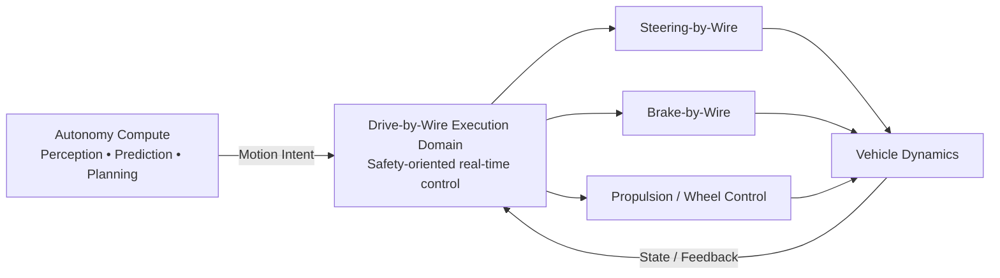
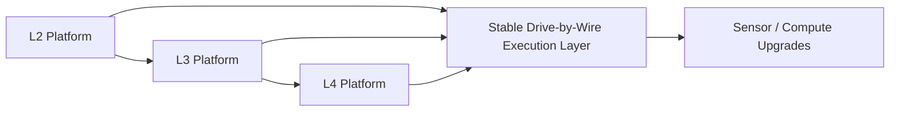

# Vehicle E/E Master Architecture

The Drive-by-Wire platform is conceived as the **physical execution layer of an autonomous electric vehicle**. It separates autonomous decision-making from deterministic, safety-oriented vehicle actuation.

## 1. System boundary

The autonomous stack should not directly control safety-critical actuators. It produces validated motion intent; the execution domain performs arbitration, plausibility checking, control and fault handling.

## 2. Execution domain

The central concept is a **dual-redundant Motion Domain ECU** capable of maintaining vehicle control in the presence of selected single faults. The execution domain interfaces with:

- Steering actuators and steering feedback
- Brake actuation and wheel-speed sensing
- Four traction inverters and motor feedback
- Vehicle dynamics and chassis sensors
- Power-management systems
- Automotive Ethernet and CAN-FD networks

## 3. Propulsion

The reference platform uses four independently controlled traction motors. Each wheel can receive an independently commanded torque, enabling precise longitudinal control and torque-vectoring strategies.

Each motor/inverter path includes feedback such as rotor position/resolver information and diagnostic status.

## 4. Braking

The braking architecture combines **electro-hydraulic friction braking** with **regenerative braking**. The execution layer coordinates the two sources to achieve the requested deceleration while respecting wheel-slip, battery acceptance, thermal and fault constraints.

The architecture is intended to support independent wheel-level braking information and redundant paths appropriate to the required safety concept.

## 5. Steering

Steering-by-Wire separates the driver's steering input from the road-wheel actuator. A production architecture requires redundant sensing, actuator monitoring, power independence and a defined degraded mode.

The steering system therefore remains an independent safety-critical execution subsystem rather than an ordinary vehicle network endpoint.

## 6. Power architecture

The platform separates high-voltage propulsion energy from low-voltage control power. A fail-operational concept can use independent low-voltage power paths so that a single power-domain fault does not immediately remove all vehicle-control capability.

The reference architecture considers isolated **12 V and 48 V control-power banks**, with appropriate conversion, protection, monitoring and backup capability. Exact voltage levels and redundancy will be refined during detailed component selection and safety analysis.

## 7. Vehicle network

The communication backbone is designed around Automotive Ethernet for high-bandwidth domain/zonal communication and CAN-FD for appropriate deterministic control and legacy interfaces.

A gateway/zonal strategy isolates body, powertrain, chassis and autonomy traffic while preserving the safety-critical control paths required by the execution domain.

## 8. Safety concept

The platform is designed to be developed against a formal functional-safety concept rather than treating redundancy as an afterthought. Detailed ASIL allocation, independence, diagnostic coverage, fault-tolerant time intervals and degraded states must be derived through the vehicle-level hazard analysis and safety lifecycle.

The target architecture is therefore **fail-operational where required by the intended autonomous function**, with graceful degradation for functions that can safely transition to a lower capability.

## 9. L2/L3 to L4 migration

A key platform objective is to avoid coupling the vehicle's physical execution architecture to a single autonomy-generation stack.

The intended evolution is:

The execution architecture should remain stable while perception compute, sensor suites and autonomy software evolve. This creates a hardware foundation on which increasingly capable autonomous systems can be deployed.

## 10. Next studies

Future articles in this section will break the platform down into:

- Steering-by-Wire architecture
- Brake-by-Wire and regenerative blending
- Four-wheel propulsion and torque vectoring
- HV battery, BMS and charging
- Redundant 12 V / 48 V power architecture
- Automotive Ethernet and CAN-FD topology
- Body and comfort electrical systems
- Fault trees, degraded modes and safety mechanisms
- Hardware-in-the-loop and vehicle validation

This master architecture is the starting point for those detailed engineering studies.
