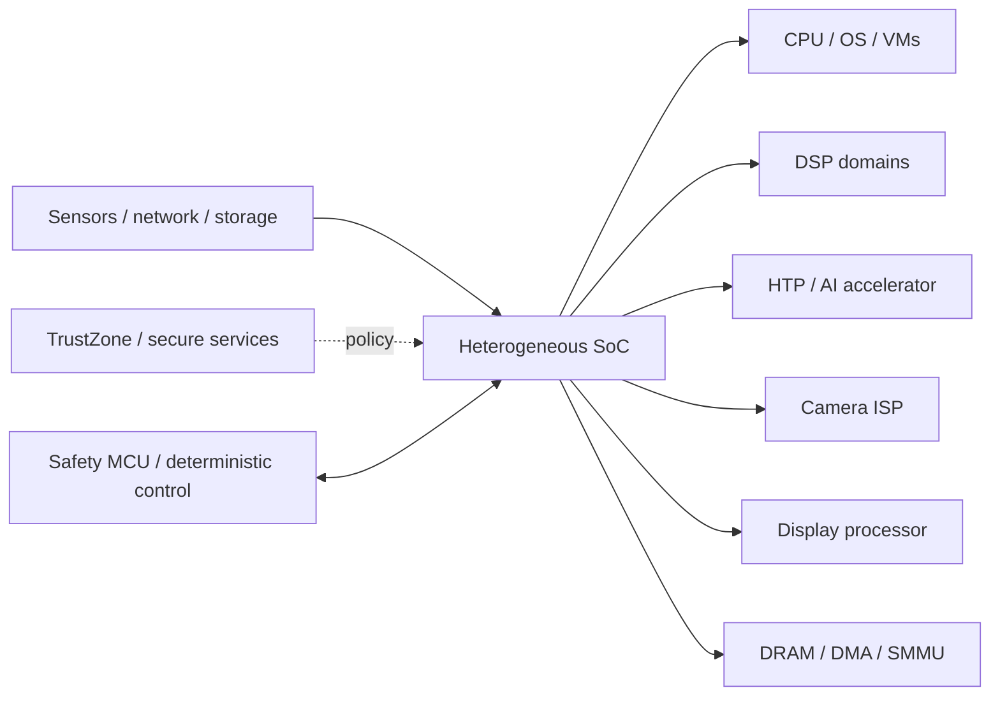

This section is written from a **system-architecture/debugging perspective**. It assumes familiarity with embedded Linux/Android/QNX concepts and focuses on the contracts that usually decide whether a vehicle platform is robust in production: execution ownership, buffer ownership, timestamps, address translation, synchronization, scheduling, security state, recovery and observability.

The central model is not “CPU plus peripherals.” A modern cockpit/vehicle-compute SoC is a network of firmware domains and accelerators sharing memory, interconnect bandwidth, clocks and protection mechanisms.



## Qualcomm automotive SoC series

Read the series in this order if you want a coherent mental model rather than isolated block descriptions:

1. [**Compute, Memory and Trust Boundaries**](/articles/qualcomm-soc-compute-map/) — the system map: control plane versus data plane, shared DRAM, IOVAs, fences, QoS, clocks and subsystem lifecycle.
2. [**DSP Domains: ADSP, CDSP, SDSP and MDSP**](/articles/qualcomm-dsp-domains/) — FastRPC as a real remote-execution boundary, mapped buffers, HVX offload economics and restart semantics.
3. [**TrustZone and the TEE**](/articles/qualcomm-trustzone-tee/) — secure state, authenticated boot, trusted-service APIs, key hierarchy, anti-rollback/RPMB and DMA-aware protection.
4. [**Hexagon NPU / HTP**](/articles/qualcomm-npu-htp/) — model lowering, graph partition, layout/quantization, memory registration, sustained latency and recovery.
5. [**Camera ISP**](/articles/qualcomm-camera-isp/) — exposure-time semantics, RAW/HDR processing, 3A, rolling shutter, effective intrinsics and the image contract seen by AI.
6. [**Display Processing / DPU**](/articles/qualcomm-display-dpu/) — SurfaceFlinger/HWC to hardware planes, atomic state, fences, vblank, scanout bandwidth and virtualization.
7. [**DMA, SMMU and Shared Buffers**](/articles/qualcomm-dma-smmu/) — IOVA translation, `dma-buf`, coherency, zero-copy, fence lifetime and SMMU fault diagnosis.

These articles use an SA8295P-class automotive platform only as a concrete frame of reference. They deliberately separate public architectural concepts from silicon/BSP details that vary by product generation.

## One set of questions spans every article

When analyzing a camera, audio, AI, display or remote-processor path, ask the same questions:

```text
Who produces the data?
Who owns the allocation?
Which timestamp describes the physical measurement?
Which address space / SMMU domain maps it?
What synchronization object transfers ownership?
Which engine/firmware schedules the work?
Which shared resource can stall it?
What happens if that engine resets?
What trace proves the answer?
```

If these questions are answerable, most “mysterious BSP issues” become ordinary state/ownership/timing problems.

## Vehicle control and safety islands

High-level compute and actuator control have different engineering requirements. Perception/planning favors throughput and complex software; actuator control requires bounded timing, explicit authority, independent monitoring and deterministic fault reaction.

[AURIX for Vehicle Control: Building a Deterministic Safety Island](/articles/aurix-vehicle-control/) covers command freshness, state machines, supervision, real-time scheduling, SMU/watchdog mechanisms and fault injection. It should be read as the counterpart to the heterogeneous-SoC series: **the application SoC proposes; the control island supervises and actuates under a different timing/safety contract.**

## Platform areas to add next

The natural extensions of this section are not more processor-block summaries, but cross-cutting vehicle-platform topics:

- Android/AAOS + QNX/Linux virtualization and VM/device ownership;
- BSP boot flow, remoteproc/subsystem lifecycle and crash recovery;
- CAN-FD / Automotive Ethernet / SOME-IP timing and diagnostics;
- camera SerDes and multi-camera synchronization;
- Bluetooth/Wi-Fi coexistence and RF/driver integration;
- OTA/A-B update, rollback and secure lifecycle;
- hardware bring-up: rails, clocks, resets, pinmux, schematics and trace-based debugging.

Safety process and assurance arguments remain grouped under [Safety & Assurance](/articles/safety-assurance/), while this section concentrates on the **technical mechanisms that those arguments depend on**.
