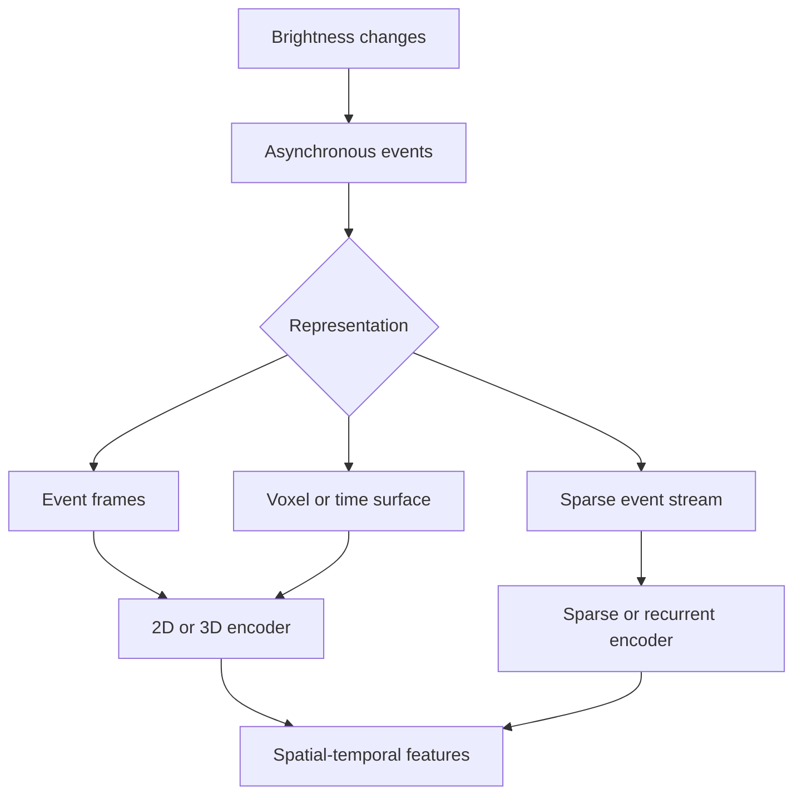

An event camera does not produce conventional frames at a fixed rate. Each pixel independently reports a brightness change, commonly as an event:

`e = (x, y, t, p)`

where `x` and `y` are pixel coordinates, `t` is the timestamp, and `p` is the polarity of the change. The stream can provide low-latency motion information and wide dynamic range, but it is sparse, asynchronous, and dependent on scene change.

The most important modelling decision is often the representation built before the encoder.



## Representation choices

### Accumulated event frame

Events within a time window are accumulated into positive and negative channels. This makes existing 2D CNNs easy to reuse, but precise timing within the window is lost.

### Voxel grid

Time is divided into bins, producing a tensor such as `[polarity × time_bins, height, width]`. A voxel grid preserves more temporal structure while remaining compatible with dense tensor processing.

### Time surface

Each pixel stores the time since its latest event, often with exponential decay. Time surfaces describe recent motion structure compactly.

### Sparse event sequence

Events remain individual timestamped elements. Sparse, recurrent, attention, or state-space processing can preserve asynchronous behaviour, but batching and accelerator support become more challenging.

## Encoder families

| Representation | Encoder families to consider |
|---|---|
| Accumulated frame | 2D CNN or vision Transformer |
| Voxel grid | 2D channel-stacked CNN, 3D CNN, or hybrid |
| Time surface | 2D CNN, recurrent CNN, or temporal attention |
| Sparse stream | Sparse network, point-style encoder, RNN, SSM, or Transformer |

The representation changes the meaning of latency. A large accumulation window may improve density but delay the earliest useful output. A small window preserves responsiveness but may provide too little evidence.

## Event voxelisation example

```python
import torch


def events_to_voxel(
    events: torch.Tensor,
    height: int,
    width: int,
    time_bins: int,
) -> torch.Tensor:
    """events columns: x, y, timestamp, polarity (+1 or -1)."""
    x = events[:, 0].long().clamp(0, width - 1)
    y = events[:, 1].long().clamp(0, height - 1)
    t = events[:, 2]
    polarity = (events[:, 3] > 0).long()

    t_min, t_max = t.min(), t.max()
    t_norm = (t - t_min) / (t_max - t_min).clamp_min(1e-6)
    bins = (t_norm * (time_bins - 1)).long()

    voxel = torch.zeros(2, time_bins, height, width)
    voxel.index_put_((polarity, bins, y, x), torch.ones_like(t),
                     accumulate=True)
    return voxel.reshape(2 * time_bins, height, width)
```

Production code must also handle timestamp wrap, empty windows, clock domains, event noise, hot pixels, batching, and deterministic memory limits.

## Temporal modelling choices

- **Fixed-window CNN:** simple and deployable, but window selection defines temporal memory.
- **3D convolution:** learns local space-time patterns but can be activation-heavy.
- **ConvLSTM or GRU:** maintains streaming state and spatial structure.
- **Transformer:** relates distant events or tokens but may be expensive for large streams.
- **State-space model:** offers evolving memory with potentially favourable sequence scaling.
- **Hybrid:** dense early representation plus recurrent or state-space temporal memory.

## How to select

Evaluate the complete chain:

- earliest useful response, not only throughput;
- performance across slow motion, fast motion, low texture, and flicker;
- event rate and worst-case memory growth;
- sensitivity to the chosen accumulation policy;
- timestamp precision and synchronisation with other observations;
- supported sparse or temporal operators on the target runtime;
- state reset, warm-up, and dropped-event behaviour.

An event encoder should preserve what makes the sensor distinctive: fine timing and change-driven sparsity. Converting events into ordinary frames may be the correct engineering trade-off, but it should be an explicit decision rather than an accidental loss of information.
