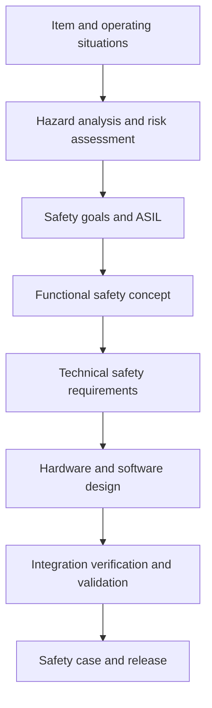
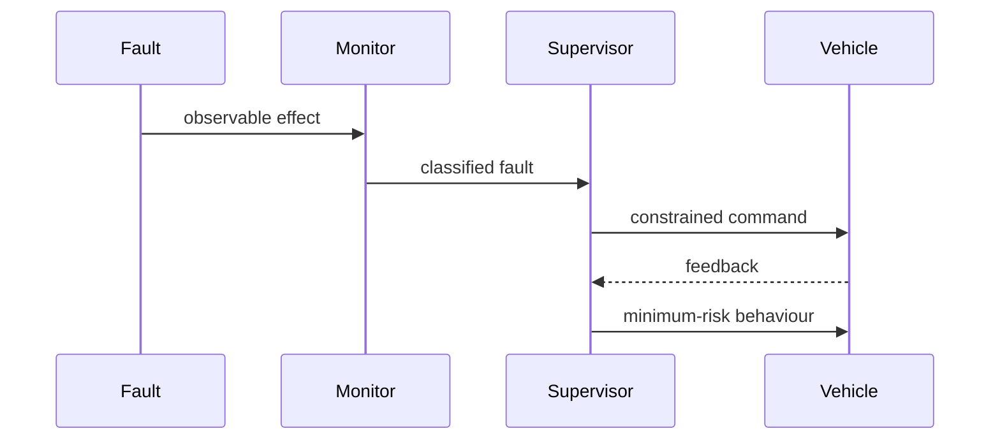

Functional safety asks a precise question: **what hazards can arise when a safety-related electrical or electronic system malfunctions, and how will unreasonable risk be prevented?**

For an autonomous-vehicle function, the answer cannot live only in a spreadsheet. It must appear in the architecture, communication contracts, timing, diagnostics, software, hardware, test cases, operating procedures, and release evidence.

ISO 26262 provides the lifecycle framework. This article is an engineering guide, not a substitute for the standard, a safety plan, or an independent assessment.

## Trace the chain from hazard to mechanism



If a safety mechanism cannot be traced to a hazard, requirement, fault model, detection interval, and reaction, its value is unclear. Likewise, a safety goal without implementable technical requirements is only an intention.

## Write hazardous events as behaviours

“Steering failure” is too vague. Consider concrete malfunctioning behaviours in an operating situation:

- unintended steering command at motorway speed;
- missing braking request while approaching a stationary object;
- delayed torque reduction during a degraded-sensor condition;
- false indication that automated control is available;
- inconsistent commands sent to redundant actuator channels.

The Hazard Analysis and Risk Assessment evaluates the hazardous event using the applicable severity, exposure, and controllability rationale and derives safety goals and ASILs. The rating should not be guessed from a component name.

## Define safe behaviour over time

A vehicle often cannot move from a fault directly to a static safe state. Define a **fault-tolerant time interval**, the detection and reaction budget, a degraded operating mode, and the conditions for reaching a minimum-risk condition.



Budget the interval across sensing, communication, scheduling, detection persistence, arbitration, actuator response, and vehicle dynamics. A monitor that detects a fault quickly is insufficient if the actuator reaction is late.

## Architect fault containment

A practical control path may include:

| Concern | Architectural response to evaluate |
|---|---|
| Corrupted command | Counter, timeout, data identifier, CRC, range and sequence checks |
| Compute stall | Internal/external watchdog and independent supervisor |
| Plausible but incorrect command | Diverse calculation, physical-envelope check, actuator/vehicle feedback |
| Memory corruption | ECC, memory tests, protection, controlled fault reaction |
| Timing interference | Partitioning, priority analysis, WCET, deadline monitoring |
| Sensor failure | Electrical diagnostics, plausibility, redundancy or graceful degradation |
| Actuator failure | Command/feedback comparison, redundant path where required, safe reaction |
| Power or clock fault | Independent supervision, reset/output inhibition, controlled restart |
| Communication loss | Defined timeout behaviour and local authority policy |

Redundancy alone does not provide independence. Analyse common power, clocks, connectors, networks, software, requirements, environmental stress, and systematic faults. A dependent-failure analysis often changes a neat block diagram into a credible architecture.

## Build a monitor around physics and time

A useful monitor is intentionally simpler than the function it supervises.

```c
typedef struct {
    float requested_angle_deg;
    float measured_angle_deg;
    float vehicle_speed_mps;
    uint32_t command_age_ms;
} SteeringObservation;

MonitorResult supervise_steering(const SteeringObservation *s) {
    if (s->command_age_ms > MAX_COMMAND_AGE_MS)
        return REQUEST_CONTROLLED_DEGRADATION;

    if (!within_speed_dependent_envelope(s->requested_angle_deg,
                                         s->vehicle_speed_mps))
        return REJECT_COMMAND;

    if (tracking_error_persists(s->requested_angle_deg,
                                s->measured_angle_deg))
        return REQUEST_MINIMUM_RISK_BEHAVIOR;

    return ALLOW_COMMAND;
}
```

Production implementation needs calibrated thresholds, diagnostic coverage, debouncing, overflow handling, scheduling guarantees, freedom from interference, startup behaviour, and evidence that the monitor itself fails safely enough for its allocation.

## Treat communication as a safety mechanism

Network “availability” is not enough. Define for every safety-relevant message:

- source, receiver, update period, deadline, and maximum age;
- units, resolution, valid range, and reserved values;
- counter and data identifier semantics;
- corruption, repetition, reordering, loss, and masquerade detection;
- startup, shutdown, bus-off, reset, and recovery behaviour;
- which node owns authority during disagreement;
- reaction if the sender is healthy but its data is implausible.

Measure end-to-end behaviour with actual gateway, bus load, and scheduling—not only a unit test of the encoder and decoder.

## Software evidence must match the allocated risk

Practical software work includes:

1. derive and review bidirectionally traceable requirements;
2. define architectural boundaries and freedom from interference;
3. restrict language features and apply defensive coding rules;
4. use static analysis, code review, unit tests, and coverage appropriate to the development plan;
5. verify numeric ranges, fixed/floating-point behaviour, concurrency, and shared data;
6. measure stack, heap, execution time, jitter, and overload behaviour;
7. qualify or validate tools according to their possible impact and error detection;
8. verify calibration, configuration, generated code, and binary identity;
9. manage anomalies with safety impact, not only defect priority;
10. reproduce the release from controlled inputs.

The deployed binary, compiler options, link map, configuration, calibration, hardware revision, and test evidence must describe the same product.

## Hardware analysis needs a fault model

Hardware metrics are outcomes of an architecture and fault analysis, not targets that can be assigned to a chip in isolation. Define relevant failure modes, safety mechanisms, diagnostic coverage assumptions, residual faults, latent faults, dependent failures, mission profile, and reaction.

Use complementary analyses:

- FMEA or FMEDA works from elements and failure modes toward effects;
- Fault Tree Analysis works backward from an unwanted top event;
- dependent-failure analysis tests assumptions about independence;
- fault injection validates that selected mechanisms detect and react as analysed.

Reconcile analysis identifiers with requirements and tests. Otherwise three teams may use three different definitions of the same “steering timeout.”

## High-value integration tests

- loss, delay, corruption, repetition, and reordering of every safety message;
- CPU overload and priority inversion near the timing boundary;
- watchdog expiry in each operating state;
- sensor stuck, drift, out-of-range, and intermittent behaviour;
- actuator lag, saturation, reversal, and feedback mismatch;
- power dip, clock issue, reset storm, and partial ECU reboot;
- failure during mode transition or minimum-risk manoeuvre;
- diagnostic event storage under repeated and simultaneous faults;
- software update interruption and version incompatibility;
- two-point faults relevant to latent-fault assumptions.

For each test, capture stimulus, detection path, detection time, reaction, vehicle effect, diagnostic record, and recovery rule.

## A release review that catches practical gaps

Ask:

- Can every safety goal be traced to verified technical mechanisms?
- Are safe states and degraded behaviours defined for each operating situation?
- Does measured worst-case reaction fit within the allocated time?
- Have shared resources and dependent failures been analysed?
- Are safety-manual assumptions and device errata satisfied?
- Do open anomalies have explicit safety impact decisions?
- Does configuration management identify the exact tested hardware and software?
- Are production, service, update, and decommissioning controls included?

Functional safety is achieved when hazard reasoning remains intact through implementation and operation. The most valuable artifact is not a large document; it is an unbroken, evidence-backed line from hazardous behaviour to a tested fault reaction.

## Official reference

- [ISO 26262-1:2018 — Road vehicles — Functional safety framework](https://www.iso.org/standard/68383.html)

