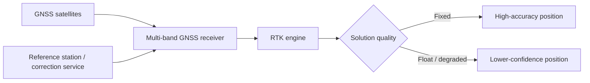
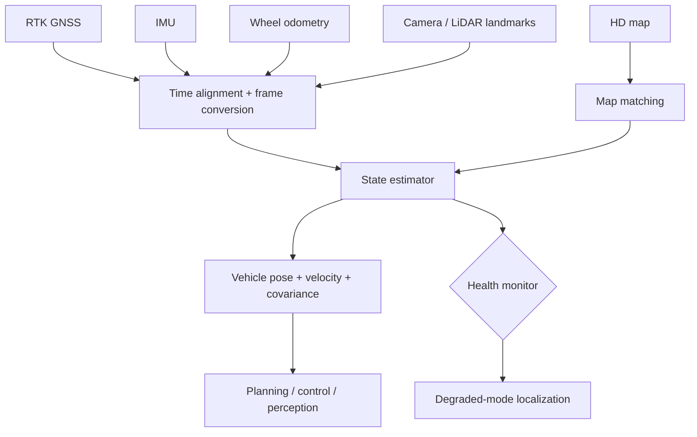

High-definition (HD) maps and Real-Time Kinematic (RTK) positioning solve different parts of the localization problem. RTK can provide centimeter-level global positioning when correction data, satellite visibility, and receiver conditions are good. An HD map provides the structured geometric and semantic context needed to understand where the vehicle is relative to lanes, road boundaries, intersections, signs, and other map features.

Together, they form a powerful localization foundation for autonomous driving—but neither should be treated as an unquestionable ground truth. A production stack must estimate uncertainty, detect map or GNSS degradation, and maintain a safe local state when either source becomes unavailable.

## 1. The role of HD maps

An HD map is a machine-readable representation of the road environment at a level of detail substantially beyond a conventional navigation map. Depending on the application, it may contain:

- lane centerlines and lane boundaries;
- road and lane topology;
- lane connectivity and turn relationships;
- road boundaries and drivable-area geometry;
- traffic signs, signals, stop lines, and crosswalks;
- speed limits and other regulatory attributes;
- elevation and road-surface information;
- landmarks useful for localization;
- construction or temporary-road metadata when supported.

The important distinction is that an HD map is not simply a very detailed picture of a road. It is a structured spatial model with geometry, semantics, topology, coordinate frames, and versioning.

## 2. Why RTK is different

Standard GNSS estimates position from satellite observations, but atmospheric effects, satellite clock and orbit errors, multipath, receiver noise, and local obstructions limit accuracy. RTK improves the position estimate by using carrier-phase measurements together with correction information from a reference station or correction service.

A simplified RTK pipeline is:



The key engineering point is that **RTK fixed is a quality state, not a guarantee that every position is correct**. Multipath, bad geometry, cycle slips, correction outages, antenna problems, or poor installation can still affect the result.

## 3. RTK versus HD map

| Capability | RTK GNSS | HD map |
|---|---|---|
| Global position | Strong | Indirect |
| Absolute geographic reference | Strong | Strong, through map coordinates |
| Lane semantics | None by itself | Strong |
| Road topology | None | Strong |
| Works without GNSS | No | Map remains available, but localization still needs another reference |
| Short-term relative motion | Limited alone | Not a motion sensor |
| Main uncertainty | GNSS/correction/environment | Map age, registration, geometry, semantic mismatch |
| Typical role | Absolute/global observation | Spatial prior and semantic context |

A robust autonomous vehicle therefore combines RTK/GNSS with IMU, wheel odometry, and perception rather than selecting one source as the single truth.

## 4. The localization architecture

A practical localization stack can be organized as a multi-source estimator:



The estimator may be implemented using an EKF/UKF, factor graph, nonlinear optimisation, or another state-estimation architecture. The exact algorithm is less important than maintaining explicit timestamps, coordinate-frame definitions, uncertainty, and sensor-health states.

## 5. Coordinate frames are critical

Autonomous-driving localization commonly crosses several frames:

- **ECEF:** Earth-Centered, Earth-Fixed global Cartesian frame;
- **LLH:** latitude, longitude, and height;
- **ENU/NED:** local navigation frames;
- **map frame:** the coordinate system used by the HD map;
- **vehicle/body frame:** fixed to the vehicle;
- **sensor frame:** fixed to a camera, LiDAR, GNSS antenna, or IMU.

A centimeter-level GNSS measurement can still produce poor vehicle localization if the antenna-to-vehicle transform, lever arm, heading convention, map datum, or timestamp alignment is wrong.

For production systems, every pose should have an explicit frame and timestamp. Avoid passing an unqualified `x, y, z` between modules.

## 6. HD map matching

Map matching estimates which map geometry best explains the vehicle's current observations.

A basic pipeline is:

1. obtain a global position from GNSS/RTK;
2. search a local map tile around that position;
3. generate candidate lanes or road segments;
4. compare vehicle heading, position, curvature, and motion against candidates;
5. incorporate camera/LiDAR landmarks where available;
6. estimate the most likely map-relative pose and uncertainty;
7. track the selected lane or road topology over time.

The important concept is **probabilistic matching**. A GNSS point near two parallel roads should not immediately force the vehicle onto one lane. Heading, history, lane topology, perception, and uncertainty should contribute to the decision.

## 7. RTK does not solve heading by itself

Position accuracy and orientation accuracy are separate problems. A single GNSS antenna primarily provides position; vehicle heading can be inferred from motion when moving, from an IMU, or from a dual-antenna GNSS configuration that measures the baseline between antennas.

For autonomous driving, heading is especially important because a small angular error can become a large lateral error several metres ahead of the vehicle. Localization should therefore estimate at least:

- position;
- orientation;
- linear velocity;
- angular velocity or relevant motion state;
- uncertainty/covariance;
- localization quality state.

## 8. What happens when RTK disappears?

A production vehicle must not suddenly lose localization because correction data is interrupted.

A typical degradation sequence is:

**RTK fixed → RTK float → GNSS degraded → inertial/odometry propagation → perception/map re-localization → GNSS recovery.**

During an outage, the estimator propagates state using IMU and odometry while uncertainty grows. Camera or LiDAR landmarks can constrain drift when suitable features are visible. When GNSS returns, the estimator should perform a controlled measurement update rather than blindly snapping the vehicle to the new coordinate.

## 9. Map freshness is a safety problem

An HD map can be geometrically accurate and still be wrong for the current road.

Examples include:

- a lane closure;
- a newly constructed road;
- changed lane markings;
- temporary traffic routing;
- a relocated stop line;
- changed speed limits;
- construction barriers;
- altered intersection topology.

This is why map-based autonomy should be designed around **map confidence and perception override**, not unconditional map authority. Perception should be capable of detecting disagreement between the physical world and the map.

## 10. Localization as a fusion problem

A useful mental model is:

```text
                 GLOBAL REFERENCE
                       │
                 RTK / GNSS
                       │
                       ▼
IMU ───────► State Estimator ◄────── Wheel Odometry
                       ▲
                       │
              Camera / LiDAR
                       │
                       ▼
                  HD Map
                       │
                       ▼
             Map-relative pose
```

Each source contributes a different constraint:

- **GNSS/RTK:** where am I globally?
- **IMU:** how did my state change?
- **wheel odometry:** how did the vehicle move relative to its wheels?
- **camera/LiDAR:** what physical landmarks and geometry do I observe?
- **HD map:** which road/lane/topology configuration explains those observations?

The estimator combines these constraints according to their uncertainties and timing.

## 11. Design considerations for an L2/L3 → L4 platform

For a vehicle platform intended to evolve from L2/L3 toward L4, localization should be designed as a reusable service rather than a feature tied to one autonomy stack.

A useful interface is:

```text
LocalizationState {
    timestamp
    frame_id
    position
    orientation
    velocity
    acceleration
    covariance
    gnss_quality
    map_match_quality
    localization_mode
    fault_flags
}
```

Higher-level perception and planning should consume this state without needing to know whether the current solution came from RTK, GNSS/INS, visual localization, LiDAR localization, or degraded inertial propagation.

## 12. Engineering checklist

Before calling an HD-map + RTK localization system production-ready, validate:

- antenna calibration and lever-arm measurement;
- GNSS/IMU time synchronisation;
- coordinate and datum consistency;
- RTK correction loss and recovery;
- multipath and urban-canyon behaviour;
- tunnel and GNSS-denied operation;
- map tile loading and cache behaviour;
- map versioning and freshness;
- map/physical-world disagreement;
- lane ambiguity and parallel-road cases;
- localization covariance and confidence calibration;
- estimator reset and re-initialisation;
- sensor fault injection;
- controlled transition between localization modes.

## Takeaway

**RTK gives the vehicle a high-accuracy global reference; the HD map gives that reference road-level meaning.** The real autonomous-driving localization solution is the fusion of RTK/GNSS, IMU, odometry, perception, and map semantics with explicit uncertainty and graceful degradation.

For an L2/L3 platform that may later become L4, this separation is important: sensors and maps will evolve, but the localization service should maintain a stable, uncertainty-aware pose contract for perception, prediction, planning, and drive-by-wire control.
