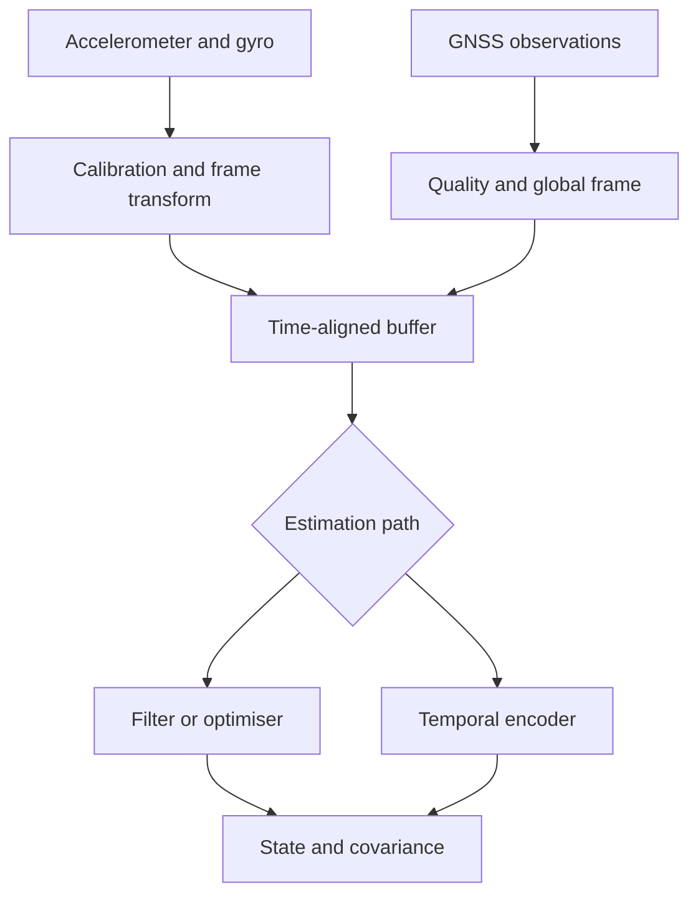

An IMU measures acceleration and angular velocity in its local sensor frame. GNSS provides global-position and timing observations at a different rate and with different failure modes. Neither stream alone is a complete vehicle state.

This domain is a strong example of hybrid engineering: coordinate transforms, calibration, and estimation remain fundamental, while learned models can estimate biases, motion features, uncertainty, or correction terms.



## What makes the data difficult

### Bias and noise

Small gyro and accelerometer biases accumulate through integration. Orientation error can project gravity into horizontal acceleration, creating large position drift.

### Coordinate frames

Measurements may be expressed in sensor, body, local navigation, Earth-fixed, or map frames. Every transform needs an explicit convention, timestamp, and calibration version.

### Different rates and availability

IMU is high-rate and local. GNSS is lower-rate, global, and may degrade through blockage, reflection, atmospheric effects, or poor geometry.

### Observability

Some states cannot be inferred reliably from a short segment or a single sensor. The estimator must represent uncertainty rather than invent confidence.

## Model families

| Goal | Useful approach |
|---|---|
| State estimation with known dynamics | Kalman-family filter or factor-graph optimisation |
| Local temporal feature extraction | 1D CNN or temporal convolutional network |
| Sequential bias or correction estimate | GRU, LSTM, or state-space model |
| Long-context relationship modelling | Transformer or selective SSM |
| Per-sample quality or covariance estimate | Small MLP or temporal head |
| Physically consistent learning | Hybrid model with constrained outputs |

Learned components should complement known geometry and dynamics when those priors are trustworthy.

## A temporal IMU encoder

```python
import torch
import torch.nn as nn


class ImuEncoder(nn.Module):
    def __init__(self, hidden: int = 96):
        super().__init__()
        self.local = nn.Sequential(
            nn.Conv1d(6, hidden, kernel_size=5, padding=2),
            nn.SiLU(),
            nn.Conv1d(hidden, hidden, kernel_size=3, padding=1),
            nn.SiLU(),
        )
        self.memory = nn.GRU(hidden, hidden, batch_first=True)
        self.quality = nn.Linear(hidden, 1)

    def forward(self, imu: torch.Tensor):
        # imu: [batch, time, 6] = acceleration + angular velocity
        x = self.local(imu.transpose(1, 2)).transpose(1, 2)
        sequence, state = self.memory(x)
        return {
            "features": sequence,
            "state": state[-1],
            "quality_logit": self.quality(sequence[:, -1]),
        }
```

This is an educational encoder, not a navigation solution. Real use requires units, axes, gravity treatment, calibration, missing samples, timestamps, and physically meaningful targets.

## GNSS as more than latitude and longitude

Useful GNSS input may include:

- position and velocity;
- time and timestamp quality;
- covariance or accuracy estimates;
- satellite count and geometry indicators;
- fix type and correction status;
- carrier or pseudorange information when available.

A model should not treat all fixes equally. Quality metadata can be as important as the nominal position.

## Hybrid learning patterns

- Predict IMU bias or scale-factor correction.
- Estimate measurement covariance for a filter.
- Detect degraded or inconsistent observations.
- Learn motion features used by a classical estimator.
- Predict a residual correction rather than absolute pose.
- Use a differentiable estimator during training while preserving explicit state at runtime.

## How to select

Prefer the simplest model that addresses a demonstrated weakness. Evaluate:

- long-duration drift, not only short-window error;
- stationary, constant-velocity, turning, and high-dynamic motion;
- GNSS outage and recovery;
- time offset and dropped-sample sensitivity;
- uncertainty calibration;
- coordinate-frame invariance and unit correctness;
- state reset, warm start, and fault containment.

For navigation, numerical accuracy without trustworthy uncertainty is incomplete. The output contract should communicate both the estimate and its quality.
