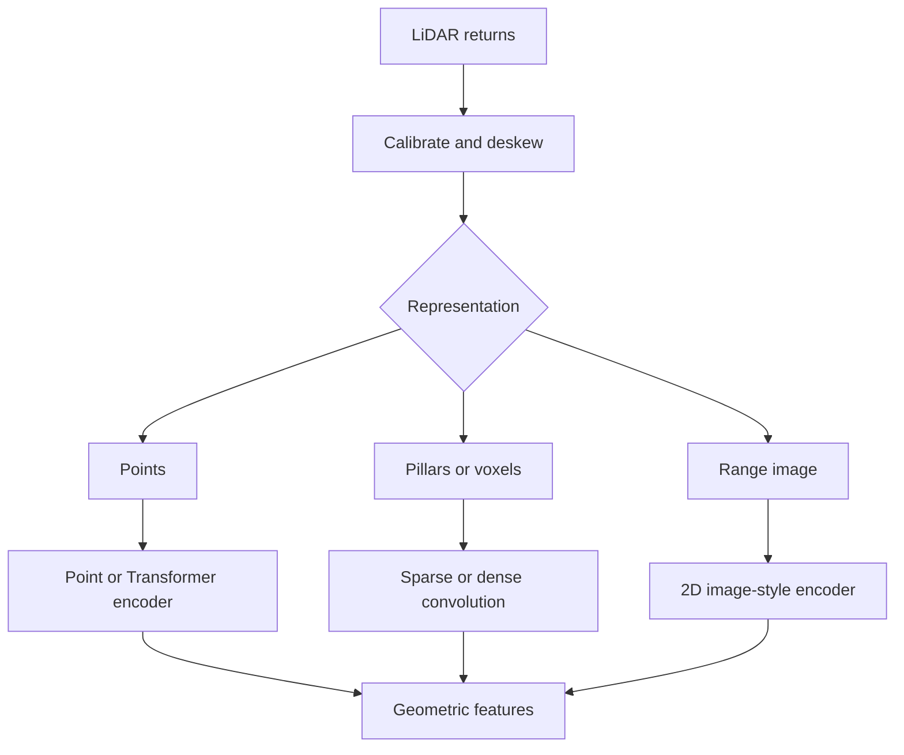

LiDAR provides geometric samples of the environment. A return may contain 3D position, intensity, ring or channel identity, timestamp, and quality information. Unlike an image, the data is irregular: point density varies with distance, reflectivity, occlusion, scan pattern, and motion.

Encoder choice depends heavily on how this unordered point set is represented.



## Representation families

### Raw-point encoders

PointNet-style encoders process individual points and aggregate them with permutation-invariant operations. Hierarchical point models build local neighbourhoods. They preserve point precision but neighbourhood search and irregular memory access may be costly.

### Pillars

The ground plane is divided into vertical columns. Points within each pillar are encoded and scattered into a 2D pseudo-image. Standard 2D backbones can then process the result efficiently. Vertical detail is compressed early.

### Voxels

Space is divided into 3D cells. Dense voxel tensors are simple but mostly empty. Sparse convolution computes only at occupied locations, preserving three-dimensional structure with better efficiency.

### Range view

Points are projected into a grid using sensor azimuth and elevation. This produces an image-like representation suitable for 2D CNNs. Projection is efficient, but neighbouring pixels in range view are not always neighbours in Cartesian space.

### Point or voxel Transformers

Attention models relationships between points, voxels, or local groups. They can capture flexible context but require careful sparsity, neighbourhood, and memory design.

## Selection matrix

| Need | Representation to investigate |
|---|---|
| Efficient 2D processing | Pillar or range view |
| Preserve full 3D occupancy | Sparse voxels |
| Preserve individual point geometry | Point hierarchy |
| Flexible long-range relationships | Local or sparse attention |
| Easy BEV interface | Pillar or voxel-derived BEV features |

No representation is lossless and inexpensive. The decision should follow output resolution, target range, vertical structure, point density, and backend support.

## Simple pillar feature construction

```python
import torch


def pillar_indices(points: torch.Tensor, x_min: float, y_min: float,
                   cell_x: float, cell_y: float) -> torch.Tensor:
    """points shape: [N, 4] containing x, y, z, intensity."""
    px = torch.floor((points[:, 0] - x_min) / cell_x).long()
    py = torch.floor((points[:, 1] - y_min) / cell_y).long()
    return torch.stack([py, px], dim=-1)


class PointFeatureEncoder(torch.nn.Module):
    def __init__(self, out_dim: int = 64):
        super().__init__()
        self.mlp = torch.nn.Sequential(
            torch.nn.Linear(7, out_dim),
            torch.nn.ReLU(),
            torch.nn.Linear(out_dim, out_dim),
        )

    def forward(self, points, pillar_centres):
        relative_xy = points[:, :2] - pillar_centres
        features = torch.cat([points, relative_xy, points[:, 2:3]], dim=-1)
        return self.mlp(features)
```

This only illustrates feature construction. A complete implementation must group points, cap or mask variable counts, aggregate per pillar, scatter deterministically, and preserve calibration and timing metadata.

## Motion compensation matters

A rotating scan is not captured at one instant. If the platform or other objects move during acquisition, points belong to different poses. Deskewing uses timestamps and motion estimates to transform returns into a consistent reference time.

An encoder cannot reliably learn away arbitrary coordinate inconsistency. Geometry and time alignment remain part of the input contract.

## How to evaluate

- accuracy as a function of distance and point density;
- small, thin, reflective, and partially occluded structures;
- vertical resolution and ground separation;
- weather and return-quality degradation;
- sparse-kernel support and fallback behaviour;
- voxelisation or neighbourhood-search cost;
- peak memory at high point counts;
- coordinate transforms, deskew, and preprocessing latency.

The fastest backbone may not produce the fastest pipeline if representation construction dominates runtime.
