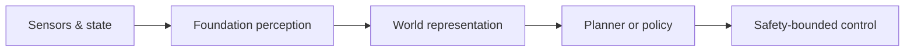
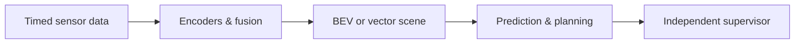
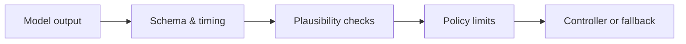

The most popular model is rarely the best model for a physical system. A useful choice must match the **task, sensor contract, latency budget, target hardware, data, licence, and safety argument**.

This atlas therefore does not rank models by a volatile download counter. It maps widely adopted and high-signal open models to the jobs they are genuinely useful for in autonomous vehicles and advanced humanoid robots.

> No Hugging Face checkpoint is an L4 driving system or a production humanoid brain. Treat every model as a candidate component inside a measured, monitored, and bounded system.



## 1. Reusable perception foundations

These models are useful across both domains. Their strongest role is usually as a backbone, annotation assistant, proposal generator, or fine-tuning starting point—not as the final decision-maker.

| Model | Best use | Vehicle example | Humanoid example | Important caveat |
|---|---|---|---|---|
| [DINOv2](https://huggingface.co/facebook/dinov2-base) | General visual features | Reusable encoder for downstream perception | Object, place, and scene embeddings | A backbone still needs a task-specific head and validation |
| [DINOv3](https://huggingface.co/facebook/dinov3-vitb16-pretrain-lvd1689m) | Strong dense visual features | Segmentation, depth, tracking, and retrieval features | Fine-grained object and workspace features | Gated access and a dedicated DINOv3 licence; benchmark its real deployment cost |
| [RT-DETRv2](https://huggingface.co/PekingU/rtdetr_v2_r50vd) | Real-time end-to-end detection | Fast detector baseline and data triage | Detect tools, people, and manipulated objects | Public checkpoints are commonly COCO-trained, not autonomy-qualified |
| [Grounding DINO](https://huggingface.co/IDEA-Research/grounding-dino-base) | Open-vocabulary detection | Mine unusual objects from recorded data | Find an object named in a task instruction | Text-grounded proposals can be unstable; do not use as a primary safety detector |
| [SAM 2](https://github.com/facebookresearch/sam2) | Promptable image/video masks | Accelerate annotation and track regions through clips | Isolate a grasp target or workspace region | Excellent tooling model; prompt quality and temporal failure modes still matter |
| [Depth Anything V2 Small](https://huggingface.co/depth-anything/Depth-Anything-V2-Small-hf) | Lightweight monocular relative depth | Pre-labelling and geometric cues | Indoor obstacle and reachability cues | Relative depth is not calibrated metric distance |
| [Depth Anything 3 Small](https://huggingface.co/depth-anything/DA3-SMALL) | Multi-view depth and camera pose | Offline geometry bootstrap and reconstruction | Multi-view workspace geometry | Newer research model; validate temporal consistency and runtime behaviour |

### A useful division of labour

- **DINOv2/DINOv3** answer: “What reusable visual representation should I start from?”
- **RT-DETRv2** answers: “Where are the known object classes?”
- **Grounding DINO** answers: “Where might the object described by this text be?”
- **SAM 2** answers: “Which pixels belong to the prompted object over time?”
- **Depth Anything** answers: “What scene geometry can be inferred from the images?”

Combining them can create a powerful data engine. It does not automatically create a real-time perception stack: each extra model adds memory, latency, synchronisation, and correlated failure modes.

## 2. Models that matter for autonomous driving research

Driving-specific repositories often provide code and checkpoints outside the standard Transformers API. They are better understood as **architectural references and experiment platforms** than as drop-in Hub pipelines.

| Model family | What it contributes | Good use case | Selection signal |
|---|---|---|---|
| [BEVFormer](https://github.com/fundamentalvision/BEVFormer) | Temporal camera features expressed in bird's-eye view | Camera-only 3D perception and semantic map experiments | Choose when temporal, query-based camera-to-BEV reasoning is the question |
| [BEVFusion](https://github.com/mit-han-lab/bevfusion) | Camera and LiDAR features unified in BEV | Multi-sensor 3D detection and map segmentation research | Choose when the value of cross-modal fusion must be measured |
| [MapTR](https://github.com/hustvl/MapTR) | Online vectorised map construction | Lanes, boundaries, and map elements as structured vectors | Choose when planning needs vector geometry rather than only raster features |
| [UniAD](https://github.com/OpenDriveLab/UniAD) | Hierarchical perception, prediction, and planning | Study task interaction in a planning-oriented stack | Choose to investigate unified optimisation—not as evidence of L4 readiness |
| [VAD](https://github.com/hustvl/VAD) | Vectorised scene representation and planning | Efficient end-to-end planning experiments | Choose when a compact vector scene and planning interface are central |
| [DiffusionDrive](https://github.com/hustvl/DiffusionDrive) | Truncated diffusion for multimodal trajectories | Research on diverse, real-time end-to-end trajectory prediction | Choose when multiple plausible futures matter and runtime is measured explicitly |



### What each family teaches

**BEVFormer and BEVFusion** are mainly about representation: how observations become a shared spatial feature space. **MapTR** changes the output contract by representing map elements as vectors. **UniAD and VAD** move further toward planning-oriented joint learning. **DiffusionDrive** explores multimodal trajectory generation under a reduced denoising budget.

For an L4 programme, benchmark these ideas within the intended operational design domain and retain independent checks around the learned path. Open-loop benchmark scores alone do not establish closed-loop safety, robustness, controllability, or fault tolerance.

## 3. Models that matter for humanoid manipulation

Robot policies differ mainly in how much prior knowledge they carry, how much task-specific demonstration data they need, and how expensive they are to adapt and run.

| Model | Policy style | Best fit | Why choose it | Watch for |
|---|---|---|---|---|
| [ACT](https://github.com/tonyzhaozh/act) / [LeRobot checkpoint](https://huggingface.co/lerobot/act_aloha_sim_transfer_cube_human) | Action-chunking transformer | Narrow, repeatable bimanual tasks | Compact baseline; learns temporally coherent action chunks from demonstrations | Limited open-world generalisation; embodiment-specific tuning |
| [Diffusion Policy](https://github.com/real-stanford/diffusion_policy) | Conditional diffusion policy | Precise continuous manipulation with multiple valid motions | Strong task policy when high-quality demonstrations are available | Iterative denoising cost and task-specific data pipeline |
| [Octo](https://octo-models.github.io/) | Generalist transformer diffusion policy | Adapting one policy family across observations, actions, and robots | Flexible interfaces; 27M and 93M published variants | Older JAX-centric research stack; still requires embodiment adaptation |
| [SmolVLA](https://huggingface.co/lerobot/smolvla_base) | Compact flow-matching VLA | Affordable VLA experiments and consumer-class hardware | Trainable on one GPU; native LeRobot workflow | Base model must be fine-tuned; compact does not mean safe or real-time everywhere |
| [OpenVLA](https://openvla.github.io/) | 7B token-action VLA | Diverse language-conditioned manipulation | Mature open research release and parameter-efficient adaptation | Substantial compute; token actions and latency must match the controller contract |
| [π₀.₅ in LeRobot](https://huggingface.co/lerobot/pi05_base) | Flow-matching VLA | Long-horizon, language-conditioned robot research | Open-world generalisation focus and continuous action chunks | LeRobot release does not include every component described in the original work |
| [GR00T N1.7](https://huggingface.co/nvidia/GR00T-N1.7-3B) | Cross-embodiment humanoid VLA | Humanoid manipulation and whole-body skill adaptation | Humanoid-focused data and vision-language-proprioception conditioning | Large platform commitment; verify licence, hardware, data, and control compatibility |


### A practical humanoid selection rule

1. Start with **ACT** when the task is narrow and demonstration quality is high.
2. Try **Diffusion Policy** when the same scene admits several smooth, valid actions.
3. Use **SmolVLA** when language conditioning is useful but compute is limited.
4. Evaluate **OpenVLA or π₀.₅** when task diversity and language generalisation justify more compute.
5. Investigate **GR00T** when the problem is explicitly humanoid and cross-embodiment adaptation is valuable.

A larger VLA can reason about a task while still producing unsafe, jerky, unreachable, or mistimed actions. Keep collision checking, joint limits, balance constraints, contact handling, emergency stop, and low-level control outside the model's unquestioned authority.

## 4. Choose by use case, not by fame

| Need | Strong first candidate | Why it is a sensible starting point |
|---|---|---|
| General visual backbone | DINOv2; evaluate DINOv3 next | Broad features with a clear path to task-specific heads |
| Fast known-class detection | RT-DETRv2 | Clean end-to-end detector baseline with Transformers support |
| Find novel objects from words | Grounding DINO + SAM 2 | Text locates the object; segmentation refines its pixels |
| Lightweight monocular geometry | Depth Anything V2 Small | Easy relative-depth baseline with a small Apache-2.0 checkpoint |
| Multi-view geometry bootstrap | Depth Anything 3 Small | Adds multi-view depth and pose estimation |
| Camera-only temporal BEV | BEVFormer | Established research reference for temporal camera-to-BEV reasoning |
| Camera–LiDAR fusion | BEVFusion | Shared BEV makes cross-modal comparison explicit |
| Online vector map | MapTR | Structured map output is directly useful to planning experiments |
| Unified driving research | UniAD or VAD | Exposes interactions among perception, prediction, and planning |
| Narrow bimanual skill | ACT | Simple, strong baseline before introducing a foundation policy |
| Multimodal manipulation trajectories | Diffusion Policy | Models multiple valid continuous action sequences |
| Resource-conscious language policy | SmolVLA | Smaller adaptation and deployment starting point |
| Generalist humanoid research | GR00T N1.7 | Explicitly designed around humanoid and cross-embodiment skills |

## 5. A small Hugging Face experiment

The Hub is especially useful for quickly testing model **interfaces**. This example produces detections and relative depth from one image; it is a learning experiment, not a control pipeline.

```python
from pathlib import Path
from PIL import Image
from transformers import pipeline

image = Image.open(Path("sample_scene.jpg")).convert("RGB")

detector = pipeline(
    "object-detection",
    model="PekingU/rtdetr_v2_r50vd",
)
depth_estimator = pipeline(
    "depth-estimation",
    model="depth-anything/Depth-Anything-V2-Small-hf",
)

detections = detector(image, threshold=0.45)
relative_depth = depth_estimator(image)["depth"]

print(detections[:3])
relative_depth.save("relative_depth.png")
```

Before this can inform a physical system, define the real contract:

```python
from dataclasses import dataclass

@dataclass(frozen=True)
class ModelContract:
    task: str
    input_clock: str
    output_frame: str
    maximum_age_ms: int
    confidence_semantics: str
    out_of_distribution_action: str
    fallback: str
```

The contract is often more important than the model name. It makes timestamping, coordinate frames, stale data, uncertainty, and fallback behaviour visible to the rest of the system.

## 6. Evaluate before adopting

Score every candidate on the same evidence sheet:

| Dimension | Questions to answer |
|---|---|
| Task and domain | Does the training domain resemble the intended environment, objects, weather, lighting, motion, and embodiment? |
| Output contract | Are coordinates, units, temporal horizon, action space, and confidence semantics usable? |
| Licence and access | Are weights, code, dataset terms, redistribution, and commercial use compatible with the programme? |
| Runtime | What are cold start, median, tail latency, memory peak, power, and sustained throughput on target hardware? |
| Exportability | Do required operators survive export, compilation, quantisation, and the intended runtime backend? |
| Temporal behaviour | Does the output flicker, drift, lag, or become unstable after occlusion and fast motion? |
| Robustness | What happens under sensor degradation, unusual objects, domain shift, missing views, and contradictory inputs? |
| Adaptation cost | How much representative data, annotation, compute, and retesting are required? |
| Safety integration | Can outputs be bounded, checked, rejected, monitored, and replaced by a defined fallback? |



## 7. Recommended learning path

1. **Perception sandbox:** run RT-DETRv2 and Depth Anything V2 Small on recorded, non-sensitive video; inspect errors rather than only good examples.
2. **Data engine:** use Grounding DINO and SAM 2 to accelerate annotation, then train a smaller domain-specific model.
3. **Spatial reasoning:** compare DINO features, depth, and BEV/vector representations on the same held-out sequences.
4. **Driving research:** study BEVFormer/BEVFusion first, then MapTR, UniAD, VAD, or DiffusionDrive in autonomous-vehicle software-in-the-loop simulation.
5. **Robot learning:** establish ACT or Diffusion Policy as a narrow-task baseline before spending compute on SmolVLA, OpenVLA, π₀.₅, or GR00T.
6. **Deployment:** export, compile, profile, and stress the selected component using the workflow in [PyTorch Export & Compile](/articles/pytorch-export-compile/).
7. **Assurance:** keep runtime monitors, safety limits, fallback behaviour, and change control explicit; model popularity is never safety evidence.

## Closing perspective

The strongest physical-AI architecture is usually not one enormous model. It is a deliberate composition:

- a reusable backbone where transfer learning helps,
- specialised heads where geometry and timing matter,
- a world representation that matches the planner or policy,
- a task model adapted to the target domain or embodiment,
- and independent control and safety mechanisms that can reject the learned output.

Use Hugging Face and official research repositories to shorten exploration. Promote a model only when its measured behaviour—not its reputation—fits the complete engineering contract.
