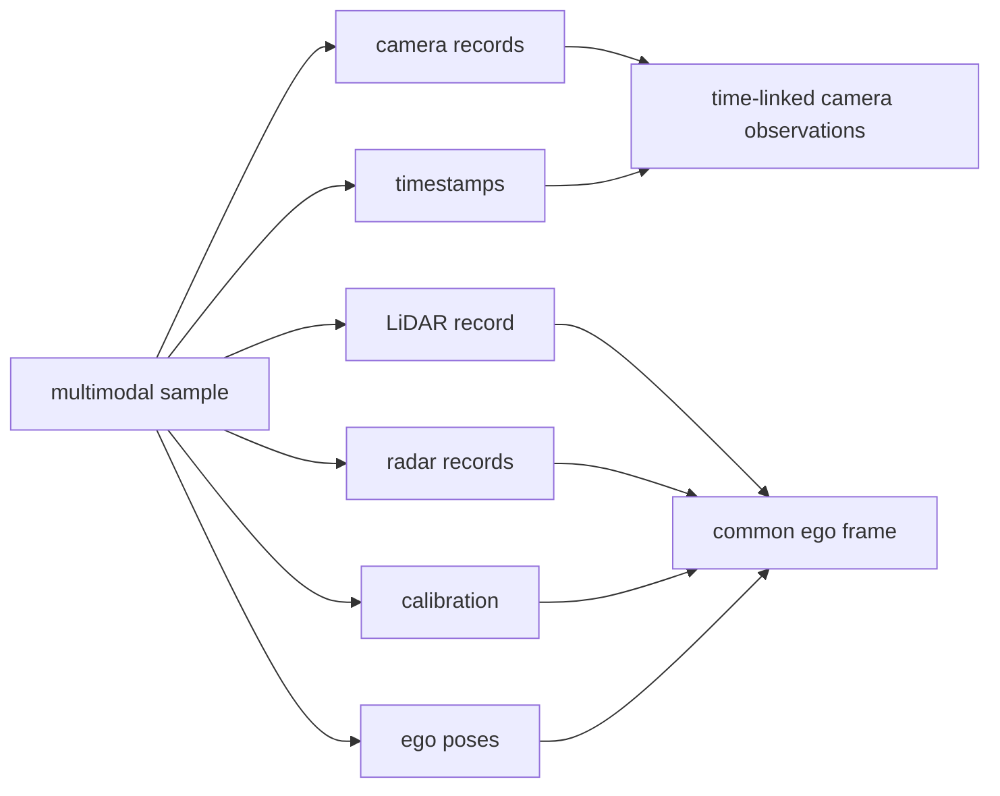

Building an autonomy stack becomes much easier to reason about when it is decomposed into explicit representation contracts. Rather than jumping directly from camera images to bounding boxes or steering commands, this series develops the pipeline one layer at a time and asks a precise question at every stage:

> **What information do we have now, what representation is it in, what assumptions does the next stage require, and how can we verify the handoff?**

nuScenes is used as a concrete multimodal data source because it provides cameras, LiDAR, radar, calibration, ego poses, timestamps, maps and annotations. The principles are broader than the dataset itself and apply to real vehicle perception architectures.

The accompanying implementation is available in [`abhishekkumardwivedi/nusenses_autonomy_pipeline`](https://github.com/abhishekkumardwivedi/nusenses_autonomy_pipeline), but the articles focus on the **technical architecture of autonomy**, not on a particular compute host or visualization tool.

## Pipeline roadmap

| Stage | Technical question | Main representation | Status |
|---|---|---|---|
| 1 | How do we inspect a live perception pipeline? | Real-time visualization transport | Complete |
| 2 | Which measurement came from which sensor, at what time and in which frame? | Sensor/time/geometry contract | **Complete** |
| 3 | How do RGB pixels become learned visual features? | `[B,N,C,Hf,Wf]` camera feature tensor | **Article available / implementation next** |
| 4 | How do perspective camera features become metric vehicle-centric space? | Camera-derived BEV | Planned |
| 5 | How should LiDAR and radar be encoded for learning? | Learned point/range features | Planned |
| 6 | How do heterogeneous modalities become one spatial representation? | Multi-sensor BEV | Planned |
| 7 | How is motion and history represented? | Ego-motion-aligned temporal BEV | Planned |
| 8 | How is the scene interpreted? | Objects, occupancy, semantics and tracks | Planned |
| 9 | How are future motions represented? | Trajectories and uncertainty | Planned |
| 10 | What is the local machine-readable world state? | Dynamic world representation | Planned |
| 11 | What does planning actually need from perception? | Candidate trajectories, risk and collision context | Planned |

The exact boundaries may evolve, but the ordering reflects an important architectural dependency: **time and geometry must be trustworthy before learned spatial fusion can be trustworthy.**

## Stage 1 — observability before autonomy

The first stage establishes a way to observe a changing pipeline continuously rather than inspecting disconnected output images. This is intentionally infrastructure-light from an autonomy perspective: its purpose is to make later stages inspectable without mixing visualization failures with perception failures.

The conceptual lesson is that observability should be designed into the system from the beginning. Sensor timestamps, tensor shapes, frame identities, latency and intermediate representations become far easier to debug when they can be inspected as the scene advances.

## Stage 2 — sensor, time and geometry truth

Stage 2 contains no neural inference. It establishes the physical measurement contract.



The detailed article is [Stage 2: Multi-Sensor Playback and Time Synchronization](/articles/nuscenes-pipeline-stage2/).

The important output is not the visualization itself. It is the set of contracts later perception depends on:

```text
sensor identity
capture timestamp
reference timestamp / dt
calibrated intrinsics
calibrated extrinsics
capture-time ego pose
coordinate convention
sample association
```

A neural network can often produce visually plausible results even when one of these is wrong. That is why the series treats them as a separate stage.

## Stage 3 — learned camera representation

Stage 3 is the first learned stage. Six RGB observations are converted into feature tensors using a shared camera backbone.


The detailed article is [Stage 3: From RGB Pixels to Learned Camera Features](/articles/nuscenes-pipeline-stage3/).

The essential lesson is that a camera encoder **does not yet produce objects or BEV**. It changes representation:

```text
pixel-space RGB
    -> learned image-space feature vectors
```

For a 256×448 input and a stride-32 ResNet-50 C5 output, each camera becomes an 8×14 grid of learned descriptors. A 1×1 projection reduces the 2048 backbone channels to a 256-channel interface suitable for later spatial processing.

Crucially, the tensor must retain its physical lineage:

```text
feature tensor
+ camera identity
+ capture timestamp
+ dt
+ resized intrinsics
+ extrinsics
+ preprocessing transform
```

The camera batch is a compute structure, not proof that the images were captured simultaneously.

## Stage 4 — perspective features to metric BEV

The next representation change is more profound. Stage 3 features still live on the camera image plane. A feature cell can be identified by `(u,v)`, but not yet by vehicle-centric metric coordinates such as `(x,y)` in metres.

Stage 4 will therefore introduce the camera model:

$$
P_{camera}=dK^{-1}p
$$

followed by the camera-to-ego transform:

$$
P_{ego}=T_{ego\leftarrow camera}P_{camera}
$$

The central challenge is depth: monocular image features define rays, not unique 3D points. Different BEV architectures solve this with explicit depth distributions, geometric lifting, learned queries, deformable attention or hybrid approaches.

## Stages 5–6 — learned point/range sensors and fusion

LiDAR and radar should not simply be appended as more channels to an image tensor. Their native sampling structures are different:

```text
Camera -> dense perspective raster
LiDAR  -> sparse 3D point set
Radar  -> sparse range / Doppler measurements
```

Each modality needs an encoder appropriate to its measurement physics. Stage 6 then fuses the representations in a common spatial frame, where correspondence becomes much more meaningful.

## Stage 7 — time becomes a first-class representation

A single-frame BEV is still an instantaneous estimate. Driving requires memory.

Temporal perception must distinguish:

```text
ego motion
object motion
measurement latency
occlusion
appearance / disappearance
persistent static structure
```

Historical BEVs therefore need ego-motion alignment before temporal fusion. The system must also avoid treating stale information as current simply because it remains in memory.

## Stage 8 — scene interpretation

Only after spatial and temporal representations are stable do higher-level tasks become easy to place architecturally:

```text
3D detection
semantic occupancy
free space
multi-object tracking
traffic-control understanding
```

These are different readouts of a richer shared scene representation rather than isolated tricks applied directly to raw sensors.

## Stage 9 — prediction

Tracking estimates what agents are doing now. Prediction estimates what they may do next.

The output should not be thought of as one deterministic future. Useful autonomy prediction represents multimodality and uncertainty: an agent approaching a junction may continue, turn, yield or stop.

## Stage 10 — local world state

A world representation organizes perception and prediction into a machine-readable state suitable for planning:

```text
static map context
+ dynamic agents
+ occupancy / free space
+ ego state
+ traffic controls
+ history
+ predicted futures
+ uncertainty
```

Whether this is called a world model depends on how much dynamics are learned. The architectural point is that planning needs a coherent state, not a collection of unrelated detector outputs.

## Stage 11 — planner-facing contract

The perception stack eventually has to answer planning questions:

```text
Where can I drive?
What occupies that space?
What is moving toward it?
What may happen next?
How uncertain is that estimate?
Which candidate trajectory is safe and feasible?
```

This is where the entire staged construction becomes useful. A planner-facing interface is only as trustworthy as the sensor, time, geometry, representation and uncertainty contracts beneath it.

## Series articles

1. **Stage 1 — Observability / live transport:** implementation baseline.
2. [**Stage 2 — Multi-Sensor Playback and Time Synchronization**](/articles/nuscenes-pipeline-stage2/)
3. [**Stage 3 — From RGB Pixels to Learned Camera Features**](/articles/nuscenes-pipeline-stage3/)
4. **Stage 4 — Camera Features to BEV:** planned.
5. **Stage 5 — Learned LiDAR and Radar Encoding:** planned.
6. **Stage 6 — Multi-Sensor BEV Fusion:** planned.
7. **Stage 7 — Temporal BEV:** planned.
8. **Stage 8 — Detection, Occupancy and Tracking:** planned.
9. **Stage 9 — Prediction:** planned.
10. **Stage 10 — Dynamic World State:** planned.
11. **Stage 11 — Planner Inputs:** planned.

This page remains the architectural index. Each detailed stage article should make one representation boundary conceptually clear before the next one is introduced.
