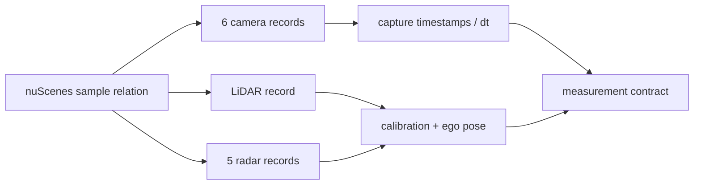
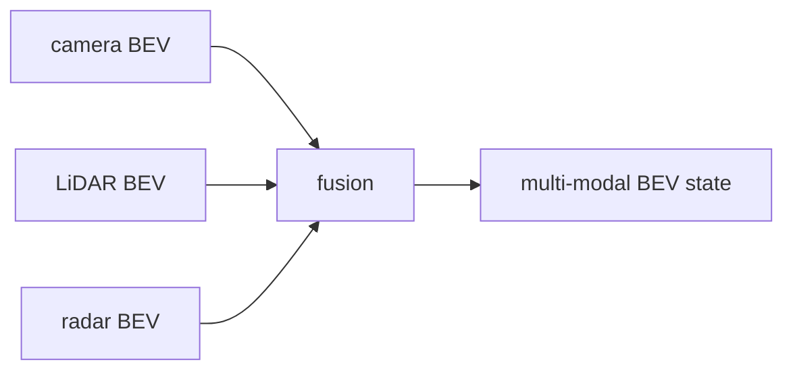

This series builds an autonomy perception/world-state pipeline in stages using nuScenes as the common recorded sensor source. The purpose of the staging is architectural, not procedural:

> **each stage introduces one stronger representation of the world, while preserving the time, geometry and provenance established by the stages before it.**

The implementation repository is [`abhishekkumardwivedi/nusenses_autonomy_pipeline`](https://github.com/abhishekkumardwivedi/nusenses_autonomy_pipeline). The visualization transport is incidental to the architecture; the important artifacts are the sensor records, transforms, tensor contracts, timing measurements and state transitions that can be inspected at each boundary.

## Pipeline roadmap

| Stage | Question being answered | Main contract | Status |
|---|---|---|---|
| 1 | Can evolving runtime output be inspected continuously? | live visualization transport | Complete |
| 2 | Which measurement happened where and when? | sensor identity + timestamp + calibration + ego-frame geometry | **Complete** |
| 3 | How do RGB pixels become reusable learned evidence? | `[B,N,C,Hf,Wf]` camera feature tensor + sensor lineage | Next / implementation stage |
| 4 | How do camera features enter metric space? | camera-to-BEV feature grid + visibility/depth semantics | Planned |
| 5 | How are LiDAR/radar measurements learned without losing their physics? | point/voxel/radar feature contracts | Planned |
| 6 | How is complementary evidence reconciled? | common multi-modal BEV + quality/provenance | Planned |
| 7 | How does perception become state over time? | ego-aligned temporal BEV/memory | Planned |
| 8 | How is scene state exposed explicitly? | objects + occupancy + tracking + map elements | Planned |
| 9 | How are possible futures represented? | multimodal trajectories / future occupancy + probabilities | Planned |
| 10 | What is the local world belief? | current world state + uncertainty + dynamics interface | Planned |
| 11 | What does planning actually consume? | candidate trajectories, risk/constraint evidence, validity horizon | Planned |

Stage boundaries may evolve as implementation reveals better interfaces. The principle that should not change is **one inspectable contract per stage**.

## Stage 1 — separate transport from autonomy logic

The first stage used a synthetic moving frame only to prove that a continuously changing in-memory output could be observed without writing image sequences to disk.

```text
runtime ndarray
   -> video frame
   -> live transport
   -> interactive viewer
```

This deliberately contains no autonomy concept. Its value is isolation: later sensor/model errors are not confused with a broken visualization path.

## Stage 2 — measurement truth: sensor, time and geometry

[Stage 2: Sensor Time, Geometry and Measurement Provenance](/articles/nuscenes-pipeline-stage2/) replaces the synthetic source with real recorded nuScenes measurements while still adding no learned inference.



The stage proves:

- which exact sensor record belongs to the selected sample;
- how sensor capture times differ;
- what each timestamp means;
- how calibrated sensor frames relate to ego;
- how capture-time ego pose transports point measurements into a common reference frame;
- the difference between ego-motion compensation and dynamic-object motion;
- the difference between a geometric sensor BEV and a learned BEV.

The output is not a detector. It is a reliable **measurement contract**.

Conceptually:

```text
Measurement {
    sensor_id
    capture_time
    payload
    calibration
    ego_pose_at_capture
    reference_time
    quality / validity
}
```

Every later learned tensor should retain this lineage.

## Stage 3 — learned camera representation

[Stage 3: From RGB Pixels to Learned Camera Features](/articles/nuscenes-pipeline-stage3/) is the first learned stage.

The transformation is intentionally narrow:

```text
six RGB cameras
    [B,N,3,H,W]
        ↓ preprocessing
shared visual encoder
        ↓
[B,N,C,Hf,Wf]
```

For the current reference configuration:

```text
input  : [1,6,3,256,448]
output : [1,6,256,8,14]
```

The important learning objective is not object detection. It is understanding exactly what the encoder boundary means:

- preprocessing is part of the numerical and geometric contract;
- a shared encoder reuses weights across camera views;
- deeper features trade spatial resolution for contextual representation;
- channel projection controls the downstream interface width;
- batching six cameras does not make their physical capture times equal;
- feature visualization is diagnostic, not semantic classification;
- inference should run on new measurement sets, not UI refresh cycles.

The feature record should remain something like:

```text
CameraFeature {
    camera_id
    capture_time
    dt_to_reference
    effective_intrinsics
    extrinsics
    image_transform
    feature_stride
    feature_tensor
    encoder/preprocess version
}
```

That is the input to Stage 4.

## Stage 4 — camera feature -> metric BEV

Stage 4 introduces the central monocular/multi-camera ambiguity: an image feature location has a ray, not a metric depth.

For pixel/feature location `p=[u,v,1]^T`:

$$P_{cam}=dK^{-1}p$$

and:

$$P_{ego}=T_{ego\leftarrow cam}P_{cam}$$

The unknown is `d`.

The implementation will make one camera-to-BEV mechanism explicit — for example depth lifting/frustum pooling — so that we can inspect:

```text
depth distribution
camera ray geometry
frustum samples
camera -> ego transform
BEV cell assignment
visibility / valid contribution
```

The output becomes a metric camera feature grid rather than six independent perspective feature maps.

This stage should be verified geometrically before adding other modalities.

## Stage 5 — LiDAR and radar learned representations

LiDAR and radar should not simply be converted to generic XYZ tensors.

LiDAR needs a representation choice such as:

```text
points -> pillars / sparse voxels / range view -> learned feature
```

while preserving:

```text
point/sweep time
intensity/quality
deskew/reference time
metric geometry
```

Radar needs to preserve what makes it distinctive:

```text
range / angle
radial velocity
RCS/SNR or quality
sensor identity
capture age
```

The goal is to make the modality encoders produce features compatible with a common spatial fusion stage **without erasing modality-specific evidence**.

## Stage 6 — multi-sensor BEV fusion

Once camera, LiDAR and radar features share a metric coordinate system, fusion becomes evidence reconciliation rather than coordinate conversion.



The implementation should expose more than concatenation. Important questions are:

- which cells were observed by which modality;
- how stale each contribution is;
- how conflicting evidence is handled;
- how missing modalities are represented;
- whether radar velocity survives fusion;
- whether unknown space is distinguishable from free space.

The common grid standardizes geometry, not measurement semantics.

## Stage 7 — temporal BEV

Past BEV features must be transported into the current ego frame:

$$T_{ego_t\leftarrow ego_{t-1}}=T^{-1}_{world\leftarrow ego_t}T_{world\leftarrow ego_{t-1}}$$

That aligns static world structure. Dynamic objects retain residual motion.

The temporal stage will therefore make visible:

```text
reference time
pose delta
warped previous state
current evidence
age / visibility
memory update
reset conditions
```

This is the point at which perception stops being a sequence of independent frames and becomes persistent **state**.

## Stage 8 — scene interpretation

A useful world representation normally needs both entity and spatial forms.

### Objects/tracks

```text
position
size
heading
velocity
class / existence probability
identity / history
uncertainty
```

### Occupancy/semantics

```text
occupied
free
unknown / unobserved
semantic category
possibly height / 3D voxels
```

These are not redundant. Boxes are compact for interaction/prediction; occupancy handles irregular or unclassified obstacles.

Tracking adds state estimation and data association over time rather than simply drawing persistent IDs.

## Stage 9 — future prediction

Future motion is multimodal.

One agent can plausibly:

```text
go straight
turn
slow
stop
```

A useful output is therefore:

$$\{(\tau_k,p_k)\}_{k=1}^{K}$$

or future occupancy distributions rather than one averaged trajectory.

The stage should make probability calibration, map context, interaction context and prediction horizon explicit.

## Stage 10 — local world state and dynamics

At this point the stack can be organized into a belief state:

```text
WorldState {
    reference_time / ego pose
    static occupancy / free / unknown
    dynamic object states
    map/topology context
    visibility / observation age
    latent BEV context
    uncertainty / quality
}
```

A world model adds dynamics:

```text
WorldDynamics(current_state, candidate_ego_action)
    -> possible future states + probabilities
```

This is a stronger definition than calling any temporal feature network a “world model.”

## Stage 11 — planner input contract

Planning should consume a state whose age, frame and uncertainty are explicit.

A useful interface includes:

```text
current world state
future agent/occupancy hypotheses
candidate ego trajectory
collision/risk evidence
road/topology constraints
validity horizon
state generation / health
```

Closed-loop planning/control requires a simulator or physical platform beyond the recorded nuScenes perception dataset, but the **contracts established by the earlier stages remain the same**.

## What nuScenes can and cannot teach

nuScenes is particularly useful for:

- multi-camera perception;
- LiDAR/radar geometry;
- calibrated sensor fusion;
- 3D detection/tracking;
- map context;
- short-horizon prediction research.

It does not provide a closed-loop environment in which the planner's action changes the next observation. That boundary should be explicit when the series eventually moves from world-state construction into active planning/control evaluation.

## Verification philosophy across all stages

Every stage should have four artifacts:

```text
1. INPUT CONTRACT
   shapes, frames, timestamps, validity

2. TRANSFORMATION
   geometry / model / algorithm actually applied

3. INSPECTABLE OUTPUT
   visualization, tensor statistics or state dump

4. INVARIANT / TEST
   a check that can fail when semantics are wrong
```

Examples:

```text
Stage 2: transform/reprojection sanity
Stage 3: exact tensor shapes + feature change across cameras/frames
Stage 4: known 3D projection/alignment checks
Stage 6: missing-modality/conflict tests
Stage 7: ego-warp consistency + state reset
Stage 9: mode coverage/calibration
```

This is the core methodology of the series: **do not add a more intelligent layer until the lower layer's state is understandable and testable.**

## Companion conceptual articles

The staged build is intended to be read with the deeper architecture articles:

- [From Sensor Measurement to Vehicle Motion](/articles/camera-to-driving-decision/)
- [Camera Encoder: ResNet-50 + FPN](/articles/rgb-camera-encoders/)
- [LiDAR Encoders](/articles/lidar-encoders/)
- [Radar Encoders](/articles/radar-encoders/)
- [IMU & GNSS Models](/articles/imu-gnss-models/)
- [BEV Model Selection](/articles/bev-model-selection/)
- [Spatial–Temporal Models](/articles/spatial-temporal-models/)
- [World Models](/articles/world-models/)

The conceptual articles explain the general mechanism. The stage articles then provide one concrete implementation boundary that can be inspected and measured.
