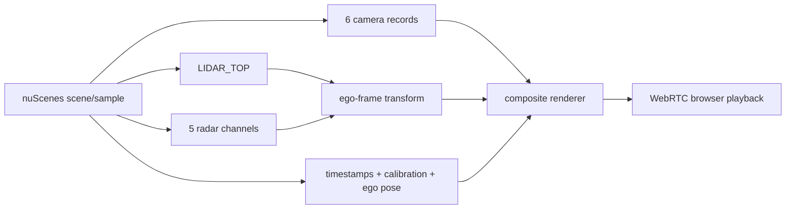

This series builds an autonomy pipeline incrementally using nuScenes and RunPod. The rule is simple: **each stage must have one clear learning objective, one inspectable output, and one verification method before the next layer is added**.

The implementation repository is [`abhishekkumardwivedi/nusenses_autonomy_pipeline`](https://github.com/abhishekkumardwivedi/nusenses_autonomy_pipeline). The browser visualization is streamed from the remote RunPod machine over WebRTC so GPU processing can remain remote while the experiment stays easy to inspect from a normal PC.

## Pipeline roadmap

| Stage | Purpose | Main output | Status |
|---|---|---|---|
| 1 | Establish remote real-time visualization | Synthetic in-memory WebRTC stream | Complete |
| 2 | Establish sensor/time/geometry truth | 6 cameras + LiDAR/radar geometric BEV + timing | **Complete** |
| 3 | Begin learned perception | Camera encoder feature tensors and feature inspection | Next |
| 4 | Lift camera features into space | Camera-to-BEV representation | Planned |
| 5 | Encode point/range sensors | LiDAR and radar learned features | Planned |
| 6 | Fuse modalities | Multi-sensor BEV | Planned |
| 7 | Add time | Ego-motion-aligned temporal BEV memory | Planned |
| 8 | Interpret the scene | 3D detection, semantics/occupancy and tracking | Planned |
| 9 | Predict motion | Agent trajectory prediction and uncertainty | Planned |
| 10 | Build the local world state | Objects + occupancy + map + ego + temporal memory | Planned |
| 11 | Produce planning inputs | Candidate trajectories, risk and collision context | Planned |

The exact stage boundaries may evolve as experiments expose better decompositions. This page will be updated as the implementation advances.

## Stage 1 — streaming substrate

Before using nuScenes, the first milestone was intentionally trivial: generate a moving synthetic frame in Python, turn it into an `av.VideoFrame`, stream it using `aiortc`, and verify smooth reception through the RunPod port-8080 proxy path.

The point was not graphics. It separated **transport problems** from **autonomy problems**. Once WebRTC worked reliably, every later stage could keep the same browser path.

```text
Python frame generator
    -> MediaStreamTrack.recv()
    -> av.VideoFrame
    -> WebRTC
    -> PC browser
```

## Stage 2 — sensor playback, synchronization and geometry

Stage 2 replaces the synthetic generator with real recorded nuScenes sensor records while deliberately adding **no AI**.

The current flow is:



The detailed article is [Stage 2: Multi-Sensor Playback and Time Synchronization](/articles/nuscenes-pipeline-stage2/).

Stage 2 establishes several contracts that later AI stages depend on:

- sample-linked sensor identity rather than folder scanning;
- per-sensor capture timestamps and visible `dt`;
- calibrated extrinsics;
- capture-time ego pose;
- a defined reference ego frame;
- deterministic geometric transforms;
- the distinction between dataset sample rate and WebRTC refresh rate;
- verification that camera/LiDAR/radar all advance as one scene timeline.

## Why the AI starts only at Stage 3

A neural network can produce convincing output even when its inputs are subtly wrong. For multi-sensor autonomy, bugs in timestamp association, extrinsics, handedness, axes, units, or ego-motion compensation are especially dangerous because they may look like model-quality problems.

For that reason, the pipeline is layered as:

```text
transport
  -> data linkage
  -> time
  -> geometry
  -> learned representation
  -> spatial fusion
  -> temporal fusion
  -> scene understanding
  -> prediction
  -> world state
  -> planning inputs
```

Stage 3 is therefore the first learned stage, not the first useful stage.

## Stage 3 — camera encoding

The next milestone will take the six synchronized RGB views and pass them through a shared camera encoder. The first objective is not detection; it is to understand the tensor contract:

```text
6 RGB images
    -> resize / normalize
    -> camera backbone
    -> multi-scale feature tensors
    -> feature visualization and profiling
```

The Stage 3 article will document input shape, preprocessing, backbone choice, intermediate feature sizes, GPU/VRAM behaviour, and how the learned features remain associated with the Stage 2 sensor metadata.

## Later stages

Camera-to-BEV comes after the camera feature contract is understood. Learned radar and LiDAR encoders follow, then multi-sensor fusion. Temporal BEV adds memory and ego-motion alignment; detection, tracking, semantic occupancy and prediction build scene understanding; finally those outputs can be organized into a local dynamic world representation suitable for planner inputs.

nuScenes is very strong for perception, fusion, tracking, maps and prediction experiments, but it is recorded data rather than a closed-loop simulator. Closed-loop planning/control will therefore eventually require a simulator such as CARLA or a physical test platform. That later transition should preserve the same contracts for timestamps, calibration, ego state and model inputs established here.

## Series articles

1. **Stage 1 — WebRTC transport baseline:** implementation is currently documented in the repository under `webrtc_test/`; a dedicated article can be added as the series is expanded.
2. [**Stage 2 — Multi-Sensor Playback and Time Synchronization**](/articles/nuscenes-pipeline-stage2/)
3. **Stage 3 — Camera Encoder and Feature Inspection:** next.

This page is the living index. As each stage is implemented, its status, interfaces and article link will be updated here rather than allowing the experimental code and the written architecture to drift apart.
