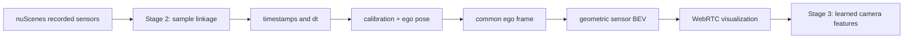
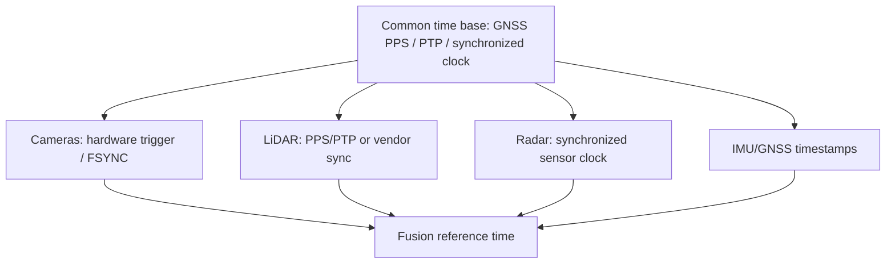
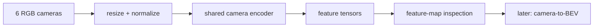

Stage 2 is deliberately **not an AI stage**. Its purpose is to establish something more fundamental: a trustworthy, inspectable sensor-time-geometry pipeline. Before a camera encoder, BEV network, detector, tracker, or world model can be believed, we need to know exactly **which sensor measurement arrived, when it was captured, which coordinate frame it belongs to, and how it is aligned with the other modalities**.

The implementation in this article is the second stage of my hands-on [nuScenes autonomy pipeline](/articles/nuscenes-autonomy-pipeline/). It runs remotely on RunPod, streams the visualization to a normal desktop browser over WebRTC, and reads the nuScenes files directly from disk. The source is available in [`nusenses_autonomy_pipeline`](https://github.com/abhishekkumardwivedi/nusenses_autonomy_pipeline).

> **Important:** the scene shown here is not synthetic sensor generation. nuScenes contains recorded real-world driving data. Stage 2 is replaying those recorded camera, LiDAR, radar, calibration, timestamp, and ego-pose records. The BEV at this stage is geometric visualization, not a learned BEV.

## What Stage 2 delivers

By the end of this stage the browser can play a nuScenes scene as a synchronized sensor set:

- six camera views: front-left, front, front-right, back-left, back, and back-right;
- the `LIDAR_TOP` point cloud rendered in a common ego-centric top-down frame;
- the five radar channels rendered into the same top-down frame;
- scene name, sample number, and dataset timestamp;
- per-camera capture-time offset `dt` relative to the sample timestamp;
- LiDAR and radar point counts;
- Play, Pause, Previous, Next, Restart, scene selection, and 0.5x/1x/2x playback;
- a 1600×900 composite frame streamed to the PC using WebRTC;
- no intermediate PNG/JPEG playback files and no neural-network inference.


*Figure 1 — Stage 2 running on RunPod. This sample shows six recorded camera views, 34,752 LiDAR returns in cyan and 281 radar returns in orange. Counts vary by sample. The ego vehicle is the green marker at the center of the sensor BEV.*

That distinction matters. A visually impressive dashboard can hide bad sensor association or frame transforms. Stage 2 is intended to make those contracts visible before the pipeline becomes complicated.

## Where Stage 2 sits in the autonomy stack



The important output of Stage 2 is not just the screen. It is a reusable **sensor contract** that later stages can consume.

## nuScenes gives us asynchronous sensors, not one magical instant

A nuScenes `sample` is an annotated keyframe. Keyframes are provided at roughly 2 Hz, while the physical sensors were captured at higher rates: the cameras at 12 Hz, the top LiDAR at 20 Hz, and the radars at 13 Hz. The dataset associates sensor records that are close in time with a sample, but their timestamps are not numerically identical.

This is why every camera label in the viewer includes a value such as:

```text
CAM_FRONT_LEFT   dt -42.8 ms
CAM_FRONT        dt -35.2 ms
CAM_FRONT_RIGHT  dt -27.1 ms
CAM_BACK_LEFT    dt  -0.2 ms
CAM_BACK         dt -10.0 ms
CAM_BACK_RIGHT   dt -19.5 ms
```

The implementation computes:

```python
offset_ms = (sensor_timestamp - sample_timestamp) / 1000
```

A negative value means that sensor record was captured **before** the sample reference timestamp; a positive value would mean after it.

### Why a few milliseconds matter

Suppose relative motion is 20 m/s. A 40 ms timing separation corresponds to:

$$
20 \times 0.040 = 0.8\ \text{m}
$$

That does **not** mean every point in this viewer is automatically wrong by 0.8 m. Stage 2 uses the ego pose at each sensor capture time to compensate the motion of the recording vehicle when transforming point sensors into the reference ego frame. For stationary world geometry, that removes a large part of the misalignment.

But a moving car, cyclist, or pedestrian has its **own** motion. Ego-motion compensation cannot rewind another object. If a vehicle moves between the radar, LiDAR, and camera captures, some residual cross-modal displacement remains. Later temporal fusion, tracking, object-motion compensation, or learned fusion must reason about that.

This is one reason I keep `dt` visible in the UI rather than hiding it.

## FSYNC, PTP and the broader synchronization problem

It is tempting to reduce synchronization to "use FSYNC." That is useful for a multi-camera rig, but the system problem is broader.

For a physical autonomy platform I would think in terms of a **common time base**:



nuScenes itself used deliberate camera/LiDAR synchronization: camera exposure was triggered when the spinning top LiDAR swept across the center of the corresponding camera field of view. The image timestamp represents the exposure trigger, while the LiDAR scan timestamp represents the completion time of the full rotation. That design improves spatial correspondence, but it still leaves explicit timestamps that software must respect.

So the practical rule is:

**FSYNC is one mechanism. Time synchronization plus timestamp provenance is the system requirement.**

## Do not scan folders: follow the dataset relationships

A weak player could enumerate image files and hope that similarly named files belong together. Stage 2 does not do that. It follows the nuScenes metadata graph:

```text
scene
  -> first_sample_token
  -> sample
       -> sample['data'][channel]
       -> sample_data
            -> filename
            -> timestamp
            -> calibrated_sensor_token
            -> ego_pose_token
```

The loader therefore starts from the `sample` and asks nuScenes which sensor record belongs to each channel:

```python
records = {
    channel: nusc.get("sample_data", token)
    for channel, token in sample["data"].items()
    if channel in CAMERAS
       or channel == "LIDAR_TOP"
       or channel.startswith("RADAR_")
}
```

This is a small design decision with a large effect: **sensor identity comes from dataset metadata, not filename coincidence**.

The scene timeline is similarly built from the linked list defined by nuScenes:

```python
token = scene["first_sample_token"]
samples = []
while token:
    sample = nusc.get("sample", token)
    samples.append(sample)
    token = sample["next"]
```

That means Play, Next and Previous operate on the dataset's sample ordering, not on a separately fabricated list.

## The coordinate-transform chain

Camera images remain in their native camera perspectives in Stage 2. LiDAR and radar, however, must be placed into one common frame before they can share a BEV.

For every point-sensor capture, the code uses three pieces of information:

1. **calibrated sensor pose** — sensor location and orientation relative to the ego vehicle;
2. **capture ego pose** — vehicle pose in the global frame at the instant that sensor record was captured;
3. **reference ego pose** — the ego pose associated with `LIDAR_TOP` for the displayed sample.

The transform is:

$$
T^{ref\_ego}_{sensor} =
\left(T^{global}_{ref\_ego}\right)^{-1}
T^{global}_{capture\_ego}
T^{capture\_ego}_{sensor}
$$

The implementation is intentionally isolated from rendering:

```python
def sensor_to_ego(calibration, capture_pose, reference_pose):
    return (
        np.linalg.inv(pose_matrix(reference_pose))
        @ pose_matrix(capture_pose)
        @ pose_matrix(calibration)
    )


def transform_points(xyz, matrix):
    return matrix[:3, :3] @ xyz + matrix[:3, 3:4]
```

The resulting reference ego axes are:

- `+x` forward;
- `+y` left;
- `+z` up;
- units in metres.

Separating `geometry.py` from the renderer is deliberate. Stage 3 and later can reuse the same transforms for projection, feature lifting, radar alignment, and BEV fusion without inheriting OpenCV drawing code.

## What the cyan LiDAR cloud actually means

In Figure 1, **cyan is just a visualization color**. It does not mean road, car, or pedestrian.

A LiDAR sweep is a set of measured returns. Conceptually, each return contains 3D position plus additional sensor attributes. The viewer takes the XYZ coordinates, transforms them into the common ego frame, and plots the XY positions from above.

The displayed `34,752 points` therefore means that the loaded LiDAR record for that sample contained 34,752 point returns after loading. It does not mean 34,752 detected objects, and there is no classification network involved.

The current BEV renderer shows a ±50 m square around the ego vehicle with a 10 m grid. The total point count is the loaded cloud count, so it can include points outside the visible ±50 m crop.

## What the orange radar points mean

The orange marks are the concatenated radar returns from the available radar channels after each has been transformed into the reference ego frame. The current implementation uses the nuScenes devkit's default radar filtering behaviour and does not infer objects from those returns.

Radar is especially interesting because a radar return can carry velocity-related information in addition to range and angle. Stage 2 intentionally does not turn that into tracks or velocity arrows yet. The goal is to preserve the distinction between **raw/filtered measurements** and **derived perception**.

A useful enhancement before or alongside later fusion work is to render each radar with its own marker style and draw sensor mounting position/FOV. That makes measurement provenance visible rather than only showing the merged orange cloud.

## Geometric BEV is not learned BEV

The top-down panel at Stage 2 is a coordinate visualization:

```text
3D LiDAR/radar points
        -> rigid transforms
        -> common ego XY
        -> pixels on a 2D grid
```

There is no CNN, transformer, depth network, Lift-Splat, BEVFormer, BEVFusion, occupancy network, or semantic head involved.

Later, when we say **camera BEV** or **multi-sensor BEV fusion**, the word BEV will refer to a learned or feature-space representation. Keeping the Stage 2 panel explicitly labelled **SENSOR BEV** helps avoid conflating the two ideas.

## Source rate and WebRTC FPS are different clocks

Another subtle point is the difference between dataset playback and browser video refresh.

nuScenes keyframes are roughly 2 Hz. The WebRTC `VideoStreamTrack`, however, refreshes the currently composed frame at 25 Hz:

```python
video = VideoFrame.from_ndarray(player.frame, format="bgr24")
video.pts = round(now * 90000)
video.time_base = Fraction(1, 90000)
```

The player advances the nuScenes sample according to the recorded timestamps. Between two samples, WebRTC sends the latest composite frame repeatedly. That is expected.

So there are at least three rates worth distinguishing:

| Rate | Meaning |
|---|---|
| Sensor capture rate | Physical camera/LiDAR/radar acquisition rate in the original dataset |
| Sample advance rate | Stage 2 keyframe progression, around 2 samples/s at 1x |
| WebRTC output FPS | Browser video transport refresh, targeted at 25 FPS |

A 25 FPS browser display does **not** turn 2 Hz keyframes into 25 Hz measured sensor states. Stage 2 performs no sensor interpolation.

## Why the composite is rendered in memory

The original experiments generated static PNG outputs. That is useful for unit tests, but poor for understanding temporal behaviour. Stage 2 instead builds the 1600×900 composite in RAM using OpenCV and immediately turns it into an `av.VideoFrame`.

The normal path is:

```text
nuScenes files
    -> sample loader
    -> transforms
    -> in-memory camera + sensor-BEV composite
    -> av.VideoFrame
    -> aiortc
    -> WebRTC
    -> desktop browser
```

No `frame001.png`, `camera_bev.png`, or browser-side image polling is required for playback.

## Try the Stage 2 pipeline on RunPod

Clone the repository into a RunPod workspace, prepare Python 3.11, and point the application at an extracted nuScenes dataset:

```bash
cd /workspace/autonomy
python3.11 -m venv .venv-player
source .venv-player/bin/activate
pip install -r app/requirements.txt

export NUSCENES_DATAROOT=/workspace/data/nuscenes
export NUSCENES_VERSION=v1.0-mini

python app/server.py
```

The current Stage 2 requirements are intentionally small:

```text
aiohttp==3.14.3
aiortc==1.15.0
av==16.1.0
nuscenes-devkit==1.2.0
numpy==1.26.4
opencv-python-headless==4.11.0.86
```

Expose HTTP port `8080` in RunPod and open the RunPod proxy endpoint from the PC browser. The page and SDP signaling travel through HTTP; the media path uses WebRTC/ICE.

Useful local checks are:

```bash
curl http://127.0.0.1:8080/health
curl http://127.0.0.1:8080/state
python app/verify.py
```

## A small sensor-timing experiment

Once the repository and dataset are available, this snippet loads the first sample of a scene and prints exactly which records were used and how far each sensor timestamp sits from the sample time:

```python
from nuscenes_player.nuscenes_source import NuScenesSource

source = NuScenesSource(
    "/workspace/data/nuscenes",
    version="v1.0-mini",
)

scene, samples = source.scene_samples("scene-0103")
data = source.load(samples[0])

print("scene:", scene["name"])
print("sample timestamp:", samples[0]["timestamp"])
print("LiDAR points:", data["lidar"].shape[1])
print("Radar points:", data["radar"].shape[1])

for channel, info in sorted(data["sensors"].items()):
    print(
        f"{channel:18s}",
        f"dt={info['offset_ms']:+7.1f} ms",
        f"token={info['token']}",
    )
```

Try stepping to `samples[1]` and compare the tokens, `dt` values, point counts and ego pose. This is a more useful Stage 2 exercise than immediately adding a detector because it reveals the input contract that every later model will inherit.

## Verification philosophy

The repository contains `app/verify.py` to test the real data path. The checks performed on RunPod include:

- all six cameras changing between samples;
- LiDAR and radar changing between samples;
- sample-data linkage coming from the nuScenes metadata;
- radar transforms agreeing with an independent devkit transform path;
- Next/Previous/Restart and scene-boundary behaviour;
- WebRTC browser reception at approximately 20–25 FPS;
- sample playback around the dataset's roughly 2 Hz keyframe rate;
- `/health` working through the RunPod HTTP proxy.

This is the mindset I want for the whole series: each stage should have an explicit purpose, an observable output, and a way to verify that the output is semantically correct before adding the next stage.

## What Stage 2 intentionally does not do

Stage 2 has **no learned perception**. Specifically, it does not yet contain:

- camera CNN/transformer encoding;
- LiDAR PointPillars/SECOND-style encoding;
- radar neural encoding;
- camera-to-BEV lifting;
- multi-sensor feature fusion;
- temporal BEV memory;
- 3D object detection;
- semantic segmentation or occupancy prediction;
- multi-object tracking;
- trajectory prediction;
- world-model construction;
- planning or control.

That is a feature, not a limitation of the stage definition. If something is misaligned here, a sophisticated fusion network will not make the data contract more trustworthy—it may only make the error harder to diagnose.

## Stage 3: where AI begins

The next stage keeps this same replay and visualization substrate and inserts a learned camera encoder:



The important architectural choice is that Stage 3 does **not** replace Stage 2. It builds on it. The camera tensor fed to the encoder will still have a known sample token, timestamp, calibration, and sensor identity. That provenance is what eventually lets us reason correctly about spatial and temporal fusion.

## References

- [nuScenes official dataset and sensor setup](https://www.nuscenes.org/nuscenes)
- [nuScenes devkit tutorial](https://www.nuscenes.org/public/tutorials/nuscenes_tutorial.html)
- [nuScenes devkit on GitHub](https://github.com/nutonomy/nuscenes-devkit)
- [Stage 2 source repository](https://github.com/abhishekkumardwivedi/nusenses_autonomy_pipeline)
