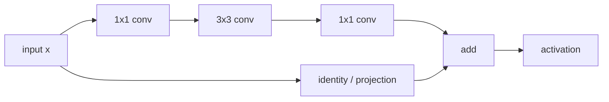

Stage 2 established the physical truth of the perception pipeline: **which sensor produced a measurement, when it was captured, where the sensor was mounted, and how its data is related to the ego frame**. Stage 3 is where the autonomy stack first becomes learned.

The objective is deliberately narrower than object detection or bird's-eye-view perception. We take the six RGB camera observations and convert each image into a compact learned tensor that preserves useful spatial structure while replacing raw pixels with higher-level visual features.

That transformation is one of the most important boundaries in modern autonomy:

```text
photons -> pixels -> learned image-space features -> metric scene representation
```

Stage 3 covers the middle step. The output is still **image-space**. It is not yet BEV, not yet a list of objects, and not yet a world model.

## 1. Where Stage 3 sits in an autonomy stack


A camera encoder is therefore **not the perception stack**. It is the learned front end that converts each camera's raster image into a representation that downstream perception can reason over more efficiently.

A useful contract for one sample is:

```text
Six camera images
    [B, N, 3, H, W]
          |
          v
shared encoder
          |
          v
Six feature maps
    [B, N, C, Hf, Wf]
```

For the concrete dimensions used in this stage:

```text
B  = 1 sample
N  = 6 cameras
H  = 256
W  = 448
C  = 256 projected feature channels
Hf = 8
Wf = 14
```

so the input and output contracts are:

```text
Input : [1, 6,   3, 256, 448]
Output: [1, 6, 256,   8,  14]
```

Understanding why the spatial grid becomes `8 x 14`, what the 256 channels mean, and what information must travel beside that tensor is the main purpose of this stage.

## 2. What information exists in an RGB image?

A camera gives a dense 2D measurement of projected scene appearance. Each pixel carries intensity and colour information, but the image itself does not directly say:

- that a rectangular patch is a car;
- that an edge belongs to a lane boundary;
- how far away a pedestrian is;
- which pixels across different cameras refer to the same physical object;
- where the observation lies in vehicle coordinates;
- how the scene is moving.

Those properties must be inferred.

At the raw pixel level, nearby values are strongly local. A pixel at `(u,v)` knows nothing explicitly about another pixel 200 pixels away. A convolutional encoder progressively builds larger-context descriptors, so deeper activations respond to combinations of edges, texture, shape, parts and scene context rather than isolated RGB values.

The conceptual transformation is:

```text
RGB values
  -> local edges and gradients
  -> textures and repeated patterns
  -> parts and shapes
  -> contextual visual features
```

This hierarchy is learned from data. It is not manually programmed.

## 3. Why use one shared encoder for all six cameras?

The six cameras look in different directions, but they all observe the same visual world. A shared backbone applies the **same weights** to every camera:

```text
CAM_FRONT_LEFT  --\
CAM_FRONT       ---\
CAM_FRONT_RIGHT ----> shared ResNet-50 ----> six feature tensors
CAM_BACK_LEFT   ---/
CAM_BACK        --/
CAM_BACK_RIGHT -/
```

This has three important consequences.

First, parameter count does not grow six-fold. The same learned filters are reused.

Second, every camera is embedded into the same feature space. Channel 37 has the same learned mathematical meaning regardless of which camera supplied the image, even though its activation pattern differs by viewpoint.

Third, the six images can be flattened into the batch dimension for efficient parallel execution:

```text
[B, N, 3, H, W]
      |
      | reshape
      v
[B*N, 3, H, W]
      |
      v
shared backbone
      |
      v
[B*N, C, Hf, Wf]
      |
      | reshape
      v
[B, N, C, Hf, Wf]
```

But there is a critical systems lesson here:

> **Batching six images does not make the cameras synchronous.**

The tensor batch is a compute convenience. Each image still has its own physical capture timestamp. That timestamp must remain associated with its feature tensor.

## 4. The feature tensor must keep its sensor lineage

A robust autonomy pipeline should never treat the feature map as an anonymous tensor. The representation needs metadata beside it.

A practical camera-feature record is conceptually:

```text
CameraFeature
  camera_id
  sample_token
  sensor_timestamp
  dt_to_reference
  image_transform
  intrinsic_matrix_after_resize
  sensor_to_ego_extrinsic
  feature_tensor
  feature_stride
  encoder_version
  preprocessing_version
```

This becomes important immediately in Stage 4. To lift an image feature into vehicle coordinates, we must know **which camera produced it, its calibration, the pixel transform used during preprocessing, and when the image was captured**.

If the tensor survives but its geometry metadata is lost, the representation becomes unusable for rigorous multi-camera spatial fusion.

## 5. Preprocessing is part of the model contract

The neural network does not receive the original JPEG/PNG/Bayer frame directly. The image passes through a deterministic preprocessing contract.

A typical path is:

```text
OpenCV BGR image
      |
      v
BGR -> RGB
      |
      v
resize to 448 x 256
      |
      v
uint8 -> float
      |
      v
scale to [0,1]
      |
      v
ImageNet channel normalization
      |
      v
[3, 256, 448]
```

For standard ImageNet-pretrained ResNet weights, normalization commonly uses:

```python
mean = [0.485, 0.456, 0.406]
std  = [0.229, 0.224, 0.225]
```

and each channel is transformed as:

$$
X'_{c} = \frac{X_c - \mu_c}{\sigma_c}
$$

This is not cosmetic. A pretrained network learned its filters under a particular numerical input distribution. Changing RGB/BGR order, forgetting normalization, using the wrong range, or altering tone mapping can shift activation statistics throughout the model.

### BGR versus RGB is a real failure mode

OpenCV conventionally loads colour images as BGR. TorchVision pretrained weights expect RGB semantics. Feeding BGR without conversion does not usually crash the model; it produces **plausible but wrong features**. That makes it more dangerous than an obvious runtime failure.

## 6. Resizing changes geometry, not only compute

Suppose the original image has camera intrinsic matrix:

$$
K =
\begin{bmatrix}
f_x & 0 & c_x \\
0 & f_y & c_y \\
0 & 0 & 1
\end{bmatrix}
$$

and the image is resized by scale factors:

$$
s_x = \frac{W'}{W}, \qquad s_y = \frac{H'}{H}
$$

Then, for a pure resize without crop or padding:

$$
f'_x=s_xf_x,\quad c'_x=s_xc_x
$$

$$
f'_y=s_yf_y,\quad c'_y=s_yc_y
$$

If preprocessing also crops or pads, the principal point must be translated accordingly.

Stage 3 itself can encode the image without using the intrinsic matrix. But Stage 4 cannot correctly project features into 3D unless the camera geometry is updated to match the transformed image.

This is why image preprocessing should be viewed as a **geometric transform plus a numerical transform**, not merely "resize before inference."

## 7. Why ResNet-50 is a useful teaching backbone

ResNet-50 is not necessarily the final backbone one would choose for every production autonomy system. It is useful here because its structure is explicit and well understood:

```text
input
  |
7x7 conv, stride 2
  |
max pool, stride 2
  |
layer1 / C2
  |
layer2 / C3
  |
layer3 / C4
  |
layer4 / C5
```

The residual idea is:

$$
y = F(x) + x
$$

A bottleneck block transforms the input through a sequence of convolutions while a skip path carries the original representation forward.



Residual connections made very deep convolutional networks easier to optimize and remain an important architectural idea even though many modern backbones use different blocks.

## 8. Why 256 x 448 becomes 8 x 14

The deepest standard ResNet feature map has an effective spatial stride of 32 relative to the input.

For an input of:

```text
256 x 448
```

the output grid is therefore:

```text
256 / 32 = 8
448 / 32 = 14
```

The spatial hierarchy is approximately:

| Representation | Stride | Spatial size |
|---|---:|---:|
| Input | 1 | 256 x 448 |
| C2 | 4 | 64 x 112 |
| C3 | 8 | 32 x 56 |
| C4 | 16 | 16 x 28 |
| C5 | 32 | 8 x 14 |

This is one of the central trade-offs of visual encoders:

```text
spatial resolution decreases
semantic/contextual abstraction increases
```

A C5 cell is not "one 32 x 32 patch" in the simplistic sense. Because successive convolutions build a large receptive field, each deep feature location depends on a much wider region of the original image. Its center-to-center spacing is about 32 input pixels, while its context can span hundreds of pixels.

## 9. What is inside `[2048, 8, 14]`?

The final ResNet-50 C5 output has 2048 channels.

Conceptually, at every spatial location `(u,v)` the network stores a learned vector:

$$
F(u,v) \in \mathbb{R}^{2048}
$$

So rather than saying:

```text
pixel = [R,G,B]
```

we now have something like:

```text
feature cell = [f1, f2, ..., f2048]
```

Each dimension is learned. Individual channels may become sensitive to particular recurring visual structures, but it is incorrect to label one arbitrary intermediate channel as "car" or "pedestrian" unless that interpretation has been established experimentally.

The important property is the **distributed representation**: useful information is generally encoded across combinations of channels.

## 10. Why project 2048 channels down to 256?

A 1x1 convolution can learn a channel projection:

$$
\mathbb{R}^{2048} \rightarrow \mathbb{R}^{256}
$$

independently at every spatial location.

```text
C5
[2048, 8, 14]
      |
      v
1x1 projection
      |
      v
[256, 8, 14]
```

A 1x1 convolution does not mix neighbouring spatial cells; it mixes channels. At each `(u,v)` it performs a learned linear transformation plus bias.

Why reduce the dimension?

- downstream BEV lifting handles fewer channels;
- activation memory falls;
- fusion layers become cheaper;
- the interface becomes a clean fixed-width feature contract;
- later encoders can be projected to a compatible embedding width.

The reduction is therefore not just an optimization trick. It defines the **interface width** between the camera backbone and the rest of the perception system.

## 11. A compact PyTorch implementation

The following model exposes the C5 stage of ResNet-50 and adds a 1x1 projection to 256 channels.

```python
import torch
import torch.nn as nn
from torchvision.models import resnet50, ResNet50_Weights

class CameraEncoder(nn.Module):
    def __init__(self, out_channels=256):
        super().__init__()
        net = resnet50(weights=ResNet50_Weights.DEFAULT)

        self.backbone = nn.Sequential(
            net.conv1,
            net.bn1,
            net.relu,
            net.maxpool,
            net.layer1,
            net.layer2,
            net.layer3,
            net.layer4,
        )
        self.proj = nn.Conv2d(2048, out_channels, kernel_size=1)

    def forward(self, x):
        # x: [B, N, 3, H, W]
        b, n, c, h, w = x.shape
        x = x.reshape(b * n, c, h, w)
        x = self.backbone(x)
        x = self.proj(x)
        _, c2, h2, w2 = x.shape
        return x.reshape(b, n, c2, h2, w2)

model = CameraEncoder().eval()
x = torch.randn(1, 6, 3, 256, 448)

with torch.inference_mode():
    y = model(x)

print(y.shape)
# torch.Size([1, 6, 256, 8, 14])
```

This tiny shape experiment is worth running before integrating real data. It verifies the tensor contract independently of the dataset, browser, visualization, or downstream geometry.

## 12. Why `eval()` and `inference_mode()` matter

Two separate ideas are involved.

`model.eval()` changes the behaviour of modules such as BatchNorm and Dropout to inference semantics.

`torch.inference_mode()` disables autograd bookkeeping and additional tensor-version tracking that is unnecessary for inference.

```python
model.eval()
with torch.inference_mode():
    features = model(images)
```

Using one does not replace the other.

For a frozen encoder in an autonomy runtime, we generally want both.

## 13. The camera batch is not the dataset clock

Suppose the six camera timestamps relative to the selected reference are:

```text
CAM_FRONT_LEFT   -42.8 ms
CAM_FRONT        -35.2 ms
CAM_FRONT_RIGHT  -27.1 ms
CAM_BACK_RIGHT   -19.5 ms
CAM_BACK         -10.0 ms
CAM_BACK_LEFT     -0.2 ms
```

The encoder may process all six images in one tensor batch, but their learned features still describe **different physical instants**.

At a relative speed of 20 m/s, a 40 ms temporal offset corresponds to:

$$
20 \times 0.040 = 0.8\text{ m}
$$

of relative displacement.

The encoder cannot repair this by itself. Temporal skew must remain visible to later stages, where ego-motion alignment and dynamic-object reasoning can account for it.

A good mental model is:

```text
camera capture time
      -> image
      -> encoder
      -> feature tensor with SAME capture identity
```

Neural processing changes the representation; it does not change when the observation happened.

## 14. Feature inspection: what can we actually visualize?

A tensor shaped `[256, 8, 14]` cannot be displayed directly as a conventional RGB image. We need a projection for human inspection.

### Mean absolute activation

One simple view is:

$$
A(u,v)=\frac{1}{C}\sum_{c=1}^{C}|F_c(u,v)|
$$

This answers:

> At which spatial locations is the representation strongly active across channels?

```python
activation = feature.abs().mean(dim=0)   # [8, 14]
activation = activation - activation.min()
activation = activation / (activation.max() + 1e-6)
```

This is useful for debugging but does **not** tell us which class is present.

### Individual channel view

A second view displays one channel:

```python
channel = 37
heatmap = feature[channel]   # [8, 14]
```

Moving through channels makes it obvious that different filters respond to different visual patterns. But channel number 37 is not globally "the vehicle channel."

### PCA visualization

A more compact representation can apply PCA across the 256-dimensional feature vectors and map the first three components into RGB. This shows feature-space variation, but those colours are artificial basis directions, not semantic labels.

The rule is simple:

> **Feature visualization is an inspection aid, not a semantic decoder.**

## 15. Why feature maps look coarse

An 8 x 14 feature grid enlarged to a monitor can look blocky. That is not a rendering defect. It is the actual spatial granularity of the C5 representation.

The network has traded spatial precision for abstraction and receptive field.

For tasks requiring fine boundaries or very small objects, autonomy architectures often use:

- higher-resolution backbone stages;
- feature pyramids;
- multi-scale attention;
- skip/lateral connections;
- learned upsampling;
- high-resolution BEV representations.

Stage 3 intentionally begins with one clean C5-style contract so that the abstraction can be understood before introducing multi-scale complexity.

For a deeper treatment of C2/C3/C4/C5 and FPN, see [Camera Encoder: ResNet-50 + FPN](/articles/rgb-camera-encoders/).

## 16. Output memory is small; intermediate activation memory is not

For six projected feature maps:

```text
6 x 256 x 8 x 14 = 172,032 values
```

At FP32:

$$
172032 \times 4 \approx 688128\text{ bytes} \approx 0.66\text{ MiB}
$$

At FP16 it is roughly half that.

The six normalized RGB inputs contain:

```text
6 x 3 x 256 x 448 = 2,064,384 values
```

or about 7.9 MiB at FP32.

But these two numbers do **not** represent peak model memory. During forward execution, intermediate feature maps exist at much larger spatial resolutions. Framework workspace, convolution algorithms, allocator caching and temporary tensors can dominate the peak.

That is why memory should be measured at multiple levels:

```text
input tensor
backbone activations
C5 tensor
projected output
framework reserved memory
peak allocated memory
```

This distinction becomes critical when the system later holds camera features, radar/LiDAR features, BEV tensors and temporal history simultaneously.

## 17. Latency must be measured at the sensor-sample cadence

A common profiling mistake is to tie neural inference to display refresh rate.

Suppose a dataset sample advances at approximately 2 Hz while a display stream refreshes at 25 Hz. Running the camera encoder 25 times each second on the same unchanged image wastes compute and makes performance numbers meaningless.

The correct dataflow is:

```text
new sensor sample
      |
      v
preprocess once
      |
      v
encode once
      |
      v
cache feature tensor
      |
      +----> downstream perception
      |
      +----> visualization may refresh many times
```

Inference cadence should be driven by **new sensor data**, not by how often a browser repaints a screen.

The same design principle applies in a real vehicle. Camera arrival drives the perception graph; visualization is an observer of that graph, not its clock source.

## 18. What should be measured in Stage 3?

Useful measurements include:

| Quantity | Why it matters |
|---|---|
| preprocessing latency | CPU/image-transform cost before inference |
| encoder latency | backbone execution time |
| output tensor shape | verifies interface contract |
| dtype | affects bandwidth, precision and memory |
| allocated GPU memory | current live tensor footprint |
| reserved GPU memory | framework allocator pool |
| peak allocated memory | worst point during the forward pass |
| activation statistics | detects abnormal distributions |
| per-camera feature difference | verifies cameras are not accidentally duplicated |
| sample-to-sample difference | verifies new observations create new features |

Average latency alone is not sufficient for vehicle deployment. Ultimately we care about tail latency, deadline misses, concurrency and thermal behaviour. But Stage 3 begins by making the basic cost visible.

## 19. A useful tensor-inspection helper

```python
def tensor_info(x):
    return {
        "shape": tuple(x.shape),
        "dtype": str(x.dtype),
        "min": float(x.min()),
        "max": float(x.max()),
        "mean": float(x.mean()),
        "std": float(x.std()),
        "finite": bool(torch.isfinite(x).all()),
        "elements": x.numel(),
        "bytes": x.numel() * x.element_size(),
    }
```

The objective is not to find one "correct" mean or standard deviation. The objective is to establish repeatable baselines and catch changes caused by broken preprocessing, wrong precision, corrupted weights or unexpected input distributions.

## 20. Pretrained does not mean autonomy-trained

ImageNet pretraining is useful because early and mid-level visual structures transfer well to many tasks. But a generic ImageNet backbone has not automatically learned the optimal representation for autonomous driving.

Autonomy introduces domain-specific challenges:

```text
small distant objects
night exposure
headlight glare
rain and spray
motion blur
traffic lights
lane markings
construction zones
rare road users
fisheye / wide-angle optics
camera contamination
```

Production perception systems often fine-tune the backbone jointly with downstream detection, segmentation, BEV or occupancy objectives.

So Stage 3 should be understood as:

> **learning the representation pipeline using a real pretrained encoder, not claiming that ImageNet features alone solve driving perception.**

## 21. Why we do not add object detection yet

It is tempting to attach a detection head immediately because bounding boxes produce intuitive results. That would hide the interface we are trying to understand.

The staged decomposition is intentionally:

```text
Stage 2: sensor/time/geometry truth
Stage 3: learned image representation
Stage 4: camera features -> metric BEV
Stage 5: learned radar/LiDAR representations
Stage 6: multi-sensor BEV fusion
Stage 7: temporal memory
Stage 8: detection / occupancy / tracking
```

By delaying detection, we can answer fundamental questions independently:

- Are the six camera tensors correct?
- Does preprocessing preserve the intended geometry?
- Are the feature shapes what we think they are?
- Are timestamps still attached?
- Do different cameras actually produce different representations?
- What is the memory/latency cost of the encoder alone?

This makes later failures much easier to localize.

## 22. The missing ingredient: metric geometry

At the end of Stage 3 we have a learned tensor associated with image coordinates:

```text
CAM_FRONT feature cell (u=7, v=3)
```

That still does not tell us directly:

```text
x = 18.4 m forward
y = -2.1 m lateral
```

A 2D image location corresponds to a ray in 3D space. Metric location requires additional information such as depth, geometry, multi-view constraints or learned queries.

This is the central problem of Stage 4.

Given an image pixel in homogeneous coordinates:

$$
p = [u,v,1]^T
$$

and camera intrinsics `K`, a ray in camera coordinates is proportional to:

$$
r = K^{-1}p
$$

Depth `d` turns that ray into a 3D point:

$$
P_{camera}=dK^{-1}p
$$

Extrinsics then move it into the ego frame:

$$
P_{ego}=T_{ego\leftarrow camera}P_{camera}
$$

The key issue is that monocular RGB does not directly supply `d` for every feature. Camera-to-BEV methods differ largely in **how they solve or avoid that depth assignment problem**.

## 23. The exact handoff to Stage 4

A well-defined Stage 3 output should look conceptually like:

```text
CameraFeatureSet
  features      [B, N, 256, 8, 14]
  camera_ids    [N]
  timestamps    [N]
  dt            [N]
  intrinsics    [B, N, 3, 3]
  extrinsics    [B, N, 4, 4]
  image_aug     [B, N, 3, 3] or equivalent transform
  feature_stride = 32
```

Stage 4 can then consume this package and perform a view transformation without reaching back into raw dataset internals.

That separation is architecturally important:

```text
sensor reader
   -> camera encoder contract
      -> geometry / BEV contract
         -> fusion contract
```

Each boundary can be tested independently.

## 24. Common implementation mistakes

### Mistake 1: wrong colour order

BGR fed to an RGB-pretrained model can silently degrade features.

### Mistake 2: forgetting to scale camera intrinsics

The neural tensor still computes, but Stage 4 geometry becomes wrong.

### Mistake 3: treating the camera batch as synchronized

Compute batching is not physical synchronization.

### Mistake 4: losing camera ordering

If `CAM_FRONT_LEFT` features are later paired with `CAM_FRONT_RIGHT` calibration, the model can produce structured but spatially nonsensical BEV output.

### Mistake 5: recomputing the encoder for visualization

Display rate should not drive inference.

### Mistake 6: interpreting a feature channel as a class

Intermediate activations are not detector outputs.

### Mistake 7: calling C5 a BEV

`[256,8,14]` still lives on the camera image plane. BEV is a different coordinate representation.

### Mistake 8: ignoring precision and layout

`NCHW` versus `NHWC`, FP32 versus FP16/INT8, and contiguous versus non-contiguous storage can materially change accelerator performance and interface assumptions.

## 25. What changes on an automotive SoC?

The mathematical encoder stays recognizable, but execution becomes a systems problem:


Real deployment adds:

- buffer ownership and zero-copy paths;
- camera/AI synchronization fences;
- NPU operator support;
- graph compilation and quantization;
- DMA/SMMU mappings;
- memory bandwidth contention;
- accelerator scheduling;
- thermal and power limits;
- startup and recovery behaviour;
- deterministic timestamp propagation.

A fast PyTorch forward pass is therefore only one piece of production readiness.

## 26. Precision: FP32, FP16 and INT8

Stage 3 is a good place to start understanding precision because the encoder dominates a large fraction of perception compute.

FP32 is convenient for reference behaviour.

FP16 reduces storage and can improve GPU throughput where tensor cores are available.

INT8 can provide substantial accelerator efficiency, but requires quantization policy and calibration/training that preserve downstream accuracy.

The important point is that precision affects more than arithmetic:

```text
precision
  -> tensor bytes
  -> memory bandwidth
  -> cache pressure
  -> kernel choice
  -> accelerator throughput
  -> numerical error
  -> final perception quality
```

Stage 3 should first establish a trusted FP32/FP16 reference before aggressively quantizing the graph.

## 27. Verification should prove behaviour, not just absence of exceptions

A useful Stage 3 verification sequence is:

```text
1. Load six different camera images.
2. Verify preprocessing shape [1,6,3,256,448].
3. Run the encoder in evaluation/inference mode.
4. Verify output [1,6,256,8,14].
5. Check every output is finite.
6. Compare camera features; they should not all be identical.
7. Advance the scene; features should change.
8. Change only visualization channel; inference count should not change.
9. Pause the data source; inference count should remain constant.
10. Preserve every camera's timestamp and calibration beside its feature.
```

This is much stronger evidence than simply seeing a heatmap on a screen.

## 28. What Stage 3 teaches us

By the end of this stage, the conceptual model should be clear:

```text
A camera encoder does not detect the world.
It transforms pixels into a compact learned image-space description.
```

The important outputs are not just numbers. They are **features with lineage**:

```text
learned tensor
+ camera identity
+ capture time
+ image transform
+ intrinsics
+ extrinsics
```

That package is the bridge between perception learning and vehicle geometry.

Stage 2 told us **where and when the sensors observed the world**.

Stage 3 tells us **how to convert camera appearance into a representation that a perception model can reason over**.

Stage 4 will answer the next question:

> **How do six perspective image-space feature maps become one metric bird's-eye representation of the space around the vehicle?**

That transition—from perspective features to a common spatial frame—is where camera perception starts becoming a vehicle-centric scene model.

## References

- Kaiming He, Xiangyu Zhang, Shaoqing Ren, Jian Sun, [Deep Residual Learning for Image Recognition](https://arxiv.org/abs/1512.03385)
- TorchVision, [ResNet model documentation](https://pytorch.org/vision/stable/models/resnet.html)
- Holger Caesar et al., [nuScenes: A Multimodal Dataset for Autonomous Driving](https://arxiv.org/abs/1903.11027)
- Jonah Philion and Sanja Fidler, [Lift, Splat, Shoot: Encoding Images From Arbitrary Camera Rigs by Implicitly Unprojecting to 3D](https://arxiv.org/abs/2008.05711)
- [Camera Encoder: ResNet-50 + FPN](/articles/rgb-camera-encoders/) — companion article covering ResNet feature hierarchies, FPN and encoder profiling in more detail.
