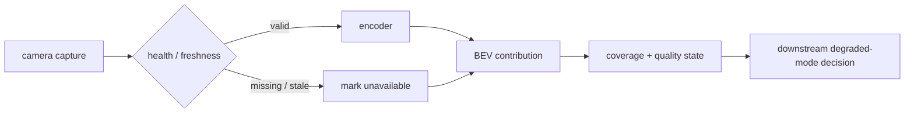

Stage 3 ended with six perspective-view feature tensors. Stage 4 changes the coordinate system of the problem.

The objective is not to detect objects yet. It is to transform learned camera evidence from **image coordinates** into a **metric, ego-centric spatial representation** that downstream perception, fusion and planning can reason about consistently.

That boundary is where a large amount of autonomy-system complexity becomes unavoidable:

```text
image feature
    + camera intrinsics
    + depth
    + camera extrinsics
    + capture-time ego pose
    + reference-time ego pose
        ↓
metric 3D evidence
        ↓
BEV discretisation / aggregation
        ↓
spatial BEV feature state
```

This article treats that transformation as a production engineering problem rather than a neural-network demo. The important questions are not only how to create a BEV tensor, but also **what assumptions made it possible, what information was discarded, how the result degrades, how failure is detected, what is deterministic, and what evidence is required before downstream safety-relevant functions can trust it**.

Stage 4 is deliberately **spatial**, not temporal. It represents one current sensor set in one chosen reference frame. Historical BEV state, ego-motion warping and temporal memory belong to a later stage.

## 1. The formal Stage 4 contract

Stage 3 produces a camera feature set such as:

```text
CameraFeatureSet {
    camera_id[N]
    capture_time[N]
    dt_to_reference[N]
    effective_intrinsics[N]
    sensor_to_ego[N]
    ego_pose_at_capture[N]
    image_transform[N]
    feature_stride
    feature_tensor [B,N,C,Hf,Wf]
    encoder_version
}
```

For the current reference configuration:

```text
B  = 1
N  = 6 cameras
C  = 256
Hf = 8
Wf = 14

camera features = [1,6,256,8,14]
```

Stage 4 should not return an anonymous tensor. A useful output contract is closer to:

```text
SpatialBEV {
    reference_time
    reference_frame
    x_bounds / y_bounds / resolution
    feature_tensor [B,C,Hbev,Wbev]
    visibility_mask [B,1,Hbev,Wbev]
    source_mask / contribution_count
    input_age_summary
    camera_health[N]
    pose_quality
    calibration_version
    processing_status
    generation_id
}
```

The metadata is not decoration. Once a feature has been rasterised into BEV, the downstream consumer can no longer recover which camera observed a cell, whether the contribution was stale, whether a camera was missing, or whether the pose used to place it was degraded unless that provenance is preserved explicitly.

## 2. Why image features cannot simply be reshaped into BEV

A camera feature cell is indexed in the image plane. It has angular meaning but no unique metric range.

For a homogeneous image coordinate

$$
p = [u,v,1]^T
$$

and camera intrinsic matrix

$$
K =
\begin{bmatrix}
f_x & 0 & c_x \\
0 & f_y & c_y \\
0 & 0 & 1
\end{bmatrix},
$$

the back-projected direction is

$$
r = K^{-1}p.
$$

A metric 3D point requires depth $d$:

$$
P_{cam} = dK^{-1}p.
$$

That unknown depth is the central difficulty of camera-only BEV.

Two pixels with identical image coordinates can correspond to radically different physical positions depending on depth. A feature at the lower center of a forward camera might belong to road at 6 m, a vehicle at 18 m, or a barrier at 40 m. The encoder can provide semantic evidence; it cannot make projective geometry disappear.

This is why the Stage 4 implementation uses nuScenes LiDAR as a **development-time depth oracle**. The purpose is to validate camera geometry and BEV placement under known metric depth before a learned-depth model introduces another source of error.

That choice mirrors a useful research methodology. *Lift, Splat, Shoot* explicitly studied image lifting into a 3D frustum and compared against oracle-depth settings. The important lesson is not one particular architecture; it is that separating **view geometry** from **depth estimation quality** makes the system much easier to diagnose.

## 3. Development oracle versus production inference

The Stage 4 oracle path is:

```text
LiDAR point
   ↓ transform to camera capture frame
camera XYZ
   ↓ perspective projection
image coordinate + metric depth
   ↓ associate with camera feature cell
feature + known depth
   ↓ lift to ego metric coordinates
spatial BEV
```

This is not a production camera-only perception architecture. It is a geometry-validation mode.

A future camera-only path could replace oracle depth with a learned depth distribution:

$$
P(d_k\mid F_{u,v}), \quad k=1...D
$$

and distribute the feature along the ray:

$$
\tilde{F}_{u,v,k}=P(d_k\mid F_{u,v})F_{u,v}.
$$

That is the classical lift-splat family of approaches.

The distinction matters operationally:

- **oracle depth unavailable** in Stage 4 means the development view transformation cannot produce validated camera BEV for those cells;
- **camera-only production inference** should not depend on that LiDAR stream unless the architecture is intentionally multi-sensor;
- training-time LiDAR supervision and runtime LiDAR dependency are different architectural choices.

Never allow a diagnostic dependency to become an undocumented production dependency.

## 4. Intrinsics must follow preprocessing

Camera calibration applies to a particular image geometry. If Stage 3 resized the image, then using the original $K$ in Stage 4 creates a systematic spatial error even though every matrix multiplication is numerically valid.

For a pure resize from $(W,H)$ to $(W',H')$:

$$
s_x=\frac{W'}{W},\qquad s_y=\frac{H'}{H}
$$

and:

$$
f'_x=s_xf_x,\quad f'_y=s_yf_y,
$$

$$
c'_x=s_xc_x,\quad c'_y=s_yc_y.
$$

If crop or padding is applied, the principal point must also be translated. If lens undistortion is performed, the effective projection model may change again.

A compact implementation should make the image transform explicit:

```python
import numpy as np


def resize_intrinsics(K: np.ndarray,
                      src_wh: tuple[int, int],
                      dst_wh: tuple[int, int]) -> np.ndarray:
    src_w, src_h = src_wh
    dst_w, dst_h = dst_wh

    sx = dst_w / src_w
    sy = dst_h / src_h

    out = K.astype(np.float64).copy()
    out[0, 0] *= sx  # fx
    out[0, 2] *= sx  # cx
    out[1, 1] *= sy  # fy
    out[1, 2] *= sy  # cy
    return out
```

For a production pipeline, the stronger interface is not `K_resized`; it is an **image-to-network affine transform** whose inverse can map any feature location back to the calibrated image convention.

That generalises cleanly to crop, pad, rotate and image pyramid operations.

## 5. Feature cells are not pixels

A Stage 3 feature tensor of `8 x 14` was derived from an input of `256 x 448`. With an effective stride of 32, feature coordinate $(i,j)$ corresponds approximately to an image-space sampling location near:

$$
u=(j+0.5)\cdot 32,
$$

$$
v=(i+0.5)\cdot 32.
$$

This is an approximation of the **sampling lattice**, not the complete receptive field. A deep ResNet feature cell depends on a much larger region of the image.

For view transformation, what matters is that each feature vector has a well-defined representative ray. That convention must remain fixed between training, validation and inference.

A small error at this boundary becomes a range-dependent BEV error. For example, an angular error $\delta\theta$ produces lateral displacement approximately:

$$
\delta y \approx r\tan(\delta\theta).
$$

Even a one-degree orientation/projection error is about 0.87 m laterally at 50 m range.

The geometry therefore deserves the same versioning discipline as model weights.

## 6. Time alignment belongs inside the spatial transform

The six cameras in a dataset sample are not guaranteed to describe exactly the same physical instant.

For camera $i$, Stage 4 should use:

$$
T^{ref\_ego}_{camera_i}=
\left(T^{global}_{ref\_ego}\right)^{-1}
T^{global}_{capture\_ego_i}
T^{capture\_ego_i}_{camera_i}.
$$

This chain contains three different ideas:

- camera calibration: where the sensor is mounted;
- capture-time ego pose: where the vehicle was when that image was taken;
- reference ego pose: the coordinate frame into which Stage 4 wants to place all evidence.

The transform compensates the recording vehicle's motion between sensor capture and reference time for static scene geometry.

It does **not** compensate the independent motion of other actors.

If a vehicle moves between two camera exposures, two correctly transformed features can still represent different physical states of that vehicle. That residual temporal inconsistency is one reason temporal modelling and tracking remain necessary later.

A spatial BEV should therefore expose input age or `dt`, not erase it.

## 7. LiDAR-to-camera projection for sparse depth

For a LiDAR point, the robust sequence is conceptually:

```text
LiDAR sensor frame
    ↓ calibrated LiDAR -> ego at LiDAR time
capture ego frame
    ↓ ego pose -> global
world/global frame
    ↓ inverse camera ego pose
camera capture ego frame
    ↓ inverse camera extrinsic
camera frame
    ↓ K projection
image pixel + Z depth
```

Only camera-frame points with positive $Z$ are visible in front of the pinhole camera.

Then:

$$
u=f_x\frac{X}{Z}+c_x,
$$

$$
v=f_y\frac{Y}{Z}+c_y.
$$

Points outside the valid image bounds are discarded. Occlusion handling needs additional care: multiple LiDAR returns may project into the same image region at different depths. A simple sparse-depth oracle normally keeps the nearest valid depth for a location.

A simplified projection kernel is:

```python
import torch


def project_points(points_cam: torch.Tensor, K: torch.Tensor):
    # points_cam: [N,3]
    xyz = points_cam
    valid = xyz[:, 2] > 1e-3
    xyz = xyz[valid]

    uvw = (K @ xyz.T).T
    uv = uvw[:, :2] / uvw[:, 2:3]
    depth = xyz[:, 2]
    return uv, depth, valid
```

Production code must also carry point timestamp, distortion convention, image transform, sensor validity and occlusion policy.

## 8. From known depth to a metric BEV cell

Once feature vector $F_{u,v}$ has metric depth $d$, its camera coordinate is:

$$
P_{cam}=dK^{-1}[u,v,1]^T.
$$

Transform to the chosen reference ego frame:

$$
P_{ref}=T^{ref\_ego}_{cam}P_{cam}.
$$

For a BEV grid with bounds:

```text
x ∈ [-50, +50) m
 y ∈ [-50, +50) m
resolution = 0.5 m
```

there are 200 x 200 cells.

One common index convention is:

$$
j=\left\lfloor\frac{x-x_{min}}{r}\right\rfloor,
$$

$$
i=\left\lfloor\frac{y-y_{min}}{r}\right\rfloor.
$$

The renderer may invert one axis for screen coordinates, but the mathematical tensor convention must remain explicit.

A useful implementation keeps coordinate conversion outside rendering:

```python

def ego_xy_to_bev(xy, x_min=-50.0, y_min=-50.0, res=0.5):
    x = xy[..., 0]
    y = xy[..., 1]
    col = torch.floor((x - x_min) / res).long()
    row = torch.floor((y - y_min) / res).long()
    return row, col
```

## 9. Splatting is a reduction problem, not just a drawing operation

Several features may map to one BEV cell:

- adjacent image cells;
- multiple depth samples;
- overlapping cameras;
- repeated or multi-sweep evidence in later architectures.

The BEV constructor therefore needs a reduction policy.

For Stage 4, averaging is a useful transparent baseline:

$$
B_c(i,j)=\frac{\sum_n w_nF_{n,c}}{\max(\epsilon,\sum_n w_n)}.
$$

The same reduction can maintain a visibility weight:

$$
V(i,j)=\sum_n w_n.
$$

In PyTorch:

```python

def scatter_mean(features, linear_index, cell_count):
    # features: [M,C]
    # linear_index: [M]
    C = features.shape[1]

    out = torch.zeros(cell_count, C, device=features.device,
                      dtype=features.dtype)
    weight = torch.zeros(cell_count, 1, device=features.device,
                         dtype=features.dtype)

    out.index_add_(0, linear_index, features)
    weight.index_add_(0, linear_index,
                      torch.ones((features.shape[0], 1),
                                 device=features.device,
                                 dtype=features.dtype))

    out = out / weight.clamp_min(1.0)
    return out, weight
```

Real deployment may replace this with dedicated BEV pooling, sorted segmented reductions, accelerator-specific scatter kernels or query-based sampling.

The mathematical reduction remains part of the model definition and should be versioned accordingly.

## 10. Unknown is not free

A camera BEV cell with no contribution can mean many things:

- outside every camera field of view;
- beyond the selected depth/range limit;
- occluded by a nearer object;
- image region had no valid depth oracle;
- camera was disconnected;
- pose/calibration was invalid;
- frame was too stale;
- the feature transform rejected the sample.

It does **not** mean free drivable space.

That distinction is critical when BEV becomes an input to occupancy or planning.

At minimum Stage 4 should preserve:

```text
feature tensor
visibility / evidence mask
sensor contribution mask
quality / health state
```

Later occupancy logic can then distinguish:

```text
FREE      — actively observed as unoccupied
OCCUPIED  — evidence supports occupancy
UNKNOWN   — insufficient evidence
```

Collapsing unknown into free is a classic perception-to-planning safety error.

## 11. Multi-camera overlap is useful evidence and a consistency test

When two adjacent cameras observe the same region, their BEV contributions should align geometrically.

Overlap can be used in three ways:

1. **fusion** — combine complementary appearance evidence;
2. **diagnostics** — detect calibration/timing disagreement;
3. **quality estimation** — reduce confidence when contributing cameras disagree strongly.

A simple engineering metric is overlap feature discrepancy after projection. Large disagreement does not prove a calibration fault because viewpoint, occlusion and encoder response differ, but persistent structured disagreement is a valuable trigger for diagnostics.

Do not erase camera identity before these checks are possible.

## 12. What happens if one camera loses connection?

Sensor loss should be represented as a first-class runtime state, not as a black image filled with zeros.

A reasonable pipeline is:



The BEV producer should expose at least:

```text
camera_available
last_valid_timestamp
frame_age
contribution_coverage
reference_pose_valid
calibration_valid
```

If `CAM_FRONT` disappears, the correct response is not universally “continue with the other five cameras” or “stop immediately.” The reaction is determined by the **vehicle-level functional/safety concept, ODD and minimum required perception coverage**.

The BEV layer's job is to avoid concealing the degradation.

For development, inject faults such as:

- drop one camera for 1 frame / 1 s / permanently;
- freeze the last valid frame while timestamps continue;
- corrupt the timestamp while image data remains valid;
- swap camera IDs;
- perturb an extrinsic angle;
- provide a valid image with invalid pose.

The system should distinguish these cases where practical because they have different failure semantics.

## 13. Loss of the LiDAR oracle in this Stage 4 implementation

The current Stage 4 oracle path is intentionally dependent on LiDAR depth.

Therefore, if LiDAR becomes unavailable:

```text
camera RGB may still be healthy
camera encoder may still produce features
BUT
oracle metric lifting is unavailable / partially unavailable
```

The correct development behavior is to report:

```text
SPATIAL_BEV_GEOMETRY_NOT_VALIDATED
or
ORACLE_DEPTH_UNAVAILABLE
```

rather than silently reusing old depth or emitting a plausible-looking BEV.

Once a trained camera-only depth path exists, LiDAR loss has a different meaning. This illustrates why runtime health must identify **which architecture variant is active**.

## 14. Determinism has several meanings

“Deterministic BEV” is ambiguous. At least four different properties matter.

### Functional determinism

Given the same input tensors, calibration and state, does the implementation produce the same mathematical result within defined numerical tolerances?

### Execution-time determinism

Can processing complete within a bounded deadline under defined resource contention?

### Memory determinism

Are peak allocation, buffer lifetimes and worst-case tensor sizes bounded?

### Fault-reaction determinism

When a specified failure occurs, does the component transition to a defined status/output within a bounded time?

These are related but not equivalent.

For example, GPU atomic `scatter_add` may produce tiny floating-point differences because addition order is not associative. That may still be acceptable if the downstream requirement specifies a tolerance rather than bitwise identity.

Conversely, a bitwise-reproducible algorithm that occasionally misses its 50 ms deadline is not temporally deterministic.

A production BEV implementation should therefore define explicitly:

```text
accepted numerical tolerance
maximum input age
maximum processing latency
maximum memory footprint
allowed missing sensors
fault detection time
fault reaction time
state after timeout/reset
```

## 15. Functional safety: what ISO 26262 changes at this boundary

ISO 26262 applies to malfunctioning behaviour of safety-related E/E systems. It does not make a neural network or a BEV tensor “ASIL-D” by name. Safety integrity follows from the item-level hazard analysis, allocated safety goals, technical safety requirements and architecture.

For Stage 4, the useful question is:

> **What malfunction of the camera-to-BEV function could contribute to violation of a vehicle-level safety goal, and how would that malfunction be detected or contained?**

Potential malfunction classes include:

| Malfunction | Example effect | Candidate detection/containment |
|---|---|---|
| stale camera accepted as current | obstacle shifted relative to ego | timestamp freshness + sequence checks |
| wrong camera calibration | systematic BEV displacement | calibration CRC/version + plausibility/overlap checks |
| wrong ego pose | all features misplaced | localization health/age contract |
| camera ID swap | left/right geometry inverted | static configuration integrity + startup self-test |
| tensor shape/stride mismatch | structured but wrong projection | interface/version checks + assertions |
| GPU kernel timeout | missing BEV generation | deadline watchdog + generation status |
| NaN/Inf propagation | unusable features | finite-value monitor + output invalidation |
| memory corruption | arbitrary output | ECC/platform mechanisms + end-to-end data integrity where allocated |
| one camera lost | reduced coverage | per-camera health + explicit coverage mask |
| all front evidence lost | major capability reduction | downstream function degradation according to safety concept |

A safety architecture should avoid relying on the learned feature values themselves as the only detector of a malfunction. Independent evidence can include timestamp checks, calibration/configuration integrity, source health, coverage, numerical sanity, execution deadline and independent localization quality.

If an AI BEV path is developed under a safety-related architecture, ISO/PAS 8800 is also relevant because it addresses safety and AI-specific output insufficiencies and assurance properties. The important engineering principle remains: **a safety case needs evidence about the entire inference chain, not merely validation accuracy of the model**.

## 16. SOTIF: correct hardware can still produce unsafe spatial understanding

SOTIF addresses hazards arising from insufficiencies of the intended functionality rather than a hardware/software fault.

Stage 4 has several natural SOTIF limitations even when every component is functioning exactly as designed:

- monocular depth ambiguity;
- distant-object depth uncertainty;
- occlusion and truncation;
- low texture;
- glare, darkness, fog, rain and dirty optics;
- unusual road geometry;
- steep slopes where simplified assumptions break;
- reflections and transparent surfaces;
- domain shift in the camera encoder;
- rare object appearance;
- calibration sensitivity at long range;
- overlap disagreements caused by dynamic objects captured at different times.

This is precisely why a geometrically valid BEV is not automatically a safe BEV.

SOTIF-oriented development should ask:

```text
Where does the representation become unreliable without any component fault?
How is that insufficiency detected or bounded?
Which scenarios trigger it?
Can downstream functions distinguish weak evidence from strong evidence?
What ODD restrictions or fallback strategy apply?
```

A visibility/quality map is therefore not merely useful for debugging. It is one of the mechanisms through which later stages can reason about representational insufficiency.

## 17. Sensor degradation and intended-function insufficiency must not be conflated

A useful distinction is:

```text
Camera disconnected
    -> malfunction / availability failure

Camera connected but sun glare destroys useful contrast
    -> intended-function performance limitation / SOTIF concern

Camera healthy and clear, but learned depth places unusual load incorrectly
    -> AI functional insufficiency / model-performance concern
```

These may lead to similar downstream symptoms but require different analysis, evidence and corrective action.

A professional runtime should therefore expose both:

```text
component health
perception quality / confidence / coverage
```

A single Boolean `bev_valid` is usually too weak.

## 18. A compact health contract

The data plane and health plane should be separate but time-correlated.

```python
from dataclasses import dataclass


@dataclass(frozen=True)
class CameraHealth:
    camera_id: str
    available: bool
    last_timestamp_us: int
    age_ms: float
    calibration_valid: bool
    pose_valid: bool


@dataclass(frozen=True)
class BevHealth:
    generation: int
    reference_timestamp_us: int
    processing_ms: float
    contributing_cameras: int
    visible_cell_fraction: float
    finite: bool
    deadline_met: bool
    status: str
```

The exact schema is product-specific. The architectural point is that **the consumer receives evidence quality and generation state beside the tensor**.

## 19. Deterministic execution on an automotive target

A prototype running PyTorch on a workstation and a production BEV path on an automotive SoC have different constraints.

A production implementation typically needs to examine:

- fixed versus dynamic tensor shapes;
- preallocated activation memory;
- data layout accepted by NPU/GPU backends;
- scatter/gather operator support;
- CPU fallback boundaries;
- synchronization/fence overhead;
- worst-case camera arrival skew;
- cache/bandwidth contention with ISP, display and other accelerators;
- thermal throttling;
- accelerator/subsystem restart;
- input buffer lifetime and SMMU mapping;
- bounded queue depth.

View transformation can become memory-bandwidth limited even when the CNN encoder is compute-heavy. Dense frustum approaches may materialize tensors proportional to:

$$
N_{cam}\times D\times H_f\times W_f\times C.
$$

With six cameras, 64 depth bins, `8 x 14` features and 256 channels, the naive lifted tensor contains more than 11 million feature values before accounting for batching or intermediate buffers.

That is why research such as BEVFusion optimized BEV pooling aggressively: the view transform itself can dominate deployment cost.

## 20. Alternatives to the Stage 4 oracle-lift path

There is no single correct camera-to-BEV architecture.

### A. Inverse perspective mapping

Assume a ground plane and project image evidence directly onto it.

**Advantages:** simple, deterministic geometry, low compute, easy to verify.

**Limitations:** fails for objects above the ground, slopes, non-flat terrain and general 3D structure.

Useful for lane/road baselines, not a general scene representation.

### B. Lift-Splat style explicit depth

Predict a depth distribution for each image feature and lift features into a camera frustum before splatting into BEV.

**Advantages:** explicit geometry, interpretable depth interface, natural multi-camera fusion.

**Limitations:** depth quality dominates performance; dense depth bins can create large activation/memory cost.

This is the conceptual family closest to Stage 4.

### C. Query-based BEV

Methods such as BEVFormer use learned BEV queries that sample camera features using calibrated geometry and attention rather than materializing a full dense frustum.

**Advantages:** flexible sparse sampling, can integrate temporal BEV state naturally.

**Limitations:** harder to inspect than explicit lifting; operator/backend complexity; learned sampling can obscure whether an error is geometric or representational.

For Stage 4, explicit lifting is preferable because our objective is to make the geometry observable.

### D. Multi-modal common-BEV fusion

BEVFusion projects camera and LiDAR features into a common BEV and fuses them there.

That belongs later in this staged pipeline. Stage 4 should establish a trustworthy camera BEV before learned LiDAR/radar features are allowed to hide camera-geometry errors.

### E. Direct occupancy / implicit 3D representations

Modern systems may predict occupancy, 3D Gaussians, neural fields or implicit scene representations rather than an intermediate 2D BEV.

These can preserve vertical structure better than a height-collapsed BEV, but they change memory, supervision and planning interfaces substantially. BEV remains attractive because it aligns naturally with road geometry and motion planning.

## 21. Height collapse is an information decision

A 2D BEV usually collapses vertical structure.

That is useful for road-plane reasoning but potentially ambiguous for:

- bridges and overpasses;
- overhead signs;
- parking structures;
- hanging obstacles;
- road elevation changes;
- multi-level environments.

A production architecture should decide whether Stage 4 stores:

```text
2D BEV feature
multi-height slices
3D voxel state
or BEV + auxiliary height statistics
```

The decision should follow downstream tasks rather than habit.

Stage 4's 2D spatial BEV is a deliberate simplification, not a claim that the world is two-dimensional.

## 22. Calibration drift is different from calibration corruption

Calibration can fail in two broad ways.

**Corruption:** configuration memory contains the wrong matrix/version. This is a classical integrity problem and can often be detected by CRC, versioning, secure configuration and plausibility checks.

**Drift:** the camera physically moves relative to the vehicle because of service, impact, bracket movement, thermal/mechanical change or manufacturing tolerance. The stored matrix remains internally valid but no longer describes reality.

Runtime overlap checks, horizon/vanishing-point cues, lane geometry, LiDAR-camera alignment or service calibration may help detect drift.

This is both a system-integrity issue and a SOTIF concern because small calibration error can produce large long-range BEV error without any software fault.

## 23. Validation metrics that matter before detection exists

Do not wait for 3D-detection mAP to validate Stage 4.

Useful geometry-level metrics include:

### Reprojection error

Project known 3D points into the image and compare against expected image coordinates.

### BEV placement error

For LiDAR-associated camera features, compare reconstructed BEV $(x,y)$ against the source LiDAR geometry.

### Orientation sanity

Forward-camera contributions should map predominantly forward; rear and side cameras should occupy the expected sectors.

### Multi-camera overlap consistency

Measure systematic spatial disagreement in overlap regions.

### Coverage

Measure fraction of BEV cells with valid camera evidence by range and direction.

### Freshness

Track distribution of camera `dt`, pose age and processing age.

### Runtime

Measure p50/p95/p99 camera-to-BEV latency under concurrent system load, not just isolated average latency.

### Memory

Measure peak working set and allocation stability across scenes.

A geometry stage that fails these checks should not be “fixed” by adding a detector.

## 24. Fault-injection matrix

A professional Stage 4 test plan should include deliberate faults and insufficiencies.

| Injection | Expected observable result |
|---|---|
| drop one camera | source marked unavailable; coverage decreases; no silent stale reuse |
| freeze camera frame | freshness violation detected even if image pixels remain plausible |
| add +50 ms timestamp error | reprojection/overlap degradation; freshness/timing monitor reacts if threshold exceeded |
| rotate extrinsic by 1° | range-dependent BEV displacement becomes visible |
| corrupt intrinsic focal length | systematic ray/BEV error |
| swap left/right camera IDs | orientation sanity test fails |
| remove LiDAR oracle | oracle BEV marked unavailable, not fabricated |
| inject NaNs into feature tensor | output invalidated or affected cells quarantined according to policy |
| force GPU timeout | missed generation reported; downstream receives explicit degraded status |
| reduce exposure / glare | component healthy but feature quality degrades — SOTIF scenario |
| heavy occlusion | visibility/evidence shrinks without claiming free space |

The pass condition should include **detection time, output state, downstream notification and recovery**, not merely “application did not crash.”

## 25. FuSa design principle: monitor claims, not implementation details

A BEV producer makes several claims:

```text
this tensor belongs to reference time T
this cell corresponds to metric region R
these cameras contributed
this geometry/calibration version was used
this output completed within its validity horizon
```

These claims can be independently checked more easily than neural feature values.

That suggests a robust architectural pattern:

```text
AI / geometry data path
        ↓
Spatial BEV

independent monitoring path
        ↓
timestamp / calibration / pose / coverage / deadline / numerical health
        ↓
BEV health contract
```

A monitor that simply reruns the same neural path with the same dependencies does not provide meaningful independence.

## 26. SOTIF design principle: preserve uncertainty until someone can act on it

A common anti-pattern is converting uncertain evidence into a crisp spatial state too early.

Examples:

```text
weak depth evidence -> one exact range
unobserved cell -> free
inconsistent cameras -> averaged feature with no quality flag
old frame -> current state
```

This makes later planning look confident while hiding upstream ambiguity.

A stronger Stage 4 contract preserves:

```text
visibility
source identity
observation age
calibration/pose quality
possibly depth uncertainty
```

so later stages can reason about uncertainty explicitly.

## 27. Recovery and state generation

Stage 4 is spatial and nominally stateless, but the runtime still needs generation semantics.

Suppose the accelerator crashes and restarts. The first new BEV after recovery must not be confused with the last valid pre-crash BEV.

Use a generation ID or monotonic sequence:

```text
bev_generation = 4711
reference_time = ...
status = VALID
```

After restart:

```text
bev_generation = 0  (new subsystem epoch)
or
system_epoch increments
```

Downstream temporal fusion can then reset its history instead of combining state across an invalid discontinuity.

This becomes critical when Stage 7 introduces BEV memory.

## 28. Training a learned depth head later

Once geometry is verified, replace or augment oracle depth with a learned distribution.

A typical head takes camera features:

```text
[B,N,C,Hf,Wf]
```

and produces:

```text
[B,N,D,Hf,Wf]
```

with softmax over the depth dimension.

Sparse LiDAR can supervise visible depth bins, but several subtleties remain:

- LiDAR and camera are not captured at identical times;
- LiDAR returns are sparse and surface-biased;
- moving objects require time-aware association;
- projected depth may be missing on important image regions;
- occlusion can create multiple candidate depths;
- depth-bin discretisation affects long-range precision;
- training distribution must cover ODD conditions.

LiDAR-supervised depth is therefore not perfect ground truth; it is a strong but imperfect training signal.

## 29. Why Stage 4 stops before temporal BEV

It is tempting to use previous BEVs immediately because temporal accumulation visibly densifies the scene.

Doing so too early hides spatial errors.

Temporal fusion introduces additional variables:

```text
pose delta
past-state warp
object motion
state age
memory decay
occlusion persistence
reset semantics
```

If spatial projection is already wrong, temporal fusion can create stable but incorrect structures that look convincing.

Therefore Stage 4 intentionally ends at:

```text
current camera features
       ↓
current metric spatial BEV
```

not:

```text
BEV(t-1) + BEV(t)
       ↓
temporal memory
```

Spatial correctness first; temporal state second.

## 30. Recommended professional-grade acceptance criteria

Stage 4 should not be considered complete merely because a coloured top-down image appears.

The minimum engineering evidence should include:

1. feature-to-ray mapping verified against known pixel geometry;
2. resized/cropped intrinsics verified;
3. each camera's capture-time ego pose used correctly;
4. LiDAR-to-camera sparse depth projection validated;
5. forward/rear/left/right orientation sanity checks passed;
6. BEV indexing and bounds verified numerically;
7. no NaN/Inf propagation under nominal input;
8. unknown/unobserved cells remain distinguishable from free space;
9. camera loss produces explicit coverage degradation;
10. stale/frozen input is detected by timestamp rather than pixel appearance;
11. calibration/version integrity is visible in the runtime contract;
12. latency and memory are bounded and measured under representative contention;
13. accelerator timeout/restart has defined status and recovery semantics;
14. SOTIF scenario tests include low visibility, glare, occlusion, unusual geometry and depth ambiguity;
15. Stage 4 output carries enough provenance for later temporal fusion and safety monitoring.

Only after these hold should learned LiDAR/radar features or temporal BEV be allowed to consume the camera spatial state.

## 31. Research context

The major research families provide useful reference points for Stage 4 design:

- **Lift, Splat, Shoot** — explicit lifting of image features through depth into a frustum and splatting into BEV; a foundational reference for depth-distributed camera-to-BEV reasoning.
- **BEVFormer** — learned BEV queries use calibrated spatial cross-attention and later temporal attention, showing an alternative to materializing dense frustums.
- **BEVFusion** — camera and LiDAR features are transformed into a shared BEV before multi-modal fusion, and the work highlights that view transformation/pooling efficiency is a significant systems issue.
- **nuScenes** — provides calibrated multi-camera, LiDAR, radar, ego-pose and map data suitable for validating the geometry and timing contracts described here.

These papers should be read as architecture references, not production safety evidence. Benchmark performance does not establish deterministic timing, failure containment, SOTIF coverage or vehicle-level safety.

## 32. Standards context

For professional vehicle development, three standards are particularly relevant to the Stage 4 boundary:

- **ISO 26262:2018 series — Road vehicles — Functional safety**: malfunctioning behaviour of safety-related E/E systems and the lifecycle/architecture evidence needed to control unreasonable risk.
- **ISO 21448:2022 — Road vehicles — Safety of the intended functionality (SOTIF)**: hazards arising from functional/performance insufficiencies even when no component is faulty.
- **ISO/PAS 8800:2024 — Road vehicles — Safety and artificial intelligence**: safety assurance considerations for AI elements and AI-related output insufficiencies in road-vehicle systems.

None of these standards can be satisfied by one BEV algorithm in isolation. They shape requirements, architecture, verification, monitoring, change management and vehicle-level evidence.

## 33. References

### Research

- Jonah Philion, Sanja Fidler, **Lift, Splat, Shoot: Encoding Images From Arbitrary Camera Rigs by Implicitly Unprojecting to 3D** — https://arxiv.org/abs/2008.05711
- Zhiqi Li et al., **BEVFormer: Learning Bird's-Eye-View Representation from Multi-Camera Images via Spatiotemporal Transformers** — https://arxiv.org/abs/2203.17270
- Zhijian Liu et al., **BEVFusion: Multi-Task Multi-Sensor Fusion with Unified Bird's-Eye View Representation** — https://arxiv.org/abs/2205.13542
- Holger Caesar et al., **nuScenes: A Multimodal Dataset for Autonomous Driving** — https://arxiv.org/abs/1903.11027

### Standards

- ISO 26262 road-vehicle functional-safety series — https://www.iso.org/publication/PUB200262.html
- ISO 21448:2022, Safety of the Intended Functionality — https://www.iso.org/standard/77490.html
- ISO/PAS 8800:2024, Road vehicles — Safety and artificial intelligence — https://www.iso.org/standard/83303.html

## Closing perspective

Stage 4 is the first point where learned visual evidence becomes a claim about **metric physical space**.

That claim is only as trustworthy as the chain that created it:

```text
image transform
    -> feature location
    -> depth evidence
    -> intrinsic calibration
    -> extrinsic calibration
    -> capture-time pose
    -> reference-time transform
    -> BEV discretisation
    -> visibility/provenance
    -> runtime health
```

The professional engineering objective is therefore not “produce a BEV.” It is:

> **produce a spatial state whose geometry, age, coverage, provenance, failure modes and validity can be explained and verified.**

Once that is true, later stages can safely become more sophisticated: learned LiDAR/radar encoders, multi-modal fusion, temporal BEV, object/occupancy state, prediction and finally world modelling.
