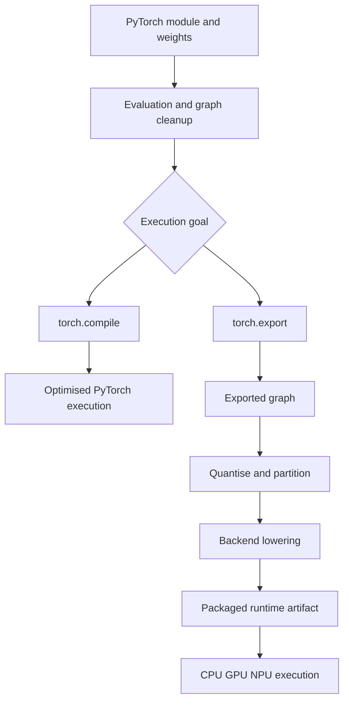
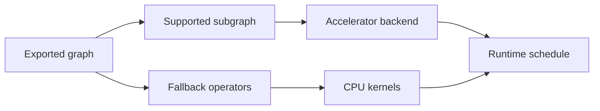

Training code is not automatically a deployable model. Python execution may include dynamic control flow, unsupported operators, development-only preprocessing, and memory behaviour unsuitable for the target device.

PyTorch provides two related but different concepts:

- `torch.compile` optimises execution of a model or function in the current PyTorch environment.
- `torch.export` captures a full Ahead-of-Time tensor graph with explicit assumptions for downstream transformation and deployment.



## `torch.compile`: optimise execution now

`torch.compile` uses TorchDynamo to capture PyTorch operations and a backend such as TorchInductor to generate optimised kernels. Unsupported Python behaviour can cause graph breaks, allowing execution to continue but reducing optimisation opportunities.

```python
import torch


model = MyModel().eval().to("cuda")
example = torch.randn(1, 3, 512, 512, device="cuda")

compiled_model = torch.compile(model, backend="inductor")

with torch.no_grad():
    # First calls may include compilation cost.
    output = compiled_model(example)
```

Use `torch.compile` when the application will continue to run through PyTorch and the goal is faster training or inference on the host platform. Measure warm-up, recompilation, dynamic-shape behaviour, and steady-state latency separately.

## `torch.export`: capture a portable graph

`torch.export` attempts to produce a complete graph of tensor computation. Instead of silently accepting an untraceable region, export normally reports the problem because downstream runtimes need a closed graph.

```python
import torch


model = MyModel().eval()
example_inputs = (torch.randn(1, 3, 512, 512),)

exported = torch.export.export(model, args=example_inputs)
torch.export.save(exported, "model.pt2")

# The exported module can be checked in Python.
reloaded = torch.export.load("model.pt2")
with torch.no_grad():
    result = reloaded.module()(*example_inputs)
```

The exported graph contains tensor operations and shape constraints. It is not CPU machine code, GPU instructions, or a generic replacement for an application executable.

## Dynamic shapes

Example inputs establish default shapes. If dimensions must vary, declare bounded dynamic dimensions rather than assuming every shape is accepted.

```python
batch = torch.export.Dim("batch", min=1, max=4)
height = torch.export.Dim("height", min=256, max=1024)
width = torch.export.Dim("width", min=256, max=1024)

dynamic_shapes = ({0: batch, 2: height, 3: width},)

exported = torch.export.export(
    model,
    args=example_inputs,
    dynamic_shapes=dynamic_shapes,
)
```

Dynamic shapes increase flexibility but may reduce optimisation, create several compiled variants, or be unsupported by a target backend. Use bounded variability when the product contract permits it.

## Quantisation

Quantisation reduces numerical precision, commonly from FP32 to FP16 or INT8. Benefits may include lower weight storage, lower activation memory, reduced bandwidth, and faster accelerator execution.

The main strategies are:

- post-training dynamic quantisation;
- post-training static quantisation with calibration;
- quantisation-aware training;
- weight-only quantisation for suitable model classes.

Quantisation is not a file-conversion option. It changes numerical behaviour. Evaluate every task head, calibration, rare class, and post-processing threshold with the quantised graph.

## Partitioning and backend lowering

An exported graph may contain hundreds of operators. A partitioner identifies subgraphs supported by a backend. Lowering translates those subgraphs into the backend’s representation and optimises them for a target accelerator.

Unsupported operations may remain on the CPU. A single fallback can introduce synchronisation and tensor copies that dominate latency. Always inspect the actual partitioned graph.



## ExecuTorch flow

ExecuTorch takes an exported PyTorch program, applies edge transformations and backend-specific lowering, performs memory planning, and serialises an on-device program—commonly as a `.pte` file. The exact partitioner and configuration depend on the target backend.

```python
# Conceptual skeleton; backend partitioner setup is target-specific.
from executorch.exir import to_edge_transform_and_lower

edge_program = to_edge_transform_and_lower(
    exported,
    partitioner=[target_partitioner],
)
executorch_program = edge_program.to_executorch()

with open("model.pte", "wb") as file:
    file.write(executorch_program.buffer)
```

A `.pte` contains the prepared model program, weights or references, execution plan, and backend delegates needed by the ExecuTorch runtime. It does not replace an ELF application or operating-system executable. The host application still owns sensors, buffers, scheduling, state, post-processing, diagnostics, and safety integration.

## Other deployment routes

The same high-level stages appear across ecosystems:

| Route | Typical purpose |
|---|---|
| `torch.compile` + Inductor | Optimised PyTorch host execution |
| `torch.export` + AOTInductor | Ahead-of-Time PyTorch-native deployment |
| ExecuTorch | Mobile and embedded on-device runtime |
| ONNX export + runtime | Interchange and cross-runtime execution |
| TensorRT | NVIDIA-targeted optimisation and runtime |
| QNN or vendor backend | Qualcomm accelerator targeting |
| OpenVINO | Intel CPU, GPU, and NPU deployment |

The file names and APIs differ, but graph capture, optimisation, partitioning, lowering, memory planning, packaging, and runtime integration remain recognisable.

## Verification harness

Compare every transformation stage against a reference implementation.

```python
def compare(reference_model, candidate_model, inputs, atol=1e-4, rtol=1e-3):
    reference_model.eval()
    candidate_model.eval()

    with torch.no_grad():
        expected = reference_model(*inputs)
        actual = candidate_model(*inputs)

    torch.testing.assert_close(actual, expected, atol=atol, rtol=rtol)
```

Real multi-output models need per-output tolerances and task-level metrics. Numerical closeness alone may not detect a harmful change after thresholding, ranking, decoding, or temporal state updates.

## Deployment checklist

1. Freeze the evaluation input and output contract.
2. Remove training-only behaviour and uncontrolled Python side effects.
3. Export with representative and edge-case shapes.
4. Inspect the exported graph and constraints.
5. Quantise only with task-specific evaluation.
6. Inspect accelerator partitions and CPU fallbacks.
7. Compare numerical and task-level outputs.
8. Measure warm-up, median, tail latency, memory, and thermal behaviour.
9. Test concurrent workloads and repeated stateful inference.
10. Version the model, preprocessing, compiler, backend, and runtime together.

## The key distinction

`torch.compile` answers: **How can this PyTorch program run faster here?**

`torch.export` answers: **What complete tensor graph can be handed to another compiler or runtime?**

Export is graph capture, not final deployment. Compilation and lowering are target-specific. The deliverable is only complete when the packaged model has been integrated, profiled, verified, and monitored inside the real application.

## Official references

- [PyTorch `torch.export` documentation](https://docs.pytorch.org/docs/stable/user_guide/torch_compiler/export.html)
- [PyTorch `torch.compile` tutorial](https://docs.pytorch.org/tutorials/intermediate/torch_compile_tutorial.html)
- [ExecuTorch model export and lowering](https://docs.pytorch.org/executorch/stable/using-executorch-export.html)
- [ExecuTorch Qualcomm AI Engine backend](https://docs.pytorch.org/executorch/stable/backends-qualcomm.html)
