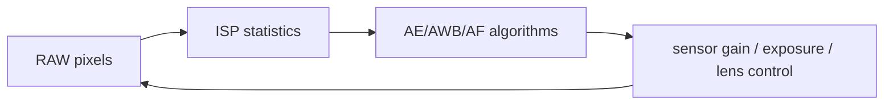

For autonomy, the ISP is not merely a block that makes pictures look good. It defines the **numerical, geometric and temporal contract** of every camera tensor that reaches perception.

A network may be trained on “RGB images,” but a production camera path has already transformed sensor charge through black-level correction, gain, HDR merge, lens shading, defect correction, demosaic, denoise, color correction, tone mapping, resize/crop and format conversion. Those operations can improve signal quality, but they also alter the distribution and geometry seen by the model.

This article uses a Qualcomm automotive-camera architecture as a reference model. Exact internal block names and throughput vary by SoC and BSP.

## 1. Start before the ISP: exposure is part of the measurement

A camera sample is not created at the moment a software buffer arrives. The physically meaningful timeline starts at exposure.

```text
trigger / frame-sync
      ↓
exposure start
      ↓
row readout over sensor line time
      ↓
MIPI CSI transmission
      ↓
receiver / packet framing
      ↓
ISP processing
      ↓
DMA to output buffer
      ↓
software callback / fence
```

For temporal fusion, the timestamp must answer a precise question: **exposure start, exposure midpoint, end of frame readout, CSI arrival, ISP completion, or software delivery?**

Assigning `now()` at the callback is usually the least useful choice because it includes variable queueing/processing delay.

## 2. CSI-2 transports packets; it does not solve camera synchronization

A typical path is:


CSI-2 preserves frame/line packetization, virtual channels and data types. Multi-camera synchronization comes from the **sensor trigger/time architecture**, not from CSI itself.

For surround or autonomy cameras, common mechanisms include:

- common hardware frame-sync/trigger;
- synchronized sensor clocks;
- PTP/PPS-related system time;
- timestamp conversion into one vehicle time base.

The system needs both **trigger alignment** and **known timestamp semantics**. One without the other is insufficient.

## 3. Bayer RAW is a sampled measurement, not a color image

A Bayer sensor usually measures one color-filtered value per photosite. For RGGB:

```text
R G R G ...
G B G B ...
R G R G ...
```

The raw value is approximately:

$$R_{raw}=g\cdot(S+D)+b+n$$

where `S` is photo-generated signal, `D` dark current, `g` analog/digital gain, `b` black offset and `n` noise.

Before demosaic, the pipeline may apply:

- black-level subtraction;
- defective-pixel correction;
- lens-shading correction;
- exposure/gain normalization;
- HDR exposure combination;
- spatial noise filtering.

Those operations change the statistics later used by AI. A training dataset processed by one tuning set is not numerically identical to the same sensor processed by another.

## 4. HDR is temporal as well as radiometric

Automotive cameras often require high dynamic range for tunnel exits, headlights and sun glare. HDR sensors may combine multiple exposure states.

Conceptually:

```text
short exposure  ─┐
medium exposure ─┼─> motion-aware merge -> linear HDR signal
long exposure   ─┘
```

The exposures do not necessarily describe exactly the same scene state. Moving vehicles, rotating wheels, LED signs and ego motion can create merge artifacts.

For perception, test not just highlight preservation but:

- moving-object ghosting;
- traffic-light/LED flicker interaction;
- edge duplication;
- contrast compression of small dark objects;
- different merge behavior across cameras.

## 5. Lens-shading correction is calibration-dependent

Vignetting causes brightness/color gain variation over image position. Lens-shading correction uses a spatial gain field.

If the correction table is wrong for lens, temperature or module variant, the model can see systematic spatial color bias.

This illustrates a general principle:

> **camera tuning is part of the sensor calibration package, not just image-quality configuration.**

Version the ISP tuning and calibration revision with model validation results.

## 6. Demosaic creates information that the sensor never directly measured

Demosaic estimates missing color channels using neighboring pixels. Different algorithms trade edge preservation, false color and noise.

For AI, the issue is not whether one demosaic is visually prettier. It is whether the model was trained on the same transformation family.

The encoder learns filters over local color/texture patterns. Changing demosaic sharpening can therefore change activation distributions even if human observers consider both images acceptable.

## 7. Noise reduction can delete model evidence

Spatial/temporal denoise is especially important in low light. It can also remove fine features:

```text
small pedestrian silhouette
lane marking at distance
thin pole/sign edge
bicycle spokes
```

Temporal denoise uses previous frames, so the output at time `t` may depend on scene history. That creates hidden state before the neural temporal model even begins.

For safety-critical perception, characterize ISP temporal filtering under:

- ego yaw;
- object crossing motion;
- sudden illumination transitions;
- rain/wiper motion;
- low-SNR distant objects.

## 8. 3A is a control loop, not a pixel filter

Auto-exposure, auto-white-balance and auto-focus (where applicable) operate through statistics and sensor/lens control.



This loop has dynamics. Two cameras looking in different directions can choose different exposure/gain states, causing large intensity differences even at the same timestamp.

For multi-camera fusion, useful metadata includes:

- exposure time;
- analog/digital gain;
- white-balance gains;
- HDR mode;
- frame sequence;
- sensor temperature or relevant calibration state where available.

Models can be robust to these variations, but only if validation covers them.

## 9. Rolling shutter is a geometric timing distortion

With rolling shutter, different rows are exposed at different times.

If line time is `t_l` and row index is `r`, a simple model is:

$$t(r)=t_0+r\,t_l$$

At high angular velocity, the top and bottom of one image correspond to different camera poses.

This matters for camera-to-BEV projection. A single rigid pose for the whole frame is an approximation whose error grows with:

- readout time;
- ego angular velocity;
- object motion;
- distance/geometry.

A high-end stack may compensate row time or use exposure-midpoint approximations depending on required accuracy.

## 10. Crop and scale change camera intrinsics

Suppose original intrinsics are:

$$K=\begin{bmatrix}f_x&0&c_x\\0&f_y&c_y\\0&0&1\end{bmatrix}$$

If the image is cropped by `(x_0,y_0)` and scaled by `(s_x,s_y)`, then the effective intrinsics become approximately:

$$K'=\begin{bmatrix}
s_x f_x&0&s_x(c_x-x_0)\\
0&s_y f_y&s_y(c_y-y_0)\\
0&0&1
\end{bmatrix}$$

This is crucial. A model may consume `448×256` images, but the geometry module must use intrinsics corresponding to **that exact resize/crop path**.

“Calibration file is correct for the sensor” is not enough if preprocessing changes the image coordinates.

## 11. Distortion correction changes the image model

Some pipelines output distorted sensor images and let downstream software use distortion coefficients. Others rectify/warp before AI.

The camera contract must state which one:

```text
raw distorted pixels + distortion model
or
rectified pixels + rectified intrinsics
```

Mixing rectified images with original intrinsics produces systematic projection error that can look like a BEV-network problem.

## 12. YUV formats matter in real pipelines

ISP output is often NV12/NV21 or another YUV format rather than RGB.

For NV12:

```text
Y plane: full resolution
UV plane: interleaved chroma at lower resolution
```

Converting to RGB requires a color matrix and range convention. BT.601 versus BT.709, limited versus full range, and UV ordering can materially alter normalized model input.

The image contract should specify:

```text
format
plane order
y/c stride
color matrix
range
transfer function
bit depth
```

A visually plausible but numerically wrong YUV conversion is a common source of model regressions.

## 13. Buffer geometry is part of the interface

A frame is not simply `width × height × bytes_per_pixel`.

Hardware buffers can have:

- aligned stride larger than visible width;
- multiple planes;
- tiled/compressed layout;
- crop rectangle;
- metadata sideband;
- secure/protected allocation state.

Downstream consumers should use buffer descriptors, not assume tightly packed rows.

For zero-copy camera-to-AI, the accelerator/backend must accept the producer’s memory representation or a conversion stage is unavoidable.

## 14. ISP latency has queueing and line-processing structure

Many pixel operations stream line-by-line rather than waiting for a complete frame. End-to-end latency is therefore not necessarily `frame period + processing time`.

Still, software sees buffers after several phases:

```text
exposure/readout
CSI transport
front-end buffering
ISP line pipeline
DMA completion
queue to consumer
```

To diagnose latency, retain at least two timestamps:

- physical capture/exposure reference;
- buffer-ready/completion time.

Their difference measures camera-pipeline age.

## 15. Multi-camera synchronization should be visible in the data model

For six cameras, store per-frame timing independently:

```text
CAM_FRONT       t = T - 3.2 ms
CAM_FRONT_LEFT  t = T - 7.8 ms
CAM_FRONT_RIGHT t = T - 1.9 ms
...
```

Do not erase this information simply because the six images are batched into `[6,3,H,W]` for inference.

Batching is a compute optimization. It does not make the physical captures simultaneous.

At relative speed `v`, temporal skew produces displacement:

$$\Delta x=v\Delta t$$

At 20 m/s, 20 ms corresponds to 0.4 m. For a nearby moving vehicle, that is significant.

## 16. ISP tuning and model training are coupled

The perception model implicitly learns the camera pipeline. Therefore treat these as a versioned compatibility set:

```text
sensor module
sensor register configuration
lens/calibration
ISP tuning
output format/crop/scale
model preprocessing
model weights
```

Changing only one item can invalidate performance evidence.

A mature release process tracks the complete chain in dataset/model metadata.

## 17. What to inspect when perception regresses after a camera update

Before retraining the network, compare:

1. exposure and gain distributions;
2. white-balance gains;
3. tone curves and gamma;
4. sharpness/denoise changes;
5. crop/scale geometry;
6. distortion/rectification mode;
7. YUV/RGB conversion;
8. frame timestamps and sync offsets;
9. dropped/duplicated frame behavior;
10. calibration/tuning version.

Then compare encoder activation statistics for the same scene. If early-layer distributions shifted strongly, the regression may be upstream of the model.

## 18. A useful experiment: propagate resize into intrinsics

```python
import numpy as np

K = np.array([[1200., 0., 960.],
              [0., 1200., 540.],
              [0., 0., 1.]])

crop_x, crop_y = 160, 90
crop_w, crop_h = 1600, 900
out_w, out_h = 448, 256
sx, sy = out_w / crop_w, out_h / crop_h

K2 = K.copy()
K2[0,0] *= sx
K2[1,1] *= sy
K2[0,2] = (K[0,2] - crop_x) * sx
K2[1,2] = (K[1,2] - crop_y) * sy

print(K2)
```

This small calculation matters more to camera-to-BEV correctness than many model tweaks.

## 19. The expert-level camera contract

A model-ready frame should conceptually travel with:

```text
pixel buffer / handle
t_capture
frame sequence
sensor identity
intrinsics for current image coordinates
extrinsics
lens/distortion model or rectification state
crop/scale transform
exposure/gain/HDR metadata
pixel format/colorimetry
calibration/tuning revision
completion fence
```

When that contract is explicit, the camera encoder and BEV stages can be reasoned about independently. When it is implicit, calibration, ISP and AI bugs become indistinguishable.

## References

- [MIPI CSI-2 specification overview](https://www.mipi.org/specifications/csi-2)
- [Linux media userspace API](https://docs.kernel.org/userspace-api/media/index.html)
- [V4L2 pixel format documentation](https://docs.kernel.org/userspace-api/media/v4l/pixfmt.html)
- [Qualcomm Automotive](https://www.qualcomm.com/products/automotive)
