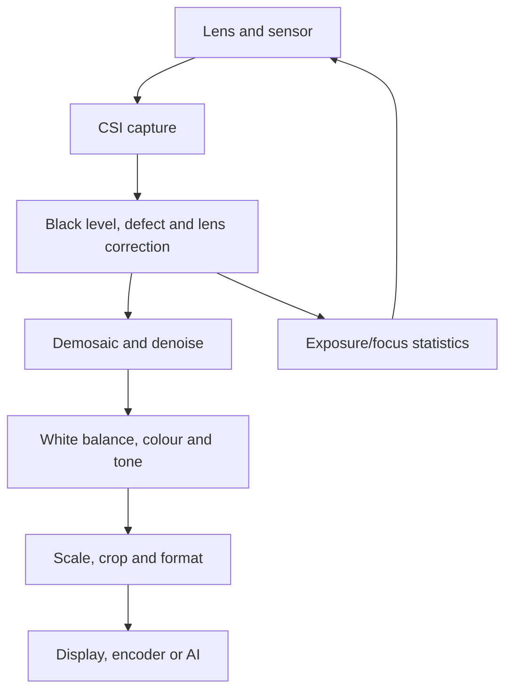

An image signal processor converts raw sensor measurements into frames usable by displays, computer vision and neural networks. On an SA8295P-class cockpit platform, it may serve surround-view, mirror-replacement, cabin-monitoring or conferencing cameras. Exact Qualcomm block names and capacities are product-specific, but the pipeline is stable enough to reason about.



## RAW is not RGB

A Bayer sensor records one colour component per photosite. Demosaicing estimates missing components. Black-level subtraction, bad-pixel correction, lens shading, denoise, white balance, colour correction and tone mapping change the numeric distribution seen by a model.

## Image quality and model quality differ

A pleasing image can be a poor model input. Temporal denoise may erase a distant pedestrian; local tone mapping alters contrast; auto-exposure can oscillate between cameras. Freeze and version an AI image contract: resolution, crop, colour space, transfer function, bit depth, stride, exposure metadata and ISP tuning.

## Synchronization

“30 FPS” does not mean eight frames describe the same instant. Trigger, exposure timing, CSI arrival, ISP queueing and timestamp placement matter. At 20 m/s, 10 ms skew is 20 cm of ego motion before rotation.

## Simulation: tiny Bayer pipeline

```python
import numpy as np
h, w = 8, 8
raw = np.tile(np.linspace(64, 900, w), (h, 1)).astype(np.float32)
raw[::2, ::2] *= 1.15       # R sites in RGGB
raw[1::2, 1::2] *= .82      # B sites

linear = np.clip(raw - 64, 0, 959) / 959
rgb = np.zeros((h, w, 3), np.float32)
rgb[::2,::2,0], rgb[::2,1::2,1] = linear[::2,::2], linear[::2,1::2]
rgb[1::2,::2,1], rgb[1::2,1::2,2] = linear[1::2,::2], linear[1::2,1::2]
for c in range(3):
    known = rgb[...,c] > 0
    rgb[...,c][~known] = rgb[...,c][known].mean()  # teaching-only interpolation
rgb = np.clip(rgb * np.array([1.7,1.0,1.45]), 0, 1) ** (1/2.2)
print("channel means:", rgb.mean(axis=(0,1)))
```

Change white-balance gains or black level and observe distribution shift. A real ISP uses calibrated matrices and spatial filters; this exposes transformations hidden behind “camera input.”

## Debug checklist

- Verify exposure-start timestamps and clock conversion.
- Record RAW plus processed frames where permitted.
- Inspect stride, plane offsets and NV12/RGB conversion.
- Measure drops and queue depth at every node.
- Correlate tuning revisions with model regressions.
- Test HDR merge, LED flicker, darkness, glare, blur and occlusion.

## References

- [MIPI CSI-2 overview](https://www.mipi.org/specifications/csi-2)
- [Linux media userspace API](https://docs.kernel.org/userspace-api/media/index.html)
- [Qualcomm Snapdragon Cockpit Platforms](https://www.qualcomm.com/products/automotive/digital-chassis/snapdragon-cockpit-platforms)

