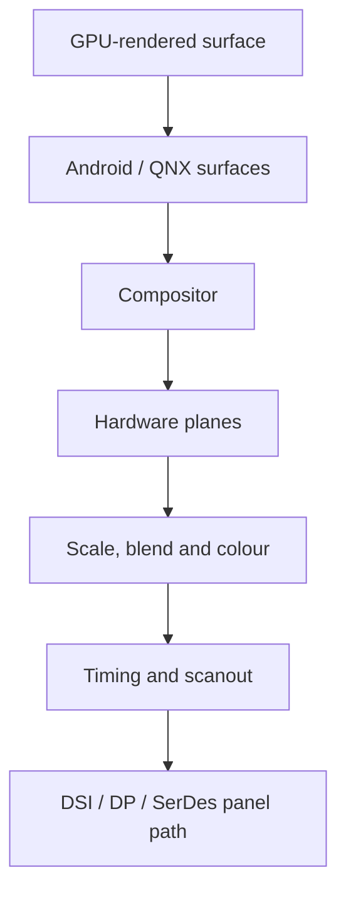

In Android/Linux, DPU commonly means display processing hardware that fetches image layers, scales and blends them, applies colour processing and scans the final stream to a display interface. Qualcomm Linux drivers use the MSM Display Processing Unit terminology. This differs from “DPU” used generically for deep-learning processors.

An SA8295P-class cockpit may drive several high-resolution displays. The problem is not only pixel quality but predictable presentation, bandwidth, safety overlays, virtualization and recovery.



## GPU rendering versus composition

The GPU generates pixels inside a surface. Display hardware can combine ready-made surfaces. If layer count, formats, transforms or scaling exceed plane capability, the compositor asks the GPU to pre-compose, increasing latency and bandwidth.

## Fences are the time contract

A producer returns a buffer with a fence. The compositor must not read before completion; scanout must not race an update. A missed presentation deadline normally reuses the prior frame, causing judder rather than displaying a partial buffer.

## Bandwidth

$$BW \approx width \times height \times bytesPerPixel \times refreshRate$$

A 3840×2160 RGBA layer at 60 Hz is about 1.99 GB/s before compression, tiling, cache effects, overfetch or multiple layers.

## Simulation: presentation misses

```python
import random
period_ms, misses = 1000/60, 0
for frame in range(600):
    ready = random.gauss(7,1.4) + random.gauss(5,1) + random.gauss(1.2,.25)
    if random.random() < .015: ready += random.uniform(4,10)
    misses += ready > period_ms
print(f"missed {misses}/600 frames ({100*misses/600:.1f}%)")
```

Real stages overlap and presentation is phase-sensitive. The model shows why a small tail of contention stalls can spoil a good average.

## Cockpit concerns

- Separate safety-relevant telltales from complex IVI where required.
- Define display-controller ownership across VMs.
- Protect secure/DRM content through buffer and scanout.
- Monitor link, panel, timing, underflow and compositor health.
- Specify boot splash, handover, suspend/resume and recovery.
- Calibrate colour and brightness across panels and temperature.

## References

- [Linux DRM/KMS](https://docs.kernel.org/gpu/drm-kms.html)
- [Linux MSM DPU driver](https://git.kernel.org/pub/scm/linux/kernel/git/torvalds/linux.git/tree/drivers/gpu/drm/msm/disp/dpu1)
- [Android graphics architecture](https://source.android.com/docs/core/graphics/architecture)

