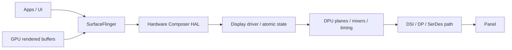

The display processor is often treated as the final cosmetic stage of a cockpit system. In reality it is a **hard real-time-ish consumer of memory bandwidth with strict presentation deadlines, explicit buffer ownership, security constraints and safety implications**.

The GPU renders pixels into surfaces. The display processor does something different: it fetches already-produced buffers, applies supported per-plane operations, composes them according to a hardware state, and scans the resulting pixels to a physical interface at a fixed timing cadence.

On Qualcomm Linux platforms this hardware is commonly represented by the MSM DPU driver family. Exact capabilities differ by SoC generation.

## 1. Separate rendering from composition

The conceptual Android path is:



A layer can reach the screen in two broad ways:

```text
GPU composition:
  many layers -> GPU renders one framebuffer -> DPU scans framebuffer

hardware composition:
  several layer buffers -> DPU hardware planes -> blend/scanout
```

Hardware composition avoids GPU work and intermediate writes when the DPU supports the requested formats, scaling, rotation, blending and color transforms.

## 2. Why Hardware Composer matters

SurfaceFlinger builds the scene graph, but the Hardware Composer decides which layers can be delegated to display hardware.

If a layer cannot be handled by hardware because of unsupported:

- format;
- transform;
- scaling ratio;
- blending mode;
- protected-content constraint;
- plane/resource exhaustion;

the system may fall back to GPU client composition.

That fallback changes both latency and memory traffic. A system that works with two layers can become bandwidth-limited when a third layer forces a full-screen GPU composition target.

## 3. Planes are scarce hardware resources

A DPU typically exposes a finite set of fetch/scaler/blender resources. Conceptually:

```text
Plane 0 -> fetch -> crop -> scale -> color -> blend ┐
Plane 1 -> fetch -> crop -> scale -> color -> blend ├-> mixer -> timing -> link
Plane 2 -> fetch -> crop -> scale -> color -> blend ┘
```

Not every plane has identical capabilities. Resource allocation can therefore fail even if total pixel rate appears acceptable.

An expert display debug should ask:

- which layer was assigned to which plane;
- which scaler/rotation path was consumed;
- whether the requested source/destination rectangles are supported;
- why HWC chose client composition;
- whether protected and non-protected layers can coexist in that composition.

## 4. Buffers are asynchronous objects with fences

A producer may submit a surface before hardware has finished rendering it. The buffer therefore travels with a synchronization primitive.

```text
producer writes buffer
      ↓
release/acquire fence
      ↓
compositor waits only when needed
      ↓
DPU starts reading buffer
      ↓
presentation / retire fence
      ↓
buffer can eventually return to producer pool
```

The buffer lifecycle is the key invariant:

> **No consumer may read before the producer is finished, and no producer may overwrite while any consumer still reads.**

A fence timeout often indicates an upstream GPU or producer problem, not a display-controller bug.

## 5. Atomic commit is a state transition, not a sequence of register writes

DRM/KMS-style atomic modesetting models a complete display state: planes, framebuffers, positions, mode timings, connectors and properties.

The driver validates whether the requested state is possible before committing it.

This is important because partial display updates would create inconsistent hardware states. Conceptually:

```text
old state S0
  + proposed plane/mode changes
  -> atomic_check()
      pass -> atomic_commit() -> S1
      fail -> remain at S0
```

For debugging, distinguish **atomic-check failure** from **commit-time/presentation failure**.

## 6. Vblank defines the presentation cadence

At 60 Hz, a new refresh starts roughly every 16.67 ms. The compositor must have the next valid state ready before the relevant presentation boundary.

If the producer misses that deadline, the previous buffer may remain on screen for another refresh.

This creates a latency quantization effect:

```text
buffer ready just before vblank -> presented now
buffer ready just after vblank  -> waits nearly one frame period
```

Average producer latency can therefore change only slightly while end-to-end display latency jumps by ~16.7 ms.

For cockpit UX and camera mirror systems, measure **capture-to-photon** or event-to-photon latency, not only compositor execution time.

## 7. Scanout bandwidth is continuous

For an uncompressed linear plane:

$$BW = W\times H\times bytesPerPixel\times refreshRate$$

A 3840×2160 RGBA8888 plane at 60 Hz is about 1.99 GB/s of raw read traffic.

But practical bandwidth includes:

- multiple planes;
- scaling overfetch;
- rotation;
- writeback;
- GPU composition intermediate buffers;
- metadata/compression overhead;
- memory-controller efficiency;
- simultaneous camera/AI traffic.

Display is particularly unforgiving because scanout must continue at a fixed rate. If memory cannot deliver data, the result can be an underflow rather than merely slower completion.

## 8. Compression helps only if the whole path understands it

Qualcomm platforms commonly use compressed/tiled surface formats such as UBWC on supported paths. Compression can reduce DRAM traffic, but only when producer, consumer and allocator agree on the format and metadata layout.

A zero-copy path can become a conversion path if one stage accepts only linear memory:

```text
GPU UBWC surface
   -> decompress/copy to linear
   -> display or encoder
```

That conversion may erase the bandwidth advantage. Treat compression format as part of the shared-buffer contract.

## 9. Color processing is another stateful pipeline

Display hardware may perform:

- CSC (color-space conversion);
- gamma/degamma;
- color-correction matrices;
- gamut mapping;
- HDR tone mapping;
- dithering;
- panel calibration.

The rendered RGB values are therefore not necessarily the exact voltages/light output seen at the panel.

For safety-relevant telltales or camera display paths, color-pipeline configuration should be versioned and validated under brightness, temperature and panel-variant conditions.

## 10. Protected content changes composition topology

A protected surface must remain in a path where untrusted CPU/GPU clients cannot map or capture it.

Possible constraints include:

```text
protected decoder output
  -> protected allocation
  -> protected-capable hardware plane
  -> secure display path
```

If the scene requires GPU client composition and the GPU composition target cannot legally contain protected content, HWC may need a different allocation strategy or reject that combination.

Security therefore affects plane assignment, not just memory flags.

## 11. Virtualization introduces display ownership questions

In a cockpit, QNX or another host may own the physical display controller while Android runs in a guest. Architectures vary, but the questions are stable:

- Which OS owns KMS/display hardware?
- Does the guest receive a virtual display device or a hardware partition?
- Who allocates scanout-compatible memory?
- How are fences transported across VM boundaries?
- Who owns the final safety overlay?
- What happens if the guest compositor hangs?

A robust design often keeps the final authority for critical display state in a more trusted/controlled domain than general IVI applications.

## 12. Safety overlays are architectural, not visual

A warning icon is not made safety-relevant simply because it is drawn on top.

The architecture must establish independence from faults in lower-criticality content. Relevant mechanisms can include:

- dedicated plane or display path;
- independent producer/watchdog;
- controlled composition ownership;
- defined fallback frame;
- panel/link diagnostics;
- end-to-end alive/freshness monitoring.

The exact mechanism depends on the safety concept, but the principle is **freedom from interference**, not z-order.

## 13. Camera mirror systems expose the full timing chain

For a digital mirror or surround-view display:

```text
exposure
 -> sensor readout
 -> CSI/ISP
 -> buffer completion
 -> optional GPU warp/stitch
 -> compositor
 -> vblank wait
 -> scanout
 -> panel response
```

End-to-end latency is roughly:

$$T_{c2p}=T_{camera}+T_{processing}+T_{queue}+T_{composition}+T_{vblank}+T_{scanout}+T_{panel}$$

Optimizing only GPU rendering may have little effect if vblank alignment or camera queue depth dominates.

The best trace carries one frame identifier from capture through presentation.

## 14. Underflow is usually a systems problem

Display underflow means a fetch path could not supply pixels before the timing engine needed them. Causes can include:

- insufficient bandwidth vote;
- pathological scaling/rotation;
- DRAM contention;
- clock throttling;
- too many active planes;
- bad QoS configuration;
- transient system stalls.

Because scanout deadlines are deterministic, underflow is often a valuable indicator of system-level memory-pressure bugs.

## 15. What to instrument

A useful display trace should correlate:

```text
producer buffer-ready time
acquire fence signal time
SurfaceFlinger/HWC composition decision
atomic commit time
plane assignment
vblank sequence/time
presentation/retire fence
underflow/link error counters
clock/bandwidth state
```

For each frame, answer:

> Was it late because the producer was late, because composition changed, because the commit missed vblank, or because hardware could not fetch fast enough?

## 16. A small timing model

```python
FRAME_MS = 1000 / 60

def present(ready_ms):
    # next refresh boundary after the frame becomes ready
    n = int(ready_ms // FRAME_MS) + 1
    return n * FRAME_MS

for ready in [15.8, 16.5, 16.8, 22.0, 33.2]:
    p = present(ready)
    print(f"ready={ready:5.1f} ms -> present={p:5.1f} ms, wait={p-ready:4.1f} ms")
```

A few hundred microseconds around the refresh boundary can change presentation latency by an entire frame interval. That is why p99 event-to-photon latency often tells a different story from average rendering time.

## 17. Practical architectural rules

- Keep rendering and scanout concepts separate.
- Track buffer/fence lifetime explicitly.
- Treat hardware-plane assignment as a scarce-resource problem.
- Measure presentation time against vblank, not merely commit-call duration.
- Include display bandwidth in whole-SoC DRAM budgeting.
- Preserve compressed/tiled formats end-to-end where useful.
- Treat protected-content and safety-layer requirements as composition constraints.
- Define recovery for GPU hang, guest compositor failure, display underflow, link failure and panel reset.

A cockpit display stack becomes understandable once it is treated as a **timed memory-consumption pipeline with explicit ownership**, not as “the GPU draws the UI.”

## References

- [Linux DRM/KMS](https://docs.kernel.org/gpu/drm-kms.html)
- [Linux MSM DPU driver](https://git.kernel.org/pub/scm/linux/kernel/git/torvalds/linux.git/tree/drivers/gpu/drm/msm/disp/dpu1)
- [Android graphics architecture](https://source.android.com/docs/core/graphics/architecture)
- [Android Hardware Composer HAL](https://source.android.com/docs/core/graphics/implement-hwc)
