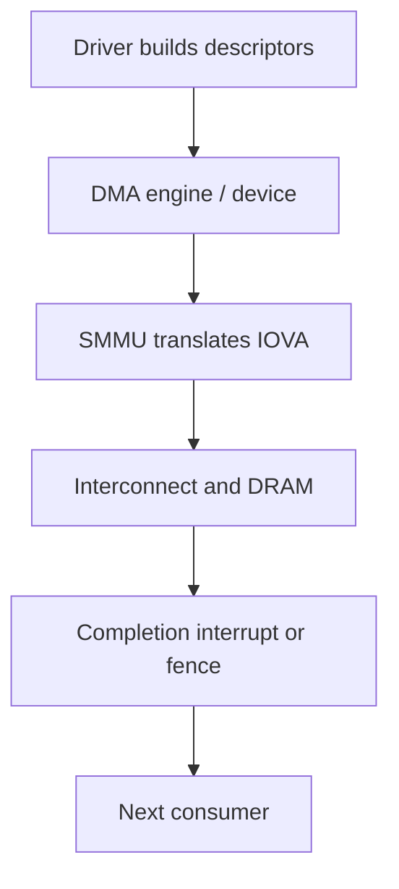

DMA lets a peripheral or accelerator move data without asking the application CPU to copy every word. Camera, storage, networking, audio, display, GPU and remote processors can all be bus masters. “Zero copy” is therefore a system property involving allocation, format compatibility, cache ownership, translation and synchronization—not merely the absence of `memcpy()`.



## Three address spaces

The CPU uses virtual addresses translated by its MMU. A device can use an I/O virtual address translated by the SMMU/IOMMU. The driver maps pages into the device’s domain and receives a DMA address; it must not normally hand the device an arbitrary CPU virtual address.

## Coherency and ownership

Coherent hardware maintains a consistent cacheable view under platform rules. On non-coherent paths, the DMA API coordinates cache maintenance. The portable rule: use the OS DMA API and obey ownership transitions, rather than inserting guessed cache flushes.

## Scatter-gather

A logically continuous buffer may occupy multiple pages. Scatter-gather descriptors describe segments without copying them into one contiguous block. Controllers still impose segment count, alignment, boundary and ring limits.

## SMMU isolation

Without translation and permissions, a faulty device could overwrite unrelated memory. Constrained SMMU domains limit accessible pages and create diagnosable faults for invalid IOVAs—if fault reporting is configured and monitored.

## Simulation: descriptor splitting

```python
BOUNDARY, MAX_CHUNK = 4096, 1536
def descriptors(start, length):
    out = []
    while length:
        chunk = min(length, MAX_CHUNK, BOUNDARY - start % BOUNDARY)
        out.append((start, chunk)); start += chunk; length -= chunk
    return out

items = descriptors(0x1F80, 7000)
for address, size in items: print(f"IOVA=0x{address:08x} bytes={size}")
assert sum(n for _, n in items) == 7000
assert all(a//BOUNDARY == (a+n-1)//BOUNDARY for a,n in items)
```

The constraints are invented for learning. The lesson is that a driver translates a logical request into hardware-safe descriptors and handles partial completion and errors.

## Camera-to-AI buffer lifecycle

1. An allocator creates a capture/AI-compatible buffer.
2. Camera receives an IOVA and writes the frame.
3. A fence transfers ownership.
4. AI maps the same allocation, possibly at another IOVA.
5. Conversion occurs only where platform rules require it.
6. AI signals completion before camera reuse.

Unmapping too early causes faults; recycling too early causes silent corruption.

## Debug checklist

- Log device, IOVA, length, direction and lifetime—not sensitive content.
- Validate descriptor arithmetic and boundary limits.
- Use DMA API debugging and IOMMU fault logs where supported.
- Check transfer direction and ownership.
- Measure QoS under concurrent workloads.
- Inject timeout, short transfer, bad completion and reset.
- Under virtualization, verify device and SMMU ownership.

## References

- [Linux DMA API HOWTO](https://docs.kernel.org/core-api/dma-api-howto.html)
- [Linux DMAEngine](https://docs.kernel.org/driver-api/dmaengine/)
- [Linux IOMMU userspace API](https://docs.kernel.org/userspace-api/iommu.html)
- [Arm System MMU](https://www.arm.com/architecture/system-architectures/system-components/system-mmu)

