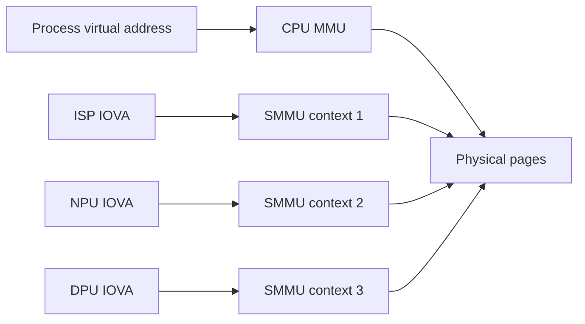

In a heterogeneous automotive SoC, **data movement is often more important than arithmetic**. Camera, GPU, DSP, NPU, display, storage and networking blocks all move large buffers through DRAM. The application CPU frequently coordinates those transfers without touching the payload.

That makes DMA and SMMU behavior part of the architecture, not a driver implementation detail.

The most useful mental model is:

> **An allocation is a physical set of pages; every CPU/process/device sees that allocation through its own mapping and synchronization contract.**

## 1. DMA engine and DMA-capable device are not the same thing

“DMA” is overloaded.

A dedicated DMA engine copies data from source to destination according to descriptors. But many peripherals are themselves **bus masters** and directly read/write memory:

```text
camera ISP  -> writes frame buffers
GPU         -> reads textures, writes render targets
NPU/HTP     -> reads/writes tensors
DPU         -> continuously reads scanout surfaces
NVMe/PCIe   -> reads/writes host memory
Ethernet    -> RX/TX descriptor rings and packets
```

The CPU configures these masters; it does not copy every byte.

## 2. Three address spaces must be kept distinct

The same allocation can have different addresses depending on who accesses it.



A host pointer such as `0x7f...` is meaningful only in one CPU address space. Passing that number to hardware is wrong unless a device-specific mapping contract says otherwise.

Drivers therefore exchange **buffer objects/handles and DMA addresses**, not arbitrary user pointers.

## 3. The SMMU is both translator and firewall

The Arm System MMU performs address translation for DMA masters.

Conceptually:

$$IOVA \xrightarrow{SMMU} Physical\ Page$$

Mappings also carry access permissions. A device can be restricted to only the pages required for its workload.

This has two consequences:

- performance: mappings populate translation structures/TLBs;
- security/safety: a buggy device/driver is constrained from arbitrary memory access.

An SMMU fault is therefore valuable evidence. It can indicate:

- stale IOVA;
- use-after-unmap;
- wrong device/domain;
- incorrect read/write permission;
- buffer length overrun;
- VM/device ownership error.

Do not hide these faults behind generic “hardware timeout” messages.

## 4. Stream IDs bind transactions to translation contexts

Bus transactions carry an identity (architecture/platform terminology varies) that lets the SMMU select the appropriate context.

That is why two devices can use the same numeric IOVA and still reach different physical pages.

It also explains a common integration bug: a device is assigned to the wrong context/VM, so perfectly valid IOVAs fault because the mapping exists in another domain.

Under virtualization, a transaction may pass through nested translation:

```text
guest IOVA
   -> guest/stage-1 mapping
   -> intermediate address
   -> host/stage-2 mapping
   -> physical pages
```

The exact implementation is platform-specific, but the debugging principle is constant: know which stage rejected the access.

## 5. `dma-buf`-style sharing separates allocation from device mapping

Linux commonly represents shareable allocations using buffer objects such as `dma-buf` file descriptors.

Conceptually:

```text
allocator creates physical backing
       ↓
exports buffer handle
       ↓
consumer imports same buffer
       ↓
consumer maps into its own DMA/SMMU domain
```

The producer and consumer do not need the same IOVA. They need the same underlying allocation plus a valid mapping in each device domain.

This is the core mechanism behind many “zero-copy” media/AI/display pipelines.

## 6. Zero-copy does not mean zero movement

Even if no CPU `memcpy()` occurs, hardware still reads and writes DRAM.

A camera-to-AI-to-display flow may do:

```text
ISP writes 12 MB frame
NPU reads 12 MB frame
NPU writes feature/output tensors
GPU reads output and writes overlay target
DPU reads final surfaces every refresh
```

Zero-copy means the **same allocation can be handed between stages without creating redundant intermediate copies**. It does not remove DRAM bandwidth.

The stronger optimization is often **format-compatible buffer reuse**.

## 7. Format incompatibility is a hidden copy trigger

Suppose:

```text
camera outputs NV12 tiled/compressed
AI expects planar RGB FP16
```

Even though both blocks support shared memory, the representation mismatch forces a conversion.

The conversion may happen via:

- CPU;
- GPU shader;
- DSP/vector kernel;
- ISP post-processing;
- AI preprocessing backend.

Architecture should track this explicitly as a stage with latency and bandwidth, not call the pipeline “zero-copy” because `dma-buf` handles are present.

## 8. Cache coherency is an ownership protocol

CPU caches complicate shared buffers.

For coherent device paths, hardware maintains consistency under platform rules. For non-coherent paths, software/driver APIs perform cache maintenance when ownership changes.

The important rule is not “flush before DMA.” It is:

> **Use the DMA/cache API appropriate to the platform and obey ownership transitions.**

Incorrect manual cache operations can be both redundant and wrong.

A typical lifecycle is:

```text
CPU owns buffer
   ↓ prepare/sync for device
Device owns/accesses buffer
   ↓ completion
sync for CPU
CPU reads/writes again
```

Two agents writing the same buffer concurrently is not solved by cache flushes; it is a synchronization bug.

## 9. Fences solve temporal ownership, SMMU solves spatial ownership

These mechanisms are complementary.

```text
SMMU: “may this device address these pages?”
Fence: “is the producer finished so the consumer may use them now?”
```

A correctly mapped buffer can still contain incomplete data if the consumer ignores the producer fence.

A correctly synchronized fence cannot make an unmapped IOVA valid.

System design needs both.

## 10. Scatter-gather describes non-contiguous backing efficiently

Large logical buffers do not require physically contiguous DRAM. A scatter-gather list describes page/segment ranges.

Hardware or the IOMMU can present those pages as a contiguous IOVA range even when physical addresses are fragmented.

```text
IOVA 0x10000000 --------------------+
                                     |
SMMU maps:                           v
  page 0 -> PA 0x81234000
  page 1 -> PA 0x99102000
  page 2 -> PA 0x81235000
```

A dedicated DMA engine may instead consume SG descriptors directly. Controllers can impose limits on segment count, alignment, boundary crossing or descriptor ring size.

## 11. Mapping cost is not free

Creating an IOMMU mapping can involve:

- page-table allocation/update;
- TLB invalidation;
- attachment to a device domain;
- cache synchronization;
- bookkeeping and locking.

Repeated map/unmap per video frame is often wasteful. Long-lived media/AI pipelines commonly benefit from buffer pools whose device mappings are reused.

Measure:

```text
allocation time
map time per device
steady-state submit latency
unmap/free time
```

Do not attribute mapping overhead to the accelerator kernel.

## 12. Buffer pools convert allocation latency into capacity planning

A streaming pipeline normally uses several in-flight buffers:

```text
buffer A: ISP writing
buffer B: NPU reading
buffer C: compositor waiting
buffer D: free
```

Too few buffers cause producer/consumer stalls. Too many increase memory footprint and, more subtly, **data age** because queues can grow.

If a camera captures at 30 Hz and the pipeline holds three queued frames, an output can already be ~100 ms old before inference finishes.

The correct buffer-pool size is therefore a latency-throughput tradeoff, not simply “more is safer.”

## 13. Ring descriptors require memory-order reasoning

Network/storage/DMA engines often consume descriptor rings shared with CPU software.

A simplified producer sequence is:

```text
1. fill descriptor fields
2. memory barrier
3. update producer index / doorbell
```

Without ordering, hardware can observe the ownership bit/index before the descriptor contents are globally visible.

Similarly, software reading completion descriptors needs the appropriate barriers before trusting fields written by hardware.

These bugs are timing-sensitive and can disappear under a debugger.

## 14. Direction matters

DMA APIs often distinguish:

```text
DMA_TO_DEVICE
DMA_FROM_DEVICE
DMA_BIDIRECTIONAL
```

The direction can influence cache maintenance and permissions. Declaring everything bidirectional may work but can cost performance and weaken diagnostics.

For SMMU mappings, minimum permissions are preferable:

```text
camera output buffer: device write
model weight buffer: accelerator read-only
result buffer: accelerator write, CPU read later
```

Least privilege improves both fault containment and bug detection.

## 15. IOVA lifetime bugs look like random hardware corruption

A classic failure sequence:

```text
map buffer -> IOVA X
queue device work using X
unmap X too early
reuse IOVA X for another allocation
device completes late and writes X
```

The late transaction can now corrupt an unrelated object.

The invariant is:

> **mapping lifetime must exceed the last possible device transaction using it.**

Fences/completions are therefore part of safe unmap logic.

## 16. Virtualization makes buffer sharing more explicit

Suppose Android guest produces a graphics surface while host QNX owns display hardware. The buffer path may require:

```text
guest allocation/handle
 -> host-visible shared-memory object
 -> host DPU mapping
 -> cross-VM fence transport
 -> scanout
```

The host must not trust guest-provided physical addresses. It imports a sanctioned shared-memory object and controls the real device mapping.

For debugging, log buffer identity across VM boundaries so the same physical allocation can be traced without exposing sensitive addresses.

## 17. Security and functional safety both care about DMA containment

A malicious device and a faulty device can cause similar memory damage. SMMU isolation helps both threat models.

For higher-integrity paths, define:

- device assignment;
- allowed address ranges;
- read/write permissions;
- fault reaction;
- reset behavior;
- whether a restarted device must rebuild mappings;
- whether diagnostic access can bypass isolation.

A system that enables the SMMU but globally maps all DRAM has translation, not meaningful containment.

## 18. A realistic camera-to-AI buffer lifecycle

```text
1. Buffer pool allocated.
2. ISP imports/maps each buffer into its SMMU domain.
3. AI runtime imports/maps same allocations into HTP domain.
4. ISP captures frame N into buffer A.
5. ISP signals completion fence with capture metadata.
6. AI waits fence, consumes A, writes output B.
7. AI signals completion.
8. Downstream consumer uses result.
9. Only after all references retire does A return to camera pool.
```

No CPU payload copy is required, but every transition still has explicit mapping and synchronization semantics.

## 19. A descriptor experiment that exposes boundary rules

```python
PAGE = 4096
MAX_SEG = 64 * 1024

def split(addr, length):
    out = []
    while length:
        page_left = PAGE - (addr % PAGE)
        n = min(length, page_left, MAX_SEG)
        out.append((addr, n))
        addr += n
        length -= n
    return out

for i, (addr, n) in enumerate(split(0x1FF0, 10_000)):
    print(i, hex(addr), n)
```

Real hardware rules differ. The point is to model the transformation from a logical transfer to hardware-safe segments and then reason about descriptor visibility, completion and partial failure.

## 20. What to capture when debugging a DMA/SMMU failure

For one buffer, correlate:

```text
allocation ID
size / planes / stride / format
CPU mapping lifetime
per-device mapping lifetime
IOVA range (where safe)
SMMU context/device identity
read/write permissions
producer fence
consumer fence
queue/submit timestamps
fault syndrome/address/device
reset generation
```

Then answer:

- Did the device access outside the mapped range?
- Was the buffer unmapped before completion?
- Was it mapped into the wrong device/VM context?
- Did a producer reuse it while a consumer still owned it?
- Was cache ownership transitioned correctly?
- Was the format/stride descriptor inconsistent with the allocation?

## 21. Practical rules

- Pass buffer objects/handles, not host pointers.
- Treat IOVAs as per-device/per-domain addresses.
- Reuse mappings for steady streaming when safe.
- Use fences for temporal ownership and SMMU mappings for spatial permission.
- Minimize format conversions across camera/AI/display.
- Size buffer pools for bounded latency, not maximum queue depth.
- Rebuild mappings after device/subsystem reset when the domain generation changes.
- Treat SMMU faults as first-class diagnostic evidence.

Once these rules are explicit, “zero-copy” stops being a marketing phrase and becomes a precise system contract.

## References

- [Linux DMA API HOWTO](https://docs.kernel.org/core-api/dma-api-howto.html)
- [Linux DMA-BUF](https://docs.kernel.org/driver-api/dma-buf.html)
- [Linux DMAEngine](https://docs.kernel.org/driver-api/dmaengine/)
- [Linux IOMMU userspace API](https://docs.kernel.org/userspace-api/iommu.html)
- [Arm System MMU](https://developer.arm.com/Architectures/System%20MMU)
