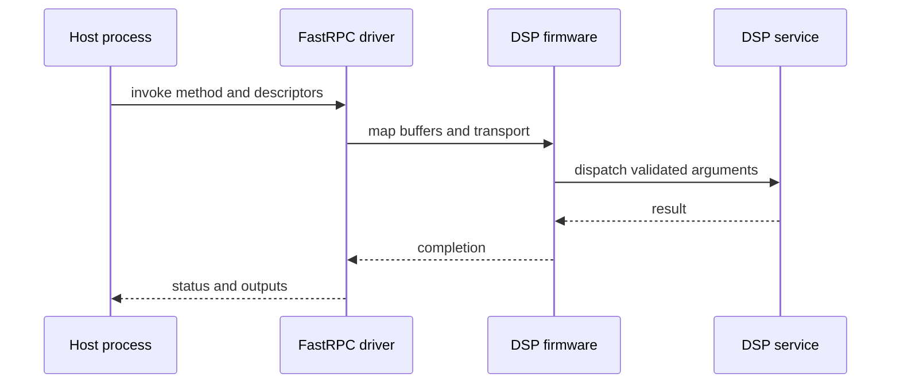

The best mental model for a Qualcomm DSP is a remote computer: it has firmware, threads, local memory, address translation, services and a message boundary to the application processor. Check Point’s Pwn2Own research made that boundary visible by studying FastRPC-generated stubs and skeletons. Here we use the same systems lens, but keep the laboratory work defensive and synthetic.

## Four names, four responsibilities

| Domain | Expanded name | Intended workload | Example |
|---|---|---|---|
| ADSP | Audio DSP | Low-latency audio/voice streams | Echo cancellation and beamforming |
| CDSP | Compute DSP | General high-throughput compute | Vision kernels and feature transforms |
| SDSP | Sensor DSP | Low-power sensing | IMU batching and always-on detection |
| MDSP | Modem DSP | Cellular baseband | Physical/protocol-layer work |

These are firmware/service domains, not four identical arithmetic cores. An SA8295P-class program may expose a different subset and may integrate AI acceleration with the compute/Hexagon subsystem. Verify the exact target and BSP.

## Host-to-DSP path



An interface generator can create the host stub and DSP skeleton. Generated code is still part of the security surface: the receiver must validate counts, lengths, offsets, handles and integer arithmetic.

## ADSP: deadlines over throughput

Audio arrives periodically. Missing one deadline causes an audible artifact even if average utilization is low. Model buffer duration, algorithmic delay, route changes and clock drift. Avoid allocation and unbounded work in the real-time path.

## CDSP: offload economics

Offload pays when parallel work outweighs invocation, mapping and cache costs. Reuse mappings, batch suitable kernels and measure end-to-end time. HVX is vector execution; it is not interchangeable with HTP tensor acceleration.

## SDSP: low power and time bases

The sensor domain optimizes always-on operation. Sensor ticks, host monotonic time and vehicle time must be related explicitly. Preserve sequence, timestamp, accuracy and calibration metadata.

## MDSP: a strongly separated service domain

Applications normally consume narrow modem services rather than loading arbitrary kernels. Treat the modem as an independent subsystem with its own lifecycle, watchdog and recovery behavior.

## Simulation: defensive RPC decoding

This validates a synthetic message. It does not target Qualcomm firmware or exercise a device.

```python
import struct
HEADER = struct.Struct("<HHI")       # method, flags, payload length
VALID_METHODS, MAX_PAYLOAD = {1, 2, 7}, 4096

def decode(packet: bytes):
    if len(packet) < HEADER.size: raise ValueError("truncated header")
    method, flags, declared = HEADER.unpack_from(packet)
    if method not in VALID_METHODS or flags & ~3:
        raise ValueError("unsupported method or flags")
    if declared > MAX_PAYLOAD: raise ValueError("payload exceeds contract")
    if declared != len(packet) - HEADER.size: raise ValueError("length mismatch")
    return method, memoryview(packet)[HEADER.size:]

tests = [b"", HEADER.pack(1,0,3)+b"abc",
         HEADER.pack(99,0,0), HEADER.pack(1,0,5000)]
for item in tests:
    try: print("OK", decode(item))
    except ValueError as exc: print("REJECT", exc)
```

Production code must also validate nested descriptors, overflow, alignment, mapping permissions, handle lifetime and output size. Host-harness fuzzing with sanitizers is appropriate before authorized target testing.

## Containment checklist

- Authenticate firmware and restrict production debug.
- Give services least-privilege SMMU mappings.
- Treat every cross-domain length and offset as untrusted.
- Define timeouts, cancellation and subsystem recovery.
- Re-test generated code whenever IDL or generator changes.

## References

- [Check Point Research: Pwn2Own Qualcomm DSP](https://research.checkpoint.com/2021/pwn2own-qualcomm-dsp/)
- [Qualcomm Hexagon DSP SDK Collection](https://docs.qualcomm.com/bundle/publicresource/topics/80-77512-1/hexagon-dsp-sdk-collection-landing-page.html)
- [Linux Qualcomm FastRPC driver](https://git.kernel.org/pub/scm/linux/kernel/git/torvalds/linux.git/tree/drivers/misc/fastrpc.c)
- [Linux remoteproc framework](https://docs.kernel.org/staging/remoteproc.html)

