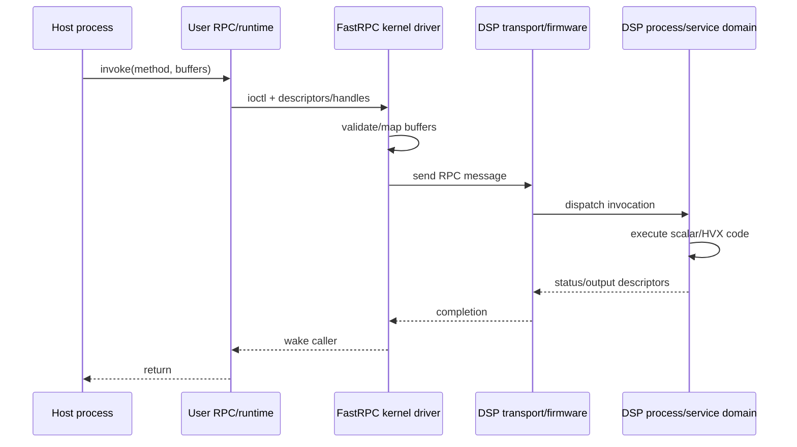

The useful mental model for a Qualcomm DSP is **not “a coprocessor executing a helper function.”** It is a remote execution environment with firmware, scheduler, services, address spaces, local memories, DMA access, clocks, watchdog/restart behavior and an RPC boundary to the application processor.

That distinction explains most integration failures. A host thread can call an API that looks synchronous while the real operation crosses process, kernel, inter-processor and memory-protection boundaries before a DSP thread executes anything.

This article uses public Hexagon/FastRPC concepts and an automotive SoC context. Exact domain names, firmware layout and available services vary by BSP and product.

## 1. “ADSP / CDSP / SDSP / MDSP” are service domains, not four interchangeable cores

The names describe **software/firmware domains and workload intent** more than a literal count of identical compute cores.

| Domain | Primary intent | Characteristic workload | What matters architecturally |
|---|---|---|---|
| ADSP | audio/voice | periodic low-latency streams, codecs, voice preprocessing | deadline, jitter, clock drift, uninterrupted buffers |
| CDSP | compute offload | vector/vision/general parallel kernels | mapping cost, HVX utilization, throughput, batching |
| SDSP | sensing | low-power always-on sensor processing | power residency, sensor time bases, wakeup paths |
| MDSP | modem/baseband | cellular physical/protocol processing | strong subsystem isolation, modem service interfaces |

A platform may expose only a subset to application software. HTP/NPU resources can also coexist with the Hexagon subsystem; **HVX vector execution and HTP tensor execution are related in platform integration but are not the same programming model.**

## 2. What actually happens during a FastRPC call

A typical offload path looks like this:



The host-language call hides at least four contracts:

1. **ABI contract** — method ID, scalar arguments, lengths, descriptor layout.
2. **memory contract** — which buffers are copied versus mapped, cacheability and lifetime.
3. **execution contract** — which process/service domain owns the call and its priority.
4. **recovery contract** — what happens to the call and mappings if that domain restarts.

Treat generated RPC stubs as serialization code, not trusted boilerplate. Integer overflow, nested lengths, output sizes, handle validity and lifetime remain security/correctness concerns.

## 3. Copy versus map is often the first performance decision

For tiny arguments, copying is cheap. For image/audio/tensor buffers, repeated copying can dominate the kernel itself.

Conceptually:

```text
small control structure
    -> marshal/copy into RPC message

large payload
    -> allocate/import shared buffer
    -> map into DSP-visible address space
    -> RPC passes handle/offset/size
```

The second path removes payload copies but creates new costs: mapping, TLB pressure, cache ownership, page pinning and synchronization.

For repeated workloads, **persistent/reused mappings** are often much cheaper than map/unmap per invocation. The host should therefore measure:

$$T_{offload}=T_{marshal}+T_{map}+T_{queue}+T_{DSP}+T_{sync}+T_{unmap}$$

A kernel that takes 100 us on the DSP can still lose to CPU execution if mapping and RPC overhead add hundreds of microseconds.

## 4. DSP-visible memory is not “the host pointer”

A host virtual address has no intrinsic meaning to DSP firmware. The runtime/driver creates an addressable mapping in the remote domain and communicates an appropriate DSP-side address/descriptor.

Questions that matter:

- Is the buffer physically contiguous or scatter-gather?
- Is it backed by `dma-buf`/ION-like shared allocation on this BSP?
- Is the mapping cached, uncached or coherent?
- Which SMMU/IOMMU context owns it?
- Can the DSP write it, read it, or both?
- How long is the mapping valid?
- What invalidates it after process or subsystem restart?

A stale remote mapping is especially dangerous because the host can believe it still owns a valid handle after the DSP-side context has disappeared.

## 5. HVX changes the kernel, not the system boundary

Hexagon Vector eXtensions accelerate data-parallel kernels. But vectorizing a function does not remove RPC/memory overhead.

A useful decomposition is:

```text
Host orchestration
   |
   +-- map/register input once
   +-- queue many operations
   |
DSP scalar control
   |
   +-- validate dimensions/strides
   +-- schedule vector work
   |
HVX vector kernel
   |
   +-- process aligned tiles
   +-- write result
```

Good HVX kernels usually care about:

- vector-aligned accesses;
- tile size and local working set;
- avoiding gather/scatter where possible;
- minimizing scalar-vector synchronization;
- fixed-point/quantized arithmetic where appropriate;
- prefetch and memory bandwidth;
- separating boundary handling from the hot inner loop.

But system performance still depends on how often the kernel is invoked and how data reaches it.

## 6. ADSP: periodic deadlines dominate average throughput

An audio path is typically a chain of periodic buffers:

```text
DMA capture -> audio service -> processing graph -> mixer/codec -> DMA output
```

If a 48 kHz stream uses 240-sample buffers, the nominal period is 5 ms. A single 8 ms scheduling stall creates an audible failure even if average CPU/DSP utilization is low.

The engineering variables are therefore:

- buffer period and depth;
- end-to-end algorithmic latency;
- scheduler priority;
- IRQ/DMA delivery jitter;
- clock drift between audio source/sink domains;
- route reconfiguration behavior;
- underrun/overrun recovery.

The correct metric is deadline miss distribution, not average MIPS.

## 7. SDSP: low-power residency and timestamp translation are first-class

Always-on sensor processing often uses clocks that are not the application processor’s monotonic clock. The data contract should preserve:

```text
sensor sample counter
sensor-domain timestamp
host-converted timestamp
calibration version
accuracy/status
sequence number
```

If the AP wakes later and assigns its current time to an old sensor batch, temporal fusion is wrong even though the values are numerically correct.

The sensor subsystem also changes power architecture: work may remain in the low-power domain specifically to avoid waking the main CPU cluster.

## 8. CDSP: decide whether a workload belongs there

CDSP offload is attractive for parallel kernels that have enough arithmetic intensity to amortize transport and mapping. Typical questions before moving a function are:

- Is the working set large enough to benefit from vector execution?
- Can the input stay mapped across invocations?
- Is the kernel branch-heavy or vector-friendly?
- Is output small compared with input?
- Will DSP/DRAM bandwidth contend with camera/AI/audio?
- Does the workload need HTP tensor acceleration instead of HVX?

A useful offload threshold model is:

$$T_{CPU} > T_{RPC}+T_{mapping}+T_{DSP}+T_{return}$$

Do not compare only `T_DSP` against `T_CPU`.

## 9. Process-domain restart versus subsystem restart

Remote execution changes failure containment. Depending on platform support, a failure may be contained to a process/service domain or may trigger a wider subsystem restart.

The host must distinguish:

```text
RPC call failed
    |
    +-- transient queue/timeout?
    +-- remote process/service died?
    +-- DSP subsystem restarted?
    +-- host mapping invalidated?
```

After restart, robust software re-establishes the complete contract:

1. detect generation/restart event;
2. stop submitting new work;
3. fail or cancel outstanding requests;
4. release/recreate remote handles;
5. re-register persistent buffers;
6. restore algorithm/service state;
7. resume only after health checks.

Blind retry is unsafe because a numerical handle from the old generation can refer to nothing meaningful in the new one.

## 10. Security boundary: FastRPC is a parser exposed to a less-trusted peer

The RPC receiver must assume malformed or inconsistent metadata is possible. Defensive validation includes:

- method allowlist;
- scalar count/type validation;
- multiplication/addition overflow checks;
- length versus mapped-buffer bounds;
- alignment and stride validation;
- output-capacity validation;
- handle ownership and generation checks;
- cancellation/timeouts;
- bounded work per request.

The lesson from public DSP vulnerability research is broader than any particular bug: **generated interfaces still deserialize attacker-controlled structure across a privilege boundary.**

## 11. A minimal cost experiment is more useful than a fake DSP simulator

The following script models the decision boundary between CPU execution and DSP offload. The constants are deliberately parameters rather than claimed Qualcomm timings.

```python
from dataclasses import dataclass

@dataclass
class Case:
    bytes_in: int
    cpu_us: float
    dsp_us: float
    reuse_mapping: bool

RPC_US = 45
MAP_FIXED_US = 90
MAP_GB_S = 3.0
RETURN_US = 20

def offload_us(c: Case):
    map_us = 0 if c.reuse_mapping else MAP_FIXED_US + c.bytes_in / (MAP_GB_S * 1e3)
    return RPC_US + map_us + c.dsp_us + RETURN_US

for c in [
    Case(4_096, 180, 45, False),
    Case(1_000_000, 2200, 420, False),
    Case(1_000_000, 2200, 420, True),
]:
    print(c, "CPU", c.cpu_us, "us", "DSP path", round(offload_us(c), 1), "us")
```

The numbers are not the lesson. The decomposition is. Change RPC cost, mapping reuse and payload size; the break-even point moves dramatically.

## 12. What to trace on a real system

For one request, correlate:

```text
host submit time
buffer map/register time
RPC enqueue
remote dispatch
DSP start/end
completion interrupt/event
host wakeup
buffer release
```

Then add system state:

- DSP clock/power state;
- DRAM/interconnect load;
- queue depth;
- mapping count;
- cache-maintenance cost;
- process/subsystem restart generation.

Without a common timeline, a 10 ms “DSP latency” measurement can actually contain 1 ms compute and 9 ms waiting.

## 13. Practical design rules

For an expert reader, the compact version is:

- use DSP domains as **remote services**, not function-call accelerators;
- keep large buffers mapped and pass handles, not payload copies;
- batch enough work to amortize RPC;
- preserve timestamp and sequence metadata across domains;
- separate HVX vector kernels from HTP neural graphs conceptually and operationally;
- treat firmware/process restart as a generation change that invalidates state;
- instrument queueing and mapping, not only kernel execution;
- design RPC metadata as a security-sensitive wire protocol.

Those rules explain more real integration behavior than simply knowing which domain is called ADSP or CDSP.

## References

- [Qualcomm Hexagon DSP SDK Collection](https://docs.qualcomm.com/bundle/publicresource/topics/80-77512-1/hexagon-dsp-sdk-collection-landing-page.html)
- [Linux Qualcomm FastRPC driver](https://git.kernel.org/pub/scm/linux/kernel/git/torvalds/linux.git/tree/drivers/misc/fastrpc.c)
- [Linux remoteproc framework](https://docs.kernel.org/staging/remoteproc.html)
- [Check Point Research: Pwn2Own Qualcomm DSP](https://research.checkpoint.com/2021/pwn2own-qualcomm-dsp/)
