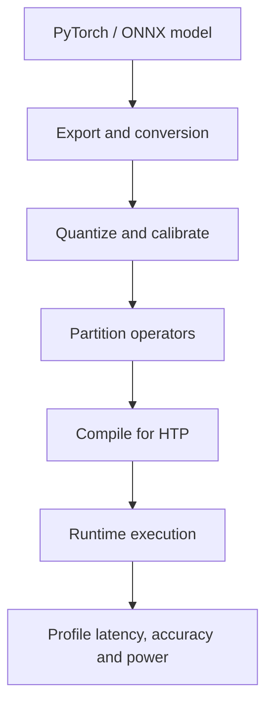

Qualcomm describes its AI engine as heterogeneous compute spanning CPU, GPU and Hexagon NPU resources. On modern platforms, the Hexagon Tensor Processor (HTP) accelerates tensor operations alongside vector/scalar resources. In an SA8295P-class cockpit, workloads can include driver monitoring, occupant sensing, voice, surround-view semantics and selected perception functions.

The NPU is not “the DSP running Python.” A deployment toolchain imports a model, partitions supported operators, chooses layouts and precision, compiles a graph, prepares tensors and submits work through a runtime.



## HTP versus HVX

HVX is Hexagon vector execution suited to explicit vector kernels. HTP is the tensor-oriented target used for neural workloads. They may belong to the wider Hexagon subsystem, but their programming and performance models differ.

## Why a model falls back

Unsupported operators, dynamic shapes, unusual layouts or precision constraints can split a graph. A CPU fallback can add synchronization and conversion costs larger than the operator. Inspect the compiled graph rather than assuming the complete network is on the NPU.

## Quantization is an accuracy contract

For an affine 8-bit representation:

$$q=\operatorname{clip}(\operatorname{round}(x/s)+z)$$

where $s$ is scale and $z$ is zero point. Calibration data must cover the operating distribution; daylight-only data can hide saturation under darkness or glare.

## Simulation: heterogeneous partition cost

```python
layers = [("conv",1.8,True), ("relu",.1,True),
          ("custom_grid",.7,False), ("conv",2.1,True),
          ("softmax",.3,False)]
TRANSFER_MS = .65

def estimate(items):
    total, previous = 0.0, None
    for name, cpu_ms, supported in items:
        device = "HTP" if supported else "CPU"
        if previous and device != previous: total += TRANSFER_MS
        total += cpu_ms * (.28 if device == "HTP" else 1.0)
        print(f"{name:12} {device}")
        previous = device
    return total

print("estimated:", estimate(layers), "ms")
```

Mark `custom_grid` supported and see the benefit of removing two boundaries. Values are illustrative; real runtimes may fuse operations or avoid copies.

## What to measure

- preprocessing + inference + postprocessing;
- p50/p95/p99 under concurrent camera, display and audio load;
- graph partition and fallback operations;
- tensor allocation, conversion and bandwidth;
- accuracy by ODD slice after quantization;
- sustained clocks, thermal throttling and power mode;
- cold start, model load and subsystem recovery.

## References

- [Qualcomm Hexagon NPU SDK](https://www.qualcomm.com/developer/software/hexagon-npu-sdk)
- [Hexagon NPU documentation](https://docs.qualcomm.com/bundle/publicresource/topics/80-77512-1/Alldocs.html)
- [Qualcomm Hexagon MLIR](https://github.com/qualcomm/hexagon-mlir)

