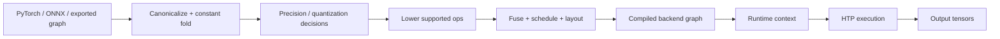

A neural model does not “run on the NPU” simply because a runtime selected an NPU backend. Between a PyTorch graph and sustained inference on Qualcomm tensor hardware sits a compiler/runtime stack that must resolve **operator support, static shape assumptions, tensor layout, precision, quantization, memory placement, graph partitioning and synchronization with the rest of the SoC**.

For system architecture, the important unit is therefore the **compiled execution graph plus its buffer contract**, not the original framework model.

This article refers to the Qualcomm Hexagon tensor path generically as **HTP/NPU** and uses public QNN/AI Engine concepts. Exact accelerator generations, capacities and backend behavior vary by platform.

## 1. The real deployment pipeline



At every boundary information can change:

- dynamic dimensions may become fixed;
- operators can be decomposed or fused;
- NCHW can become another internal layout;
- FP32 can become FP16/INT8;
- unsupported regions can move to CPU/GPU;
- constants can be packed into backend-specific forms.

A production debug session should therefore compare **framework graph, lowered graph and runtime trace**, not assume they are equivalent.

## 2. HTP versus HVX

These are commonly conflated because both sit in the wider Hexagon ecosystem.

**HVX** is vector execution: the programmer/compiler reasons about vectorized kernels, loads/stores, tiles and arithmetic.

**HTP** is tensor-oriented execution: the backend compiler maps neural operators into a graph of accelerator-supported tensor primitives.

The distinction matters operationally:

```text
HVX-style offload
  host RPC -> remote scalar/vector kernel -> result

HTP-style inference
  compile graph -> create runtime context -> bind tensors -> execute graph
```

A model may still use vector/scalar support around tensor kernels, but the programming and performance contracts differ.

## 3. QNN-style execution is a host/runtime/backend system

Conceptually, an application does something like:

```text
create backend
create device/context
construct or load graph
register/import memory
bind input/output tensors
execute graph
wait for completion
```

The host process is not issuing multiply-accumulate instructions. It is configuring a graph and submitting work to a runtime/backend that manages the accelerator domain.

That means lifecycle matters. Graph compilation/loading, context creation and memory registration belong outside the hot per-frame path wherever possible.

## 4. Operator support determines graph topology

One unsupported operator can split a graph into multiple device regions:

```text
HTP region A
    ↓ synchronization / format conversion
CPU custom op
    ↓ synchronization / format conversion
HTP region B
```

The cost is not merely the CPU op itself. It may include:

- device-to-host synchronization;
- layout conversion;
- quantize/dequantize;
- cache ownership transitions;
- additional allocations;
- loss of compiler fusion across the boundary.

A 100 us unsupported operation can create a millisecond-scale end-to-end penalty.

The right review question is:

> **How many device boundaries exist in the compiled graph, and what tensor volume crosses each boundary?**

## 5. Static shapes are a performance feature

Accelerator compilers can optimize aggressively when tensor dimensions are known. Dynamic shapes reduce opportunities for:

- memory planning;
- kernel selection;
- tiling;
- constant folding;
- fusion;
- fixed scratch-buffer reuse.

Autonomy pipelines are often naturally static: camera count, image resolution, BEV grid and batch size are known. Treat those fixed shapes as part of the interface contract rather than leaving them dynamic without reason.

## 6. Tensor layout is not cosmetic

A framework may expose `[N,C,H,W]`, but the accelerator can prefer blocked/channel-packed layouts. Conversions are expensive when inserted at subsystem boundaries.

Suppose the camera pipeline produces NV12, preprocessing creates RGB/NHWC, and the model framework expects NCHW. A naive path may perform:

```text
NV12 -> RGB
RGB interleaved -> planar
FP16/FP32 normalize
NCHW -> backend-packed layout
```

That can move more bytes than the convolution kernels themselves.

The architectural goal is to minimize representation changes across the chain:

```text
camera output format
 -> preprocessing format
 -> model input layout
 -> accelerator native layout
```

A model with 5% fewer FLOPs can be slower if it causes extra full-frame transforms.

## 7. Quantization is a representation contract, not a checkbox

For affine quantization:

$$q = \mathrm{clip}(\mathrm{round}(x/s)+z)$$

and reconstruction is approximately:

$$x \approx s(q-z)$$

The engineering decision includes:

- symmetric versus asymmetric representation;
- per-tensor versus per-channel scale;
- activation calibration range;
- accumulator precision;
- mixed-precision exceptions;
- where requantization occurs.

Calibration data must cover the **operational distribution**, not merely random training examples. For automotive perception, useful slices include darkness, glare, rain, overexposure, tunnel transitions, unusual object sizes and camera-tuning variants.

A good deployment report therefore includes accuracy deltas **by ODD slice**, not only aggregate mAP.

## 8. Quantization errors often concentrate at graph boundaries

Consider two adjacent layers with different activation scales. The backend may have to requantize between them. Excessive scale transitions can create both accuracy loss and extra operations.

For debugging, inspect:

- activation min/max or percentile distributions;
- saturation percentage;
- per-layer quantization error;
- tensors immediately before/after problematic branches;
- mixed-precision islands inserted by the compiler.

If one layer dominates error, changing only that layer’s precision can be better than moving the whole network back to FP16.

## 9. Memory registration and reuse matter as much as kernel time

An inference loop should avoid repeatedly allocating and registering large tensors.

Prefer:

```text
startup:
  create graph/context
  allocate/import tensor buffers
  register memory
  warm graph

per frame:
  producer fills input buffer
  wait producer fence
  submit graph
  wait completion
  consume output
```

For camera pipelines, the strongest architecture is often to import or share producer buffers directly when format/layout allows it.

The total latency is closer to:

$$T_{frame}=T_{pre}+T_{wait}+T_{submit}+T_{HTP}+T_{post}+T_{handoff}$$

than to `T_HTP` alone.

## 10. Throughput and latency are different scheduling goals

If the graph takes 12 ms, it does not automatically mean the system can process one frame every 12 ms. Multiple in-flight requests, other HTP clients, memory bandwidth and power policy change the answer.

Definitions:

```text
latency    = completion_time(frame_i) - submit_time(frame_i)
throughput = completed_frames / time
```

A runtime can improve throughput by queueing work while making per-frame latency worse. For ADAS, the age of the output may matter more than aggregate FPS.

## 11. Model pipelines should preserve sensor age

Suppose a camera frame was exposed at `t_capture`, queued for 8 ms, then inferred for 12 ms. The detection is already 20 ms old when produced.

The output should remain associated with the **capture timestamp**, not be retimestamped at inference completion.

```text
camera frame: timestamp = t_capture
feature tensor: carries t_capture
inference result: carries t_capture + processing metadata
```

This becomes critical when fusing radar/LiDAR or when temporal models compensate ego motion.

## 12. Preprocessing can be a hidden accelerator bottleneck

A common architecture mistake is to optimize the neural graph while leaving expensive CPU preprocessing:

```text
camera NV12
 -> CPU colorspace conversion
 -> CPU resize
 -> CPU normalization
 -> HTP inference
```

If preprocessing consumes 7 ms and HTP inference consumes 5 ms, “5 ms NPU latency” is not the system result.

Measure preprocessing and postprocessing as first-class pipeline stages. Where supported, use GPU/DSP/ISP/backend preprocessing or fuse operations into the graph, but only after confirming that the numerical contract matches training.

## 13. Tensor memory can dominate multi-camera perception

For six cameras with a feature tensor `[6,256,8,14]`:

$$6\times256\times8\times14=172,032\ values$$

That is modest. Earlier feature levels are much larger. A `[6,256,64,112]` feature set contains over 11 million values — about 44 MB at FP32 or 22 MB at FP16, before temporal history.

This is why BEV systems often aggressively select feature levels, reduce channels and use lower precision.

The memory problem is not only capacity. Each tensor is read/written by kernels, so activation size drives **DRAM bandwidth and energy**.

## 14. Fusion can make arithmetic counts misleading

Framework graphs often show:

```text
Conv -> BatchNorm -> ReLU
```

A compiler may fold BatchNorm into convolution weights and fuse activation. The deployed graph no longer has three materialized tensor passes.

Conversely, an unsupported pattern can prevent fusion and create intermediate DRAM writes.

Therefore:

> FLOPs from the framework graph are not enough to predict backend memory traffic.

Use backend profiling to identify actual execution units and tensor spill points.

## 15. Thermal behavior changes sustained inference

A short benchmark often runs at a favorable clock/power state. Automotive workloads run continuously alongside camera, display, audio and networking.

Profile at least:

```text
cold start
first inference
steady-state 1 min
steady-state 10+ min
concurrent workload
thermal-soak condition
```

Watch for:

- HTP clock changes;
- DRAM bandwidth pressure;
- thermal throttling;
- queueing from other clients;
- model-load memory pressure.

The sustained number matters more than the first 20 frames.

## 16. Failure and recovery are part of the runtime contract

The AI backend can fail because of:

- graph/config incompatibility;
- remote service failure;
- memory registration failure;
- accelerator timeout;
- subsystem restart;
- out-of-memory condition.

The application needs a state machine:

```text
READY -> EXECUTING -> READY
  |          |
  |          +-> TIMEOUT
  +-> BACKEND_LOST

TIMEOUT/BACKEND_LOST
  -> stop submissions
  -> invalidate contexts/handles
  -> recreate backend/graph/mappings
  -> health check
  -> READY
```

A stale context after remote restart should never be treated as valid merely because the host object still exists.

## 17. A useful partition-cost experiment

This small model makes boundary cost explicit:

```python
from dataclasses import dataclass

@dataclass
class Op:
    name: str
    device: str
    exec_us: int
    bytes_out: int

ops = [
    Op("conv1", "HTP", 400, 2_000_000),
    Op("custom_grid", "CPU", 250, 2_000_000),
    Op("conv2", "HTP", 500, 500_000),
]

SYNC_US = 80
CONVERT_GB_S = 5.0

total = 0.0
prev = None
for op in ops:
    if prev and prev.device != op.device:
        total += SYNC_US + prev.bytes_out / (CONVERT_GB_S * 1e3)
    total += op.exec_us
    prev = op

print(f"estimated pipeline = {total/1000:.2f} ms")
```

Change only `custom_grid` to HTP. The improvement comes not only from faster execution, but from removing two tensor crossings.

## 18. What to capture in an expert deployment report

A credible model-deployment report should contain:

- framework and exported graph hashes;
- backend/runtime version;
- static input/output shapes;
- precision per region;
- unsupported/fallback ops;
- compiled partition boundaries;
- tensor layouts at external interfaces;
- memory registration strategy;
- cold/warm/steady-state latency p50/p95/p99;
- preprocessing and postprocessing latency;
- peak/steady memory;
- accuracy delta by relevant operating slice;
- thermal and concurrent-load results;
- backend restart/recovery result.

“Model runs on HTP at 30 FPS” is not enough information to reproduce or reason about a vehicle deployment.

## 19. How this connects to an autonomy stack

For a camera encoder, the intended flow is:

```text
camera timestamp + calibrated image
        ↓
preprocess with known resize/crop contract
        ↓
HTP camera backbone
        ↓
image-space feature tensor
        ↓
geometry-aware camera-to-BEV transform
        ↓
BEV fusion / temporal perception
```

The accelerator changes **how efficiently** the learned representation is produced. It does not remove the need for timestamp discipline, camera calibration, geometric transforms or fusion semantics.

## References

- [Qualcomm AI Engine Direct / QNN documentation portal](https://docs.qualcomm.com/)
- [Qualcomm Hexagon NPU SDK](https://www.qualcomm.com/developer/software/hexagon-npu-sdk)
- [Qualcomm Hexagon MLIR](https://github.com/qualcomm/hexagon-mlir)
- [ExecuTorch Qualcomm backend](https://docs.pytorch.org/executorch/)
