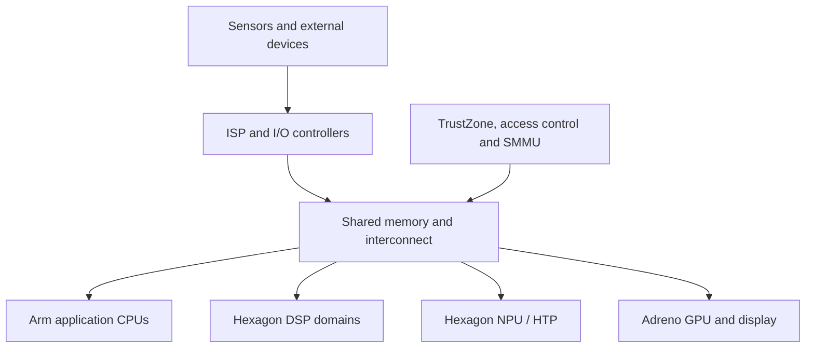

A Qualcomm automotive processor such as the SA8295P is not one processor. It is a network of compute engines, memories, firmware domains, interconnects and protection units. Android or Linux makes the application CPU most visible, but a camera-to-display or microphone-to-assistant path crosses several independently scheduled and protected domains.



The names are architectural—not a disclosed die floorplan. Firmware partitions, capacities and APIs vary by platform release, BSP and customer program.

## The engines and their contracts

| Engine | Best at | Typical automotive use | Contract to inspect |
|---|---|---|---|
| Arm CPU cluster | Branch-heavy general software | Android, QNX/Linux services | Threads, syscalls, shared buffers |
| ADSP | Deterministic streaming signal work | Audio and voice front end | RPC/control and audio buffers |
| CDSP | General compute offload | Vision and feature kernels | FastRPC, mappings and fences |
| SDSP | Low-power sensing | Always-on sensor algorithms | Messages, timestamps and calibration |
| MDSP | Modem signal processing | Cellular baseband | Narrow modem services |
| NPU/HTP | Tensor operations | In-cabin AI and perception | Compiled graph and tensor layouts |
| ISP | Pixel-domain processing | Demosaic, denoise, statistics | Camera graph, frames and metadata |
| Display processor | Composition and scanout | Cluster/IVI displays | Layers, surfaces and fences |
| DMA engines | Data movement | Peripheral and memory transfers | Descriptors and coherency |
| TrustZone/TEE | Isolated trusted services | Keys, boot, DRM, attestation | Narrow commands and validated buffers |

## Follow one frame

A surround-view frame can travel through capture, ISP correction, a shared buffer, NPU inference, GPU composition and display scanout. The CPU coordinates the graph without touching every byte. Copies appear when formats, protection domains, cache policy or APIs cannot share an allocation.

$$T_{frame}=T_{capture}+T_{ISP}+T_{queue}+T_{AI}+T_{compose}+T_{scanout}$$

Average accelerator time is insufficient: queues, contention and synchronization fences determine tail latency.

## Simulation: heterogeneous pipeline latency

Run this on Python 3. It is a teaching model, not an SA8295P benchmark.

```python
import random, statistics

stages = {"capture": (4,.3), "isp": (3.2,.5), "npu": (8,1.5),
          "compose": (2,.3), "scanout": (8.3,.2)}
samples = []
for _ in range(10_000):
    total = sum(max(0, random.gauss(mean, jitter))
                for mean, jitter in stages.values())
    if random.random() < .02:       # shared-resource contention
        total += random.uniform(4, 15)
    samples.append(total)
samples.sort()
for p in (50, 90, 99):
    print(f"p{p}: {samples[int(len(samples)*p/100)]:.2f} ms")
print("mean:", statistics.mean(samples))
```

Increase only the contention probability. p99 rises much faster than the mean—why system architects profile bandwidth, queues, SMMU faults and fences rather than only TOPS.

## Real-BSP questions

- Which firmware owns each engine, and how is it authenticated and recovered?
- Which buffers are contiguous, IOMMU-mapped, cached or protected?
- Which clocks and bandwidth votes precede work submission?
- What is the timeout and subsystem-restart behavior?
- Which workloads share bandwidth or thermal budget?
- What timestamp travels end-to-end?

## References

- [Qualcomm Snapdragon Cockpit Platforms](https://www.qualcomm.com/products/automotive/digital-chassis/snapdragon-cockpit-platforms)
- [Qualcomm Hexagon NPU SDK](https://www.qualcomm.com/developer/software/hexagon-npu-sdk)
- [Qualcomm Hexagon DSP SDK Collection](https://docs.qualcomm.com/bundle/publicresource/topics/80-77512-1/hexagon-dsp-sdk-collection-landing-page.html)

