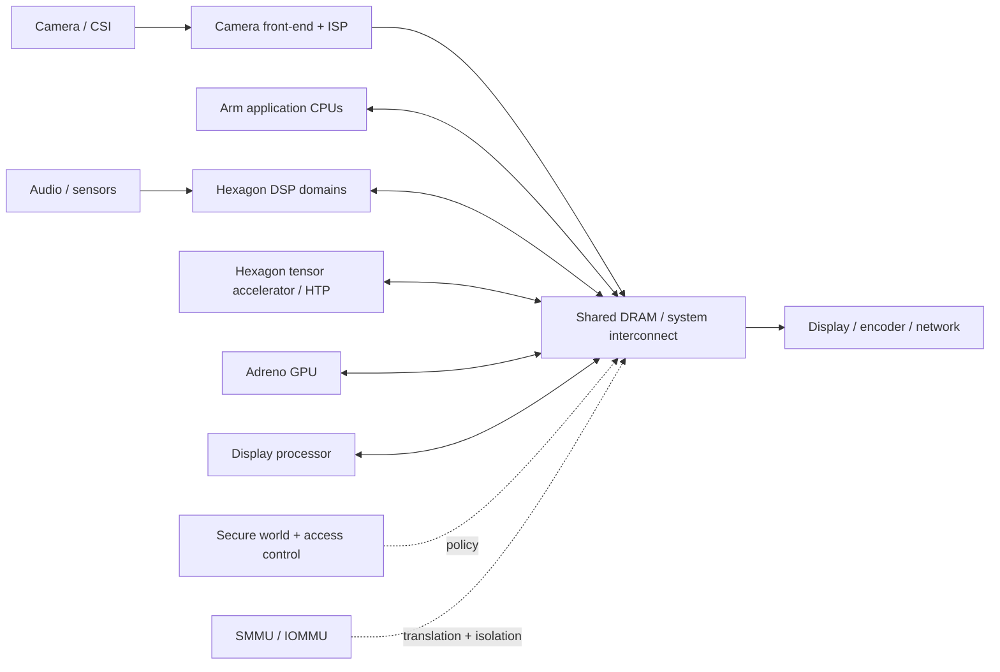

A modern Qualcomm automotive SoC is best understood as a **set of independently scheduled execution domains connected by shared memory and an interconnect**, not as a CPU with a few accelerators attached. The application CPUs are only the control plane most software engineers see. Camera pixels may move from CSI capture through an ISP into DRAM, be consumed by a tensor accelerator, reused by a GPU or display block, and cross one or more protection domains without the CPU ever copying the payload.

This article uses an **SA8295P-class cockpit/vehicle-compute architecture as a reference model**, not as a claim about an unpublished die floorplan. Exact block counts, firmware partitioning, clock domains, memory topology and product APIs vary by silicon revision and BSP.



The useful question is therefore not “which core runs this feature?” but:

> **Who owns the buffer, who may address it, which clock/timestamp describes it, what wakes the consumer, and what happens if that consumer fails?**

## 1. Think in execution domains, not marketing blocks

The main domains have different scheduling and failure semantics.

| Domain | Typical strength | Primary contract | Typical failure symptom |
|---|---|---|---|
| Arm CPU cluster | Branch-heavy OS/application logic | Threads, syscalls, IPC, shared buffers | process crash, watchdog, scheduler latency |
| ADSP/CDSP/SDSP-class DSP domains | streaming/vector/sensor workloads | RPC + mapped buffers + firmware services | RPC timeout, subsystem restart, stale stream |
| HTP / tensor engine | dense/quantized tensor graphs | compiled graph + tensor buffers | graph rejection, fallback, inference timeout |
| ISP | deterministic pixel pipeline | frame buffers + camera metadata | frame drop, bad exposure, corrupt format |
| GPU | graphics/general parallel compute | command buffers + shared allocations | fence timeout, GPU reset |
| Display processor | composition and scanout | planes + buffers + fences + timing | underflow, missed vblank, blank/frozen display |
| Secure world / TEE | key and policy enforcement | narrow command API | denied request, secure fault, boot refusal |

The important distinction is that these are **not merely function libraries**. Several execute firmware with their own schedulers, address spaces, lifecycle and reset behavior. A system-level design must model those boundaries explicitly.

## 2. Control plane and data plane are intentionally different

Consider camera inference. The CPU may configure the graph, queue work and receive completion, but the frame itself can remain in shared memory throughout:

```text
sensor
  -> CSI / camera front-end
  -> ISP writes buffer
  -> fence / event signals completion
  -> tensor runtime maps or reuses buffer
  -> HTP reads input and writes output
  -> CPU consumes compact result
```

The **control plane** carries handles, descriptors, sequence numbers and status. The **data plane** carries megapixel images or tensors. Performance collapses when an architecture confuses the two and starts copying data through CPU-visible temporary buffers.

A useful latency model is therefore not simply the sum of accelerator execution times:

$$T_{e2e}=T_{capture}+T_{queue}+T_{ISP}+T_{sync}+T_{AI}+T_{post}+T_{consumer}$$

where `T_sync` includes fences, wakeups, cache ownership transitions and scheduling delay. In production, p95/p99 is often governed by contention and synchronization rather than nominal compute time.

## 3. Shared memory is the centre of the architecture

Most heterogeneous pipelines converge on DRAM. That creates three system properties that software teams often underestimate:

### Bandwidth

A 4K RGBA surface at 60 Hz is roughly 2 GB/s of raw read bandwidth before overfetch, multiple layers, writeback or compression. Camera streams, AI tensors and display scanout can therefore contend even when each engine has spare arithmetic capacity.

### Latency sensitivity

A DSP audio buffer may care about deterministic service every few milliseconds while an NPU inference may tolerate burstier access. Interconnect QoS and memory-controller arbitration therefore matter to system behavior.

### Data lifetime

A producer may finish computation while a consumer still references the allocation. Buffer reuse must be synchronized by fences/events or explicit ownership protocols. “The function returned” is not equivalent to “the hardware stopped using the memory.”

## 4. Virtual addresses, IOVAs and physical memory are different namespaces

The application CPU works with virtual addresses. Devices usually operate on DMA/I/O virtual addresses. The SMMU translates device-visible IOVAs into physical pages and enforces permissions.

```text
CPU VA --CPU MMU--> physical pages
                         ^
                         |
Device IOVA --SMMU-------+
```

The same physical allocation may therefore have:

- one virtual address in an Android process;
- another mapping in a hypervisor or host OS;
- one IOVA for the ISP;
- another IOVA for the NPU;
- another for the display controller.

That is why a “pointer” is not a portable cross-engine interface. **Buffer handles and mapping contracts are.**

Under virtualization, there may also be stage-2 translation and explicit device assignment. Debugging then requires knowing which VM owns the device context, which SMMU domain contains the mapping, and whether the fault is a guest mapping issue or host policy issue.

## 5. Fences are dependency edges in a distributed scheduler

Heterogeneous compute is effectively a distributed scheduler implemented across drivers and firmware. Fences/events encode the dependency graph.


A missing wait causes data races. An unnecessary wait serializes the pipeline and destroys throughput. A cyclic dependency creates a deadlock that can look like a hardware hang.

For performance work, inspect **fence age**, queue depth and buffer occupancy together. Accelerator utilization alone cannot explain a pipeline stall.

## 6. Clock and power management are part of correctness

Execution blocks are not permanently at peak frequency. Drivers/runtime firmware vote for clocks, power domains and memory/interconnect bandwidth. A workload that benchmarks well in isolation can miss deadlines when:

- another VM raises memory pressure;
- thermal policy reduces sustained clocks;
- a block repeatedly powers up/down;
- bandwidth votes are too low for the actual tensor or display format;
- a wakeup path adds variable latency.

The practical model is:

$$T \approx \max\left(\frac{operations}{effective\ compute},\frac{bytes}{effective\ bandwidth}\right)+T_{queue}+T_{sync}$$

where both “effective” terms are runtime quantities, not datasheet peaks.

## 7. TrustZone and SMMU solve different problems

TrustZone defines secure/non-secure execution and access policy. The SMMU constrains DMA-capable masters. A secure CPU page table alone does not stop a misconfigured peripheral from DMA-writing memory.

For any sensitive buffer, ask:

1. who allocated it;
2. which security state owns it;
3. which bus masters can address it;
4. whether the SMMU mapping is read-only/read-write;
5. whether it crosses a VM boundary;
6. whether the downstream display/codec path preserves protection.

This matters for key material and DRM, but also for isolation between mixed-criticality workloads.

## 8. Remote subsystems need lifecycle design

DSPs, modem-side processors and other firmware-controlled blocks may support subsystem or process-domain restart. Recovery is not just “restart firmware.” The host must reconcile:

- outstanding RPC calls;
- stale buffer mappings;
- lost queues;
- clocks and power votes;
- client handles;
- stateful algorithms;
- timestamps and sequence counters.

A correct restart path often requires a higher-level state-machine transition so clients stop trusting pre-restart data.

## 9. One end-to-end example: camera -> AI -> display

A useful systems trace looks like this:

```text
1. Sensor starts exposure at t_exp.
2. CSI receiver timestamps/frames the incoming stream.
3. ISP performs RAW processing and writes NV12/RGB buffer A.
4. Camera driver publishes buffer A + metadata + completion fence.
5. AI runtime imports or reuses A; no CPU copy if format/layout is accepted.
6. HTP reads A, writes tensor/result buffer B.
7. Completion wakes post-processing or compositor.
8. GPU may render overlays into buffer C.
9. Display compositor selects hardware planes.
10. DPU fetches buffers at scanout and presents at vblank.
```

Now notice how many independent contracts exist: exposure time, frame timestamp, pixel format, calibration revision, buffer handle, cache state, SMMU mapping, tensor layout, inference completion, display fence and vblank time. **System correctness is the composition of those contracts.**

## 10. What to instrument on a real BSP

A useful trace should correlate all engines on one timeline. At minimum capture:

- producer/consumer timestamps in a common clock domain;
- buffer identifier, size, format and plane offsets;
- map/unmap lifetime and IOVA where safe to expose;
- fence create/signal/wait timestamps;
- queue depth and dropped/reused buffers;
- accelerator execution interval;
- clock/bandwidth/thermal state;
- SMMU faults and remote-subsystem resets;
- VM/process identity and security domain.

The debugging goal is to answer **where the data waited**, not only where code executed.

## 11. Architectural anti-patterns

Several patterns repeatedly create hard-to-debug automotive failures:

- treating accelerators as synchronous function calls;
- using CPU memcpy as the integration boundary between every block;
- ignoring capture timestamps and assigning “now” when software receives the frame;
- reusing buffers before all consumers signal completion;
- assuming an SMMU mapping is global across devices/VMs;
- measuring only average latency;
- relying on peak TOPS or GHz to predict end-to-end performance;
- recovering one subsystem without invalidating dependent state.

## 12. Read the rest of the series as boundary analysis

The companion articles intentionally go deeper into one boundary at a time:

- [DSP Domains](/articles/qualcomm-dsp-domains/) — firmware/process domains, FastRPC, mappings and restart semantics.
- [TrustZone & TEE](/articles/qualcomm-trustzone-tee/) — secure state, boot chain, trusted services and DMA-aware isolation.
- [Hexagon NPU / HTP](/articles/qualcomm-npu-htp/) — graph compilation, tensor layouts, quantization, memory registration and fallback.
- [Camera ISP](/articles/qualcomm-camera-isp/) — RAW capture, pixel processing, control loops, timestamps and calibration consequences.
- [Display / DPU](/articles/qualcomm-display-dpu/) — composition, planes, fences, atomic commit and scanout timing.
- [DMA & SMMU](/articles/qualcomm-dma-smmu/) — the memory-transport layer that makes all of the above possible.

The objective is not to memorize Qualcomm block names. It is to reason about **execution ownership, data ownership, time, address translation, synchronization, failure containment and observability**. Those concepts transfer to almost every modern automotive SoC.

## References

- [Qualcomm Snapdragon Digital Chassis / Cockpit Platforms](https://www.qualcomm.com/products/automotive)
- [Qualcomm Hexagon DSP SDK Collection](https://docs.qualcomm.com/bundle/publicresource/topics/80-77512-1/hexagon-dsp-sdk-collection-landing-page.html)
- [Qualcomm AI Engine Direct / QNN documentation](https://docs.qualcomm.com/)
- [Linux DMA API](https://docs.kernel.org/core-api/dma-api.html)
- [Linux DRM/KMS](https://docs.kernel.org/gpu/drm-kms.html)
- [Arm System MMU](https://developer.arm.com/Architectures/System%20MMU)
