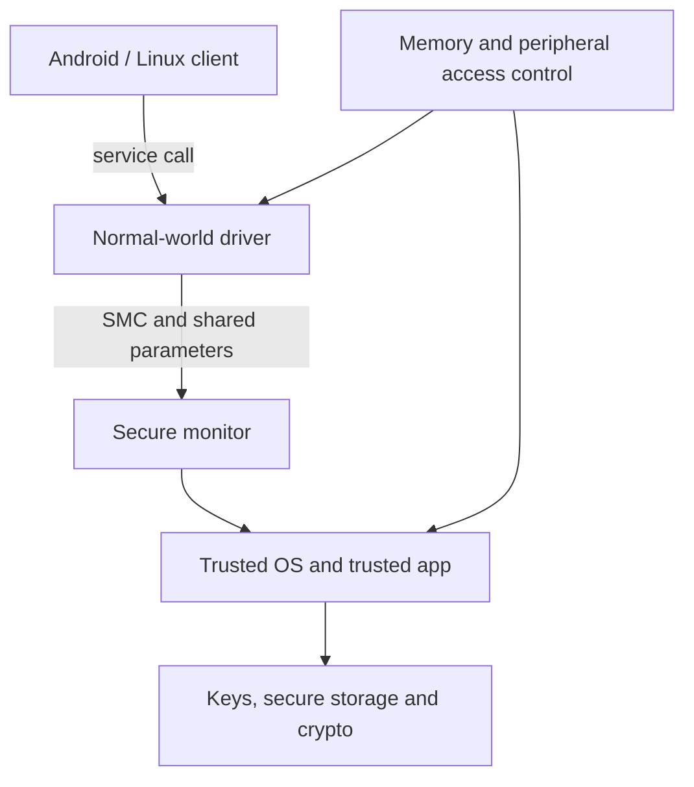

Arm TrustZone adds a security state to the architecture. It lets a platform build a Secure Processing Environment beside the normal world where Android, Linux or a hypervisor executes. On a Qualcomm automotive platform, it can support verified boot, key services, protected content and authentication of remote-subsystem images.

TrustZone is not a magic protected app. Security comes from a chain: root key material, authenticated boot stages, secure monitor, trusted OS, access controllers, SMMU policy, secure memory, narrow APIs and production lifecycle controls.



## Privilege is not security state

Normal-world kernel mode is still non-secure. A compromised kernel controls normal memory but correctly configured hardware rejects access to secure regions. Secure software is highly privileged and should remain small, reviewed and updateable.

## Request path and boundary

A client sends a command plus bounded buffers. The driver pins or copies memory; the monitor enters secure state; the trusted service validates the request before using a key. A normal-world pointer must never be blindly dereferenced. Mapping, range, caller identity and time-of-check/time-of-use behavior matter.

## DMA changes the threat model

CPU page tables do not constrain a camera, GPU, DSP or PCIe endpoint performing DMA. System protection also requires bus security, access controllers and SMMU/IOMMU policy. A buffer is protected only if every bus master is denied or deliberately trusted.

## Simulation: authenticated command envelope

This uses an in-memory development key. Production keys belong in a hardware-backed hierarchy and need anti-replay persistence.

```python
import hashlib, hmac, json
DEV_KEY = b"simulation-only-key"

def sign(command, counter, payload):
    body = json.dumps({"cmd": command, "ctr": counter, "payload": payload},
                      sort_keys=True).encode()
    return body, hmac.new(DEV_KEY, body, hashlib.sha256).digest()

def verify(body, tag, last_counter):
    expected = hmac.new(DEV_KEY, body, hashlib.sha256).digest()
    if not hmac.compare_digest(tag, expected): raise ValueError("auth failed")
    message = json.loads(body)
    if message["ctr"] <= last_counter: raise ValueError("replay")
    if message["cmd"] not in {"SIGN_DIAGNOSTIC", "UNWRAP_SESSION"}:
        raise ValueError("command denied")
    return message

body, tag = sign("SIGN_DIAGNOSTIC", 42, {"digest": "ab12"})
print(verify(body, tag, 41))
```

HMAC provides authenticity, not confidentiality. The trusted side must cap sizes, parse strictly, authorize callers, bind keys to purpose, clear secrets, rate-limit work and minimize error leakage.

## Automotive questions

- Which boot stage establishes trust and prevents rollback?
- Which VM owns TEE clients and protected buffers?
- Does a protected camera/display path remain protected end-to-end?
- Which remote processors use authenticated image loading?
- What survives warm reset, and how are counters persisted?
- How are development keys, debug policy and RMA separated from production?

## References

- [Arm TrustZone for Cortex-A](https://www.arm.com/technologies/trustzone-for-cortex-a)
- [Trusted Firmware-A](https://trustedfirmware-a.readthedocs.io/)
- [GlobalPlatform TEE specifications](https://globalplatform.org/specs-library/?filter-committee=tee)

