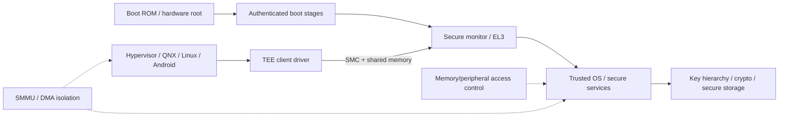

TrustZone is often described as “secure world versus normal world.” That is correct but incomplete. For an automotive SoC, the security argument spans **boot ROM, authenticated firmware, exception-level transitions, memory/peripheral access control, key hierarchy, secure storage, SMMU policy, VM ownership, trusted-service APIs and lifecycle state**.

A TEE is therefore not just a privileged process. It is one component in a hardware-enforced chain of trust.



The exact Qualcomm secure software stack is product/BSP-specific. The architectural concepts below are stable across implementations.

## 1. Security state and privilege level are orthogonal

A normal-world kernel running at high privilege is still **Non-secure**. Secure-world software is in the Secure state and can access resources that hardware policy hides from Non-secure masters.

That gives a matrix rather than a single privilege ladder:

```text
                 Secure state        Non-secure state
high privilege  secure monitor/TEE   hypervisor/kernel
lower privilege trusted app/service  user process
```

A compromised Android kernel can own almost everything in normal-world software without automatically gaining access to correctly protected secure memory. Conversely, a bug in secure-world parsing can be far more serious precisely because secure software is highly privileged.

## 2. Boot establishes the first security invariant

At reset, the first immutable/ROM stage must decide what code is allowed to execute. Later stages inherit that decision.

A typical secure-boot chain is conceptually:

```text
hardware root key / fuse policy
        ↓ verifies
boot stage 1
        ↓ verifies
boot stage 2 / firmware package
        ↓ verifies
hypervisor / secure OS / remote-subsystem firmware
        ↓ verifies or measures
normal-world OS and partitions
```

Each link needs more than signature checking:

- image identity and target binding;
- anti-rollback version policy;
- debug/lifecycle-state policy;
- key revocation/rotation strategy;
- recovery-image rules;
- failure behavior when metadata is corrupt.

If an old signed but vulnerable image can be installed, signature verification alone does not provide the intended security property.

## 3. The secure monitor is a transition mechanism, not an application API

On Arm systems, an SMC instruction enters the secure monitor at EL3. The monitor switches context/security state and dispatches to the trusted execution environment or other secure firmware.

Applications usually see a much higher-level path:

```text
normal-world client
    -> TEE client library
    -> kernel driver
    -> shared-memory descriptors
    -> SMC
    -> secure monitor
    -> trusted OS
    -> trusted service
```

The critical security boundary is the **trusted service command interface**, not the SMC instruction itself.

## 4. Shared memory is deliberately non-secret

TEE clients commonly exchange bulk request/response data through shared memory accessible from normal world. The secure service must therefore treat it as untrusted mutable input.

A robust request pattern is:

```text
1. Validate command ID and caller authorization.
2. Validate every offset/length before access.
3. Copy security-critical metadata into secure memory if it must remain stable.
4. Perform operation using secure key/object handles.
5. Bound output to caller-provided capacity.
6. Clear temporary secret material.
```

This prevents a class of TOCTOU problems where normal world changes shared metadata after validation but before use.

Never design an API where secure code blindly follows a normal-world pointer. The pointer has meaning only after controlled mapping and range validation.

## 5. Key handles are better interfaces than raw keys

A secure architecture tries to keep private key bytes out of normal world entirely.

Instead of:

```text
GET_PRIVATE_KEY -> return bytes
```

use:

```text
OPEN_KEY(key_id) -> opaque handle
SIGN(handle, digest) -> signature
DERIVE(handle, context) -> new handle
DELETE(handle)
```

That lets policy bind a key to purpose, caller, boot state and lifecycle. It also makes access auditable and rate-limitable.

The key hierarchy often separates:

- hardware-bound root secrets;
- device identity/attestation keys;
- storage-encryption keys;
- application/service keys;
- ephemeral session keys.

Derivation context must prevent one key purpose from being reused as another.

## 6. Secure storage is mostly an anti-replay problem

Encrypting a blob is not enough. An attacker who can restore an older encrypted blob may roll security state backward.

A hardware-backed secure-storage design therefore needs freshness: monotonic counters, authenticated metadata, RPMB-like replay-protected storage, or another trusted version mechanism.

For example:

```text
secure object = ciphertext + object_id + version + integrity tag
trusted state = latest accepted version/counter
```

The system must also define behavior across factory reset, service replacement, RMA and interrupted updates.

## 7. RPMB is useful because storage itself is not trusted

Replay Protected Memory Block mechanisms use authenticated operations and monotonic write counters so a normal storage device cannot silently replay arbitrary previous contents.

The security value is not confidentiality by itself. It is **authenticated freshness** anchored to a key not exposed to the normal OS.

Typical secure-state candidates include:

- rollback indexes;
- key metadata;
- monotonic security counters;
- trusted object metadata.

Capacity and write-cycle characteristics still matter; RPMB should not become a generic high-rate database.

## 8. DMA is where many “secure memory” explanations stop too early

CPU page tables protect CPU accesses. They do not automatically constrain every DMA-capable device.

Suppose a camera, GPU, PCIe endpoint or remote processor can issue bus transactions. Protecting a secure buffer requires that the interconnect/SMMU/access-control configuration prevents those masters from reaching it.

The actual invariant is:

> **No unauthorized CPU or bus master can address the protected physical pages.**

That requires coordination between secure-world policy and SMMU/device assignment.

This becomes especially important under virtualization. A guest VM may control a device driver, while the host/hypervisor owns the final SMMU stage and device assignment.

## 9. Protected media/camera paths are end-to-end properties

Marking one allocation “secure” does not create a protected path. Every consumer must preserve the protection domain.

For a protected video path:

```text
secure/protected producer
    -> protected allocation
    -> protected decoder/processor mapping
    -> protected composition plane
    -> protected display scanout
```

If any stage maps the buffer into an untrusted CPU process, captures it into a normal framebuffer or sends it through an unprotected writeback path, the end-to-end claim is broken.

## 10. Remote-subsystem authentication belongs to the same chain

DSP/modem/other firmware can have DMA and privileged access. Their images therefore need authenticated loading and rollback policy as part of platform security.

The host should know:

- which component verifies the firmware;
- which key hierarchy signs it;
- whether version rollback is blocked;
- what memory/device access the subsystem receives;
- what changes after subsystem restart.

A signed remote firmware image with excessive DMA access is still a large attack surface.

## 11. Error handling must not become an oracle

Secure services often fail in ways useful to an attacker if they expose too much detail.

Prefer externally coarse errors while keeping internal diagnostics protected. Bound expensive cryptographic operations and malformed-input parsing to avoid denial-of-service against secure resources.

A secure command interface should define:

```text
command set
caller authorization
input/output size limits
object/handle lifetime
anti-replay semantics
timeout/cancellation behavior
rate limits
audit/diagnostic policy
```

That is essentially a small security protocol and should be reviewed like one.

## 12. Virtualization changes ownership, not the security principles

In a cockpit architecture, Android may run as a guest while a host OS/hypervisor owns hardware. A TEE client request can therefore cross:

```text
Android app
 -> Android kernel
 -> virtual device / hypercall path
 -> host driver
 -> secure monitor
 -> TEE service
```

The threat model must state which layer authenticates the caller. Process identity inside a guest is not automatically meaningful to secure world unless a trusted path binds that identity across the virtualization boundary.

Similarly, a protected buffer may have guest virtual, host virtual, guest IOVA and host-stage IOVA mappings. Security reviews must follow the physical pages, not just the guest API.

## 13. Warm reset and recovery are easy to get wrong

A secure service can retain state across events that reset normal world. Decide explicitly what survives:

- session handles;
- monotonic counters;
- temporary keys;
- failed-authentication counters;
- rollback state;
- provisioning state.

If normal world restarts, stale client handles should not accidentally reference live secure objects from an earlier generation unless that is intentionally designed.

A useful rule is to attach a **boot/session generation** to volatile handles and reject references from an older generation.

## 14. A better test harness: validate the command contract

A useful simulation is not “fake TrustZone”; it is a hostile client driving the same message rules the secure side would enforce.

```python
from dataclasses import dataclass

MAX_BLOB = 4096
ALLOWED = {1: "SIGN_DIGEST", 2: "DERIVE_KEY"}

@dataclass
class Request:
    cmd: int
    session: int
    counter: int
    payload: bytes

def validate(r: Request, last_counter: int, valid_sessions: set[int]):
    if r.cmd not in ALLOWED:
        raise ValueError("bad command")
    if r.session not in valid_sessions:
        raise ValueError("bad session")
    if not (0 < len(r.payload) <= MAX_BLOB):
        raise ValueError("bad size")
    if r.counter <= last_counter:
        raise ValueError("replay")
    return True
```

Fuzz command IDs, sizes, counters, session generations and malformed nested structures. The objective is to prove parser/authorization invariants before target integration.

## 15. What an expert review should ask

For every trusted service, be able to answer:

- What exact asset is protected?
- Which boot state must be true before the service runs?
- Who can call it, and how is identity established across VMs?
- Which buffers are shared versus secure-only?
- Which DMA masters can reach those buffers?
- Where are keys created, derived, wrapped and destroyed?
- How is rollback prevented?
- What persists across warm reset and software update?
- What happens when the trusted service itself crashes?
- What production-debug and RMA policy can weaken the boundary?

If those answers are vague, “we use TrustZone” is not yet a security architecture.

## References

- [Arm TrustZone for Cortex-A](https://www.arm.com/technologies/trustzone-for-cortex-a)
- [Trusted Firmware-A](https://trustedfirmware-a.readthedocs.io/)
- [GlobalPlatform TEE specifications](https://globalplatform.org/specs-library/?filter-committee=tee)
- [Linux OP-TEE documentation](https://docs.kernel.org/staging/tee.html)
- [Arm System MMU](https://developer.arm.com/Architectures/System%20MMU)
