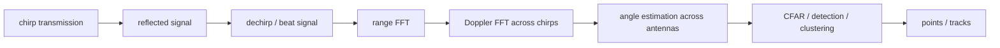

“Radar input” is not one thing. Depending on where the interface is cut, a perception model may receive raw ADC samples, a range-Doppler map, a range-angle map, a 3D/4D radar tensor, CFAR detections, clustered points, or tracker outputs.

Those representations contain very different information. Encoder selection is therefore inseparable from **which radar signal-processing stages have already happened upstream**.

## 1. Start from the FMCW measurement chain

A simplified automotive FMCW pipeline is:



Different model interfaces may tap the pipeline before or after `DET`.

A dense tensor preserves weak evidence and ambiguity. A detection list is compact but has already discarded most sub-threshold signal structure.

## 2. Range comes from beat frequency

For a simple FMCW chirp with slope `S`, the beat frequency is approximately related to range:

$$R \approx \frac{c f_b}{2S}$$

Real systems also account for Doppler coupling and waveform design, but the systems lesson is simple: **range is estimated from signal frequency, not directly measured as a Cartesian coordinate**.

Resolution depends on waveform bandwidth:

$$\Delta R \approx \frac{c}{2B}$$

This sets a physical lower bound before any neural encoder is involved.

## 3. Doppler gives radial velocity, not full object velocity

Across repeated chirps, phase progression provides Doppler frequency and radial velocity:

$$v_r \propto f_D$$

`v_r` is the component of relative velocity along the radar line of sight:

$$v_r = (v_{target}-v_{ego})\cdot \hat r$$

A radar point with `v_r = 0` does not mean the object is stationary. It can move tangentially to the sensor.

The encoder and fusion layer must not reinterpret radial velocity as `(vx, vy)` without additional geometry/temporal evidence.

## 4. Angle estimation is usually the least precise dimension

Multiple receive/transmit antennas create a virtual aperture. Phase differences across the aperture provide azimuth/elevation information.

Angle resolution depends on array geometry and SNR. In many automotive radars, range and radial velocity are much more precise than lateral position.

This creates anisotropic measurement uncertainty:

```text
range:          relatively strong
radial velocity: strong
azimuth:        weaker
vertical angle: often weakest / configuration-dependent
```

A fusion model that treats radar XYZ coordinates as equally precise hides this physics.

## 5. Raw ADC is information-rich but usually impractical for a vehicle AI stack

Raw ADC samples preserve the most information but have enormous bandwidth and tight coupling to radar waveform/antenna calibration.

Using them in an end-to-end model means the neural network must effectively learn parts of conventional radar signal processing.

Advantages:

- weak/pre-CFAR evidence retained;
- potentially richer learned interference handling.

Costs:

- huge tensor bandwidth;
- sensor-specific waveform dependency;
- harder calibration and deployment;
- much larger validation problem.

Most production-style perception stacks tap a later representation.

## 6. Range-Doppler maps preserve motion evidence before angle localization

A range-Doppler map is approximately:

```text
range bins × Doppler bins × amplitude/complex features
```

It is dense and CNN-friendly. Multiple targets at similar range but different velocity can separate clearly.

However, spatial angle information is missing or represented in another branch.

A network using only range-Doppler cannot by itself determine precise lateral position.

## 7. Range-angle maps trade velocity detail for spatial structure

A range-angle map is convenient for spatial reasoning:

```text
range × azimuth × feature
```

but the Doppler dimension may be collapsed, selected or encoded separately.

A useful architecture can therefore have multiple branches:

```text
range-Doppler encoder ─┐
range-angle encoder   ─┼-> fusion -> radar feature
quality/SNR metadata  ─┘
```

The encoder design should state exactly which dimensions were reduced and how.

## 8. Radar cubes are expensive because all dimensions matter

A richer tensor may keep:

```text
range × Doppler × azimuth
```

or even elevation/antenna channels.

Dense 3D convolution becomes expensive quickly. Practical alternatives include:

- separable/factorized convolutions;
- axial attention;
- selecting top-K energy cells;
- sparse tensorization after thresholding;
- collapsing one dimension with learned pooling.

The choice determines what ambiguity the model is still able to resolve.

## 9. CFAR detections are already a model of “interesting” signal

CFAR compares a cell under test with a local noise estimate and emits detections above a threshold.

After CFAR, a radar point might contain:

```text
range / x,y,z
azimuth/elevation
radial velocity
RCS / amplitude
SNR
noise level
ambiguity flags
quality/dynamic-state fields
```

This is much smaller than a radar cube, but low-SNR evidence below the threshold is gone.

A learned point encoder operating on CFAR detections cannot recover signal that upstream CFAR discarded.

## 10. RCS is useful but not a semantic label

Radar cross section depends on target geometry, material, orientation, frequency and multipath.

A truck can have high RCS; a small corner reflector can also have high RCS. Human RCS varies strongly with pose and aspect.

Treat RCS/amplitude as a noisy measurement feature rather than a direct object-class indicator.

## 11. Multipath and ghosts are structured errors

Radar can receive indirect reflections:

```text
radar -> road/barrier -> vehicle -> radar
```

or multiple-bounce paths from guardrails/buildings.

Ghost detections can appear at plausible ranges/velocities. They are not i.i.d. noise.

Temporal and map context help because ghosts often violate consistent object motion or spatial constraints.

The model should preserve quality/SNR/ambiguity metadata instead of feeding only `(x,y,v)`.

## 12. Stationary clutter filtering can delete relevant objects

Upstream processing may classify detections into stationary/moving/ambiguous states.

Aggressively removing stationary radar points saves compute but can remove:

- stopped vehicles;
- barriers;
- parked cars;
- objects with radial velocity near zero.

Whether stationary clutter should be removed depends on the consumer. For dynamic-object tracking it may be useful; for occupancy/free-space it may be harmful.

## 13. A point encoder should represent measurement uncertainty

A stronger radar-point feature is something like:

```text
x, y, z
radial_velocity
RCS
SNR / noise
sensor_id
relative_time
angle/range uncertainty or quality flags
```

Then encode with an MLP/point network and aggregate spatially.

```python
import torch
import torch.nn as nn

class RadarPointEncoder(nn.Module):
    def __init__(self, in_dim=9, out_dim=64):
        super().__init__()
        self.net = nn.Sequential(
            nn.Linear(in_dim, 96), nn.SiLU(),
            nn.Linear(96, out_dim), nn.SiLU(),
        )

    def forward(self, x, valid):
        f = self.net(x)
        return f.masked_fill(~valid[...,None], 0)
```

The important part is not the MLP. It is the feature contract and masking.

## 14. Multiple radars create a calibration/time problem before fusion

A vehicle may have front, corner and rear radars with different capture times and fields of view.

For each detection:

$$p^{ego}_{i}=T_{ego\leftarrow radar_i}(t_i)p^{radar_i}$$

If the sensors are not hardware-synchronized, keep `t_i` and compensate ego motion to a common reference time.

Do not concatenate all radar detections and then forget which sensor/time produced each point.

## 15. Radial velocity should be compensated for ego motion carefully

The raw measured Doppler is relative motion along the line of sight.

If ego velocity `v_e` is known, static-world expected radial velocity is approximately:

$$v_{r,static} = -v_e \cdot \hat r$$

Subtracting this expectation yields a motion cue, but angular velocity and sensor lever arm matter for corner radars.

For accurate compensation, use the velocity of the **sensor location**, not only vehicle-center translation.

## 16. Temporal accumulation is extremely valuable for sparse radar

Single-frame radar detections can be sparse. Accumulating several sweeps increases spatial evidence:

```text
past radar sweeps
   -> ego-motion transform
   -> attach relative age
   -> current ego frame
   -> temporal radar encoder
```

Static infrastructure becomes denser; moving objects trace motion.

The model should receive `Δt` so that a 200 ms-old point is not treated like a current measurement.

## 17. Temporal radar is close to tracking

Because radar measures velocity directly, even a simple state estimator can be powerful.

A learned radar encoder can operate at different abstraction levels:

```text
measurement level -> preserve raw detections
cluster level      -> group local evidence
track level        -> persistent object hypotheses
```

Track-level inputs are compact, but every tracker assumption becomes upstream information loss. End-to-end fusion may prefer lower-level detections when compute allows.

## 18. Radar-to-BEV representation should retain velocity semantics

A BEV cell can aggregate:

```text
occupancy/evidence
mean/max RCS
radial velocity statistics
sensor count
age statistics
quality/confidence
```

If multiple detections with different radial velocities land in one cell, simple averaging can destroy multi-object information.

Learned pooling or multi-bin statistics may be better than one scalar velocity channel.

## 19. Dense radar and sparse radar have different deployment profiles

| Input | Information retained | Compute/bandwidth | Typical encoder |
|---|---|---|---|
| ADC / FFT tensors | maximal signal structure | very high | custom CNN/complex processing |
| radar cube | range+Doppler+angle | high | 3D/factorized CNN/attention |
| range maps | selected dense dimensions | medium | 2D CNN |
| CFAR detections | compact object-like evidence | low | point/sparse/BEV encoder |
| tracks | highly compressed temporal state | very low | sequence/graph model |

There is no “best radar network” independent of where this interface sits.

## 20. What to evaluate

Radar evaluation should be sliced by:

```text
range
azimuth
relative velocity
stationary vs moving
RCS/SNR
rain/spray
multipath-heavy environments
large metal structures
overhead signs/guardrails
cross traffic
```

Also measure:

- timestamp skew sensitivity;
- ego-motion compensation errors;
- false positive persistence;
- velocity calibration;
- point-count/radar-cube bandwidth;
- preprocessing cost.

## 21. The key design rule

Preserve the parts of radar that are **physically distinctive**: direct range, radial velocity, robustness to lighting, and uncertainty structure.

If the pipeline converts radar into generic XYZ points and discards Doppler/SNR/sensor timing, it throws away much of the reason radar was installed in the first place.
