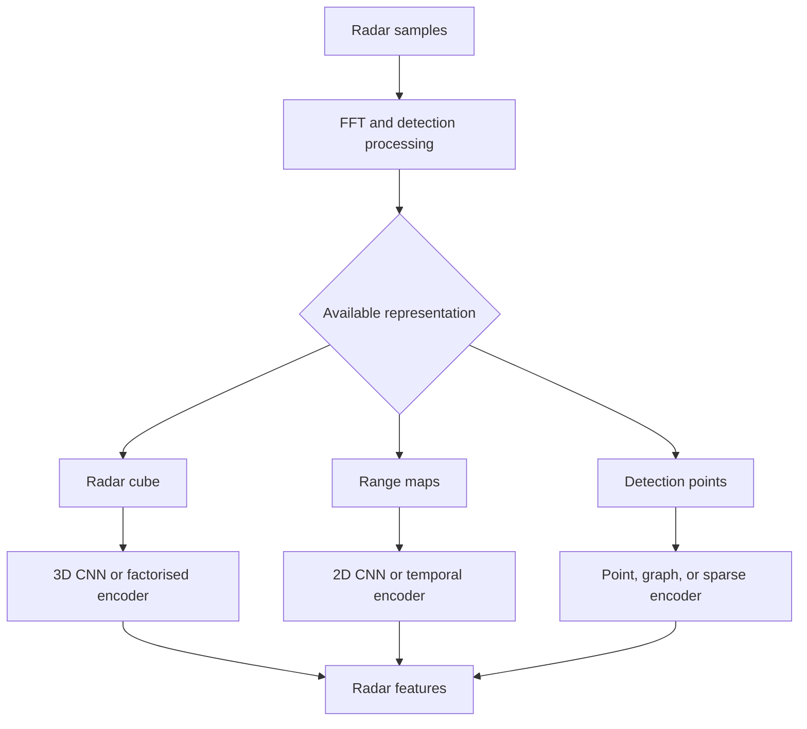

Automotive radar measures reflected radio energy. Signal processing can estimate range, relative radial velocity, and angle, with reflectivity and quality metadata. Radar remains useful in darkness and adverse visibility, but its measurements are sparse or ambiguous depending on the processing stage exposed to the model.

The phrase “radar input” is incomplete. A model may receive raw or processed data at very different abstraction levels.



## Representation choices

### Radar cube

A dense tensor may retain range, Doppler, and angle dimensions. It contains rich information but can be computationally and memory intensive. 3D convolution, separable processing, or attention across selected dimensions may be used.

### Range–Doppler or range–angle map

Two-dimensional maps make standard CNN processing possible. Each map preserves only selected relationships, so several maps or branches may be required.

### Sparse detections

Traditional signal processing produces a point-like list containing position, radial velocity, reflectivity, and confidence. Point encoders, graph networks, sparse convolution, or Transformers can process this compact representation.

### Tracks

An upstream tracker may provide object hypotheses rather than measurements. This reduces model workload but couples perception to tracker assumptions and information loss.

## Encoder families

| Input | Suitable model bias |
|---|---|
| Dense cube | 3D CNN, factorised CNN, or axial attention |
| Range map | 2D CNN with temporal aggregation |
| Sparse detections | Point MLP, graph network, sparse encoder, or attention |
| Track sequence | RNN, temporal convolution, SSM, or Transformer |

Radar velocity is radial relative velocity, not a complete 2D or 3D motion vector. The model and post-processing must preserve this measurement meaning.

## Point-style radar encoder

```python
import torch
import torch.nn as nn


class RadarPointEncoder(nn.Module):
    def __init__(self, feature_dim: int = 64):
        super().__init__()
        # Example inputs: x, y, radial_velocity, reflectivity, quality.
        self.point_mlp = nn.Sequential(
            nn.Linear(5, feature_dim),
            nn.LayerNorm(feature_dim),
            nn.SiLU(),
            nn.Linear(feature_dim, feature_dim),
        )

    def forward(self, points: torch.Tensor, valid: torch.Tensor):
        features = self.point_mlp(points)
        features = features.masked_fill(~valid[..., None], 0.0)
        count = valid.sum(dim=1, keepdim=True).clamp_min(1)
        pooled = features.sum(dim=1) / count
        return features, pooled
```

Normalisation ranges, padding limits, quality masks, and coordinate frames are part of the deployment contract. They should not be hidden inside undocumented preprocessing.

## Why temporal modelling is valuable

Individual radar measurements may be sparse, noisy, or contain multipath artefacts. Temporal processing can improve continuity and motion evidence. Options include:

- accumulation after ego-motion compensation;
- classical tracking and filtering;
- temporal convolution over maps;
- recurrence or state-space memory;
- attention across detection or track histories.

Accumulating without correct transforms can create false structures. Temporal density is useful only when timestamps and ego motion are handled consistently.

## Selection questions

1. Which stage of radar processing is accessible?
2. Which measurement dimensions and quality indicators remain?
3. Is dense-cube bandwidth affordable?
4. Does the target support required 3D or sparse operators?
5. How are multipath, ghost detections, and stationary clutter represented?
6. Is temporal state reset and degradation behaviour defined?
7. Does output need measurement-level evidence or object-level hypotheses?

Radar model selection is inseparable from signal-processing ownership. The same sensor can lead to very different encoder architectures depending on what information the interface exposes.
