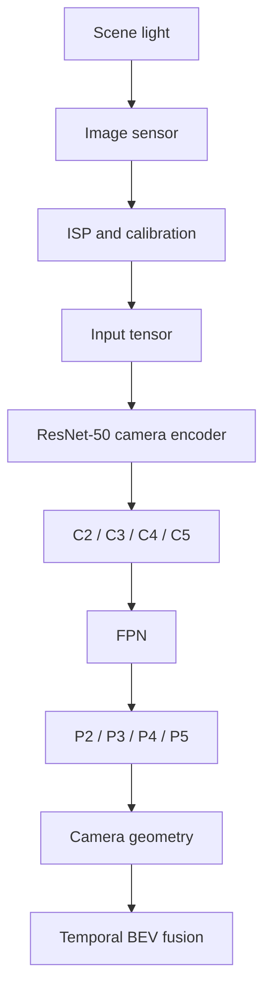

An RGB camera measures reflected light projected onto a two-dimensional sensor. It provides rich colour, texture, and semantic information, but it does not directly provide metric depth, object identity, or motion. Those must be inferred from appearance, geometry, time, or other observations.

Encoder selection should therefore begin with the camera pipeline and output contract—not with a favourite backbone name.



## Camera Encoder: the component we want to understand

The camera encoder converts pixels into learned image-space features. In this article, the focus is deliberately on understanding the internals rather than treating the encoder as a black box.

```text
RGB Camera
    |
    v
[ N, 3, H, W ]
    |
    v
ResNet-50
    |
    +--> C2
    +--> C3
    +--> C4
    +--> C5
    |
    v
FPN
    |
    +--> P2
    +--> P3
    +--> P4
    +--> P5
    |
    v
Temporal BEV / downstream perception
```

The important distinction is that **ResNet-50 + FPN creates image-space features. It does not by itself create the BEV representation.**

## 1. The input tensor

The model commonly receives a tensor shaped as `[batch, channels, height, width]`:

```text
[1, 3, 256, 448]
```

means one RGB image, 256 pixels high and 448 pixels wide.

For a multi-camera system, synchronized images can conceptually be stacked as:

```text
Camera 0 ─┐
Camera 1 ─┤
Camera 2 ─┤
Camera 3 ─┤
Camera 4 ─┼──> [8, 3, H, W]
Camera 5 ─┤
Camera 6 ─┤
Camera 7 ─┘
```

The batch dimension therefore becomes a systems decision involving parallelism, accelerator utilization, memory and latency.

## 2. Start with ResNet-50

TorchVision provides a pretrained ResNet-50 implementation:

```python
import torch
from torchvision.models import resnet50, ResNet50_Weights

weights = ResNet50_Weights.DEFAULT
model = resnet50(weights=weights)
model.eval()
```

The pretrained checkpoint contains learned numerical parameters. A training checkpoint may also contain optimizer state and metadata depending on how it was saved.

A useful mental model is:

```text
Neural network
    = computation graph
    + learned tensors
```

## 3. Why `.eval()` matters

Inference should use evaluation behaviour:

```python
model.eval()
```

This is important for layers such as BatchNorm and Dropout. Evaluation mode makes profiling and comparison experiments repeatable.

## 4. Why image resolution matters

Suppose a camera frame is resized from:

```text
1920 × 1080
```

to:

```text
960 × 540
```

The pixel count falls from 2,073,600 to 518,400 — a 4× reduction.

For a standard convolution, a useful approximation is:

$$
\text{FLOPs} \approx 2HWC_{in}C_{out}K^2
$$

Therefore, resolution is both an accuracy decision and a silicon decision.

## 5. CPU, GPU and NPU

The same convolution can execute on very different compute engines:

```text
CPU
 └─ flexible control + SIMD/vector execution

GPU
 └─ massively parallel tensor computation

NPU
 └─ specialized tensor acceleration
```

Peak TOPS alone does not determine latency. Memory movement, operator support, compiler efficiency, tensor layout and workload contention also matter.

## 6. Memory traffic matters

A useful simplified model is:

$$
\tau \approx \max\left(\frac{\text{FLOPs}}{\text{Peak Compute}},\frac{\text{Bytes}}{\text{Memory Bandwidth}}\right)+\tau_{overhead}
$$

This gives us two broad regimes:

```text
Compute bound -> arithmetic throughput limits speed
Memory bound  -> tensor movement limits speed
```

This is why optimizing only FLOPs can be misleading.

## 7. ResNet-50 and the residual block

The central ResNet idea is:

$$
H(x)=F(x)+x
$$

Conceptually:

```text
              +-------------------+
              |                   |
Input x ------+--> F(x) ----------+--> Add --> Output
```

ResNet-50 uses bottleneck blocks:

```text
Input
  |
  +------------------------------+
  |                              |
  v                              |
1×1 Conv                         |
  |                              |
  v                              |
3×3 Conv                         |
  |                              |
  v                              |
1×1 Conv                         |
  |                              |
  +-------------> Add <----------+
                   |
                   v
                  ReLU
```

The 1×1 layers transform channel dimensions around the spatial 3×3 convolution.

## 8. C2, C3, C4 and C5

As we move deeper into ResNet:

```text
Spatial resolution  ↓
Semantic abstraction ↑
```

For a 256×448 input, a useful conceptual hierarchy is:

```text
Input : 256 × 448
  |
 C2   : 64 × 112
  |
 C3   : 32 × 56
  |
 C4   : 16 × 28
  |
 C5   : 8 × 14
```

C2 preserves more spatial detail. C5 provides stronger semantic/contextual representation at a coarser grid.

> **C2 knows more about where; C5 knows more about what and context.**

## 9. Why FPN exists

ResNet is the backbone. FPN is a separate feature-aggregation architecture.

```text
             C5
              |
              v
             P5
              |
          upsample
              |
              +------ C4
                         |
                         v
                        P4
                         |
                      upsample
                         |
                         +------ C3
                                    |
                                    v
                                   P3
                                    |
                                 upsample
                                    |
                                    +------ C2
                                               |
                                               v
                                              P2
```

The top-down pathway brings semantic information toward higher-resolution maps. Lateral connections preserve spatial information.

The resulting pyramid provides:

```text
P2 -> fine spatial detail
P3 -> medium scale
P4 -> larger objects/context
P5 -> coarse grid + strong context
```

## 10. Inspect the actual FPN tensors

```python
import torch
from torchvision.models.detection.backbone_utils import resnet_fpn_backbone

backbone = resnet_fpn_backbone(
    "resnet50",
    weights="DEFAULT"
)
backbone.eval()

frame = torch.zeros(1, 3, 600, 800)
frame[:, :, 200:400, 300:500] = 1.0

with torch.no_grad():
    features = backbone(frame)

for name, tensor in features.items():
    print(name, tensor.shape)
```

For a 600×800 input, the usual FPN grid hierarchy is approximately:

```text
P2 -> stride 4  -> 150 × 200
P3 -> stride 8  -> 75 × 100
P4 -> stride 16 -> 38 × 50
P5 -> stride 32 -> 19 × 25
```

## 11. Inspect tensor statistics

A useful helper is:

```python
def tensor_info(t):
    return {
        "shape": tuple(t.shape),
        "dtype": str(t.dtype),
        "min": float(t.min()),
        "max": float(t.max()),
        "mean": float(t.mean()),
        "std": float(t.std()),
        "elements": t.numel(),
        "MB_fp32": t.numel() * 4 / (1024 ** 2),
    }
```

For a tensor shaped `[1, 256, 64, 112]`:

$$
1\times256\times64\times112=1,835,008
$$

values, or approximately 7.34 MB at FP32.

This is why activation memory becomes important when we have multiple cameras, pyramid levels, temporal history and other perception models.

## 12. Visualize the feature pyramid

```python
import matplotlib.pyplot as plt

fig, axes = plt.subplots(1, 4, figsize=(16, 5))
names = ["P2 (Stride 4)", "P3 (Stride 8)", "P4 (Stride 16)", "P5 (Stride 32)"]

for ax, key, name in zip(axes, list(features.keys())[:4], names):
    tensor = features[key]
    heatmap = tensor[0].mean(dim=0).cpu().numpy()
    ax.imshow(heatmap)
    ax.set_title(f"{name}\n{heatmap.shape[0]}×{heatmap.shape[1]}")
    ax.axis("off")

plt.tight_layout()
plt.show()
```

P5 may look blocky when enlarged. That is expected from its coarse feature grid.

## 13. Feature stride and camera geometry

A feature coordinate is not automatically an image coordinate. For a stride-8 feature map, a simplified mapping is:

$$
u_{image}\approx u_{feature}\times8$$

Actual geometry must also account for resizing, padding, convolution conventions and camera calibration.

This matters directly to the later camera-to-BEV transformation.

## 14. From image features to BEV

The camera encoder produces learned image-space features:

```text
RGB
 |
v
ResNet-50
 |
 +--> C2 C3 C4 C5
 |
v
FPN
 |
 +--> P2 P3 P4 P5
 |
v
Multi-scale image features
```

A later stage incorporates camera geometry and view transformation:

```text
Camera
  |
  v
Encoder
  |
  v
FPN
  |
  v
Image features
  |
  v
Camera geometry / view transform
  |
  v
BEV features
  |
  v
Temporal BEV fusion
```

This is the conceptual handoff we will investigate next.

## 15. What happens on the automotive SoC?

The complete path can look like:

```text
Camera sensor
     |
     v
ISP / calibration
     |
     v
DMA / shared memory
     |
     v
Preprocessing
     |
     v
NPU / GPU
     |
     v
ResNet-50 + FPN
     |
     v
Feature buffers
     |
     v
BEV transformation
```

We therefore need to understand not only the neural graph, but also buffer ownership, DMA, tensor layout, accelerator memory, compiler transformations, precision conversion, concurrent workloads, latency distribution and thermal behaviour.

## 16. Layer fusion

A compiler may be able to optimize compatible sequences such as:

```text
Conv
  |
BatchNorm
  |
ReLU
```

reducing intermediate memory traffic. Exact fusion depends on the graph, compiler and target accelerator, so deployed performance must be measured rather than inferred from the framework graph alone.

## 17. Recommended experiment sequence

### Experiment 1 — Raw ResNet-50

Measure:

```text
parameters
feature shapes
latency
activation memory
```

### Experiment 2 — ResNet-50 + FPN

Trace:

```text
C2 C3 C4 C5
     |
     v
FPN
     |
     v
P2 P3 P4 P5
```

### Experiment 3 — Activation analysis

Record min/max, mean/std, percentiles, zero percentage and memory footprint.

### Experiment 4 — Compute analysis

Compare FLOPs, parameters, activation memory, latency and throughput.

### Experiment 5 — Precision

Compare FP32, FP16 and INT8 for both numerical behaviour and performance.

### Experiment 6 — Encoder comparison

Only after understanding ResNet-50 should we compare ResNet-18, ResNet-101, ConvNeXt, Swin and MobileNet.

## 18. The next level: open one bottleneck block

The next experiment should trace one actual ResNet-50 bottleneck:

```text
Input tensor
      |
      v
1×1 Conv
      |
      v
BatchNorm
      |
      v
ReLU
      |
      v
3×3 Conv
      |
      v
BatchNorm
      |
      v
1×1 Conv
      |
      v
BatchNorm
      |
      +<------ Skip connection
      |
      v
     Add
      |
      v
     ReLU
```

Then trace the same computation through:

```text
PyTorch tensor
      ↓
Convolution
      ↓
FP32 / FP16 / INT8
      ↓
Compiler graph
      ↓
Kernel
      ↓
GPU/NPU execution
      ↓
Memory traffic
```

That is where the camera encoder stops being a black box and becomes something we can understand from the algorithm all the way down to the silicon.
