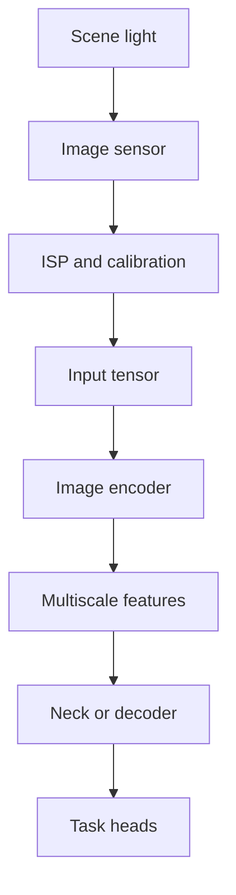

An RGB camera measures reflected light projected onto a two-dimensional sensor. It provides rich colour, texture, and semantic information, but it does not directly provide metric depth, object identity, or motion. Those must be inferred from appearance, geometry, time, or other observations.

Encoder selection should therefore begin with the camera pipeline and output contract—not with a favourite backbone name.



## What the encoder receives

The model commonly receives a tensor shaped as `[batch, channels, height, width]`. Before it reaches the encoder, the input contract may include:

- colour order and transfer function;
- bit depth and numerical range;
- lens distortion handling;
- resize, crop, and padding policy;
- mean and standard-deviation normalisation;
- exposure, gain, and quality metadata;
- camera calibration and timestamp ownership.

A backbone trained on one contract may degrade severely when deployed with another. Preprocessing is part of the model interface.

## Major backbone families

### Residual CNNs

Residual networks use convolutional stages and skip connections. They provide predictable multiscale features, mature tooling, and broad operator support. They are useful baselines when portability and clear feature strides matter.

### Efficient mobile CNNs

MobileNet- and EfficientNet-style backbones use depthwise separable convolution, inverted bottlenecks, channel attention, and compound scaling. They target better accuracy per operation, but theoretical operation counts do not guarantee target latency. Depthwise kernels may behave differently across accelerators.

### Modern convolutional backbones

ConvNeXt-style models incorporate design lessons from Transformers while retaining convolution. They can provide strong features with a familiar hierarchical structure.

### Hierarchical vision Transformers

Windowed or pyramid Transformers build multiscale features using attention. They can capture wider context than local convolution, but memory, token count, operator support, and quantisation must be assessed carefully.

### Plain vision Transformers

A flat patch-token encoder is conceptually simple and benefits from global contextual reasoning. Dense prediction usually requires intermediate features, token reshaping, or a decoder that reconstructs spatial hierarchy.

### Hybrid encoders

Hybrid designs combine convolution for local structure and efficient early processing with attention or state-space blocks for broader context. The trade-off is a more complex compilation and tuning surface.

## Selection matrix

| Priority | Backbone bias to investigate |
|---|---|
| Mature deployment and multiscale outputs | Residual or modern hierarchical CNN |
| Tight compute and memory envelope | Mobile-oriented CNN |
| Strong global context | Hierarchical attention or hybrid |
| Long spatial sequences with efficient scaling | State-space or hybrid hierarchy |
| Maximum reuse across several dense tasks | Backbone exposing stable intermediate stages |

This is a starting point, not a universal ranking. Input resolution, neck, heads, precision, compiler, and memory movement can dominate the final result.

## A generic multiscale encoder wrapper

```python
import torch
import torch.nn as nn


class ImageEncoder(nn.Module):
    """Illustrative hierarchy; replace stages with a chosen family."""

    def __init__(self):
        super().__init__()
        self.stem = nn.Sequential(
            nn.Conv2d(3, 32, 3, stride=2, padding=1, bias=False),
            nn.BatchNorm2d(32),
            nn.SiLU(),
        )
        self.stage2 = nn.Conv2d(32, 64, 3, stride=2, padding=1)
        self.stage3 = nn.Conv2d(64, 128, 3, stride=2, padding=1)
        self.stage4 = nn.Conv2d(128, 256, 3, stride=2, padding=1)

    def forward(self, image: torch.Tensor) -> dict[str, torch.Tensor]:
        x = self.stem(image)
        c2 = torch.relu(self.stage2(x))
        c3 = torch.relu(self.stage3(c2))
        c4 = torch.relu(self.stage4(c3))
        return {"c2": c2, "c3": c3, "c4": c4}


encoder = ImageEncoder().eval()
features = encoder(torch.randn(1, 3, 512, 512))
print({name: tuple(value.shape) for name, value in features.items()})
```

The point is not the layers. It is the explicit multiscale contract. A neck or decoder can use high-resolution detail from `c2` and stronger semantics from deeper stages.

## How to evaluate candidates

Compare candidates using the complete inference graph:

1. Fix the input contract and representative dataset.
2. Attach the actual style of neck and heads required by the task.
3. Measure task quality, calibration, and behaviour under difficult conditions.
4. Export the graph and inspect unsupported operations.
5. Measure latency distribution, not only average latency.
6. Record peak activation memory and data-transfer cost.
7. Test the intended precision, including quantised execution.
8. Evaluate startup, thermal stability, and concurrent workloads.

The best encoder is the one that preserves the necessary information and remains reliable inside the product’s complete compute and lifecycle constraints.

## What remains outside the backbone

An image encoder does not by itself solve perception. The wider model may still require:

- multiscale aggregation;
- geometry-aware lifting or projection;
- temporal memory;
- task-specific decoding;
- uncertainty estimation;
- post-processing and coordinate conversion;
- cross-sensor or cross-view fusion.

Backbone selection is therefore an architectural decision, not a model-completion decision.
