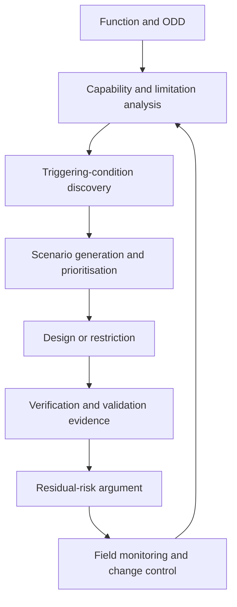

A camera can be electrically healthy, the software can execute exactly as designed, and the vehicle can still misunderstand a faded lane, a partially hidden pedestrian, or an ambiguous temporary sign. That is the territory of **Safety of the Intended Functionality (SOTIF)**.

ISO 21448 addresses unreasonable risk arising from limitations in the specification or performance of the intended functionality, including reasonably foreseeable misuse. It complements functional safety: ISO 26262 focuses on malfunctioning behaviour of safety-related electrical/electronic systems, while SOTIF asks whether a fault-free implementation can still be unsafe.

## Begin with the behaviour, not the model

“Validate the perception network” is too narrow. Start with a vehicle-level capability and its operating context:

- What behaviour is promised?
- In which Operational Design Domain (ODD)?
- What must the system detect, predict, decide, and communicate?
- What assumptions does it make about the road, other users, weather, maps, connectivity, and the human?
- What happens near and beyond the capability boundary?

An ODD should be testable. “Urban roads in normal weather” is not. Road classes, geometry, speed range, illumination, precipitation, visibility, surface condition, traffic control, vulnerable road users, localization availability, and operational constraints need measurable definitions.



## Convert limitations into testable hypotheses

Avoid a vague list such as “bad weather may reduce performance.” Write a causal hypothesis:

> At low sun angle, glare reduces the usable contrast of a traffic signal; the perception output remains confident; the behaviour function receives an incorrect state long enough to enter the intersection.

This statement identifies the trigger, functional insufficiency, propagation path, duration, and hazardous behaviour. It can drive data search, simulation, track testing, monitoring, and mitigation.

### Practical trigger families

| Area | Examples to investigate |
|---|---|
| Visibility | glare, darkness, fog, spray, dirty lens, reflections, shadow transitions |
| Geometry | hill crest, sharp curvature, unusual camber, narrow lane, complex junction |
| Occlusion | parked vehicle, vegetation, crowd, large vehicle, infrastructure |
| Object appearance | unusual pose, load, costume, mobility aid, non-standard vehicle |
| Infrastructure | faded markings, temporary signs, construction, conflicting signals |
| Dynamics | cut-in, sudden reversal, rolling object, emergency vehicle, unstable load |
| Sensor interaction | saturation, multipath, ghost return, poor overlap, timing skew |
| Map/localization | changed road, stale semantic attribute, repeated structure, GNSS degradation |
| Human interaction | mode confusion, delayed takeover, over-trust, foreseeable misuse |

The goal is not to enumerate the universe. It is to develop a disciplined discovery process and evidence that high-risk regions have been searched with appropriate depth.

## Use a scenario record, not a video folder

A scenario becomes useful when it is searchable and traceable. A minimal record can include:

```python
from dataclasses import dataclass


@dataclass(frozen=True)
class SotifScenario:
    function: str
    odd_tags: frozenset[str]
    triggering_conditions: tuple[str, ...]
    expected_behavior: str
    safety_metric: str
    severity: int
    exposure: int
    controllability: int
    evidence_sources: tuple[str, ...]


def priority(s: SotifScenario, novelty: float, evidence_gap: float) -> float:
    consequence = s.severity * s.exposure * s.controllability
    return consequence * (1.0 + novelty) * (1.0 + evidence_gap)
```

The formula is deliberately illustrative. A real prioritisation scheme must be defined by the safety process. The important idea is to retain the scenario’s cause, context, expected behaviour, safety measure, and evidence—not merely the input clip.

## Test the system response, not only component accuracy

Aggregate precision and recall can conceal a safety-critical corner. Connect component output to a vehicle-level consequence.

For a candidate scenario, measure:

- detection or estimation quality by relevant distance and time-to-event;
- confidence calibration, not just confidence magnitude;
- temporal stability and recovery after temporary loss;
- delay from physical event to usable system state;
- downstream prediction and planning sensitivity;
- minimum separation, time-to-collision, rule compliance, and comfort where relevant;
- degradation, driver communication, and fallback response;
- repeatability across parameter variation.

Test the same semantic situation through several methods. Simulation provides controlled parameter sweeps; recorded-data replay provides realism; closed-course tests validate the integrated vehicle; carefully governed field exposure reveals distribution and interaction effects. None provides complete evidence alone.

## Search for the unknown unsafe region

Known scenarios are the easy part. Practical discovery methods include:

1. mine disengagements, overrides, near misses, and monitor activations;
2. cluster high-uncertainty or high-disagreement field samples;
3. search parameter spaces around known failures;
4. use metamorphic tests—change lighting or appearance while preserving the expected behaviour;
5. compare diverse models or sensing paths to expose disagreement;
6. perform expert review across perception, behaviour, human factors, maps, and vehicle dynamics;
7. inspect distribution gaps by ODD dimension rather than dataset name;
8. feed every discovered condition back into requirements, tests, and monitoring.

Mileage is not coverage. Ten thousand repeated motorway kilometres may add less safety evidence than one carefully varied construction-zone scenario.

## Mitigation is broader than improving the model

When a limitation is found, possible measures include:

- restrict the ODD or operating speed;
- add a complementary sensor or independent evidence source;
- improve training data, labels, loss, architecture, or calibration;
- add temporal confirmation or a consistency monitor;
- adjust behaviour to preserve more safety margin;
- communicate capability and mode more clearly to the user;
- require a fallback-ready user or minimum-risk manoeuvre where appropriate;
- detect the triggering condition and degrade early;
- prevent activation when prerequisites are not met.

A SOTIF measure should break a documented causal chain. “Add more data” is incomplete unless the required coverage and acceptance evidence are defined.

## Practical review questions

### Specification

- Is every capability boundary objectively detectable?
- Are assumptions about other road users and infrastructure explicit?
- Are ambiguous situations and right-of-way uncertainty represented?
- Does the expected behaviour remain safe when the system is uncertain?

### Perception and localization

- What produces confident-but-wrong output?
- What input-quality signals exist, and are they calibrated?
- How long can state be propagated without fresh evidence?
- Can temporal smoothing hide a fast hazard?

### Planning and control

- Does the planner preserve margin under multimodal futures?
- Can a nominally valid trajectory be socially or legally surprising?
- Are model limitations converted into motion constraints?
- Is degradation stable, observable, and testable?

### Human factors

- Can the user understand the active mode and its limits?
- What foreseeable misuse follows from the interface or marketing?
- Is a takeover request timely under realistic attention and workload?
- What happens when the user does not respond?

### Operations

- Which field signals reveal ODD drift or an emerging trigger?
- Can a software, model, sensor, or map change invalidate previous evidence?
- Are safety events reproducible with versioned data and software?
- Is the residual-risk argument revisited as exposure grows?

## Evidence that should survive a release

A useful SOTIF package contains a versioned function and ODD definition, limitation catalogue, triggering-condition hypotheses, scenario database, test strategy, safety measures, validation results, residual-risk rationale, open assumptions, and field-monitoring/change plan.

SOTIF is not a final testing phase. It is a learning loop: specify the capability, actively search for where it can be unsafe without a fault, reduce the unsafe region, and preserve evidence about what remains.

## Official reference

- [ISO 21448:2022 — Road vehicles — Safety of the intended functionality](https://www.iso.org/standard/77490.html)

