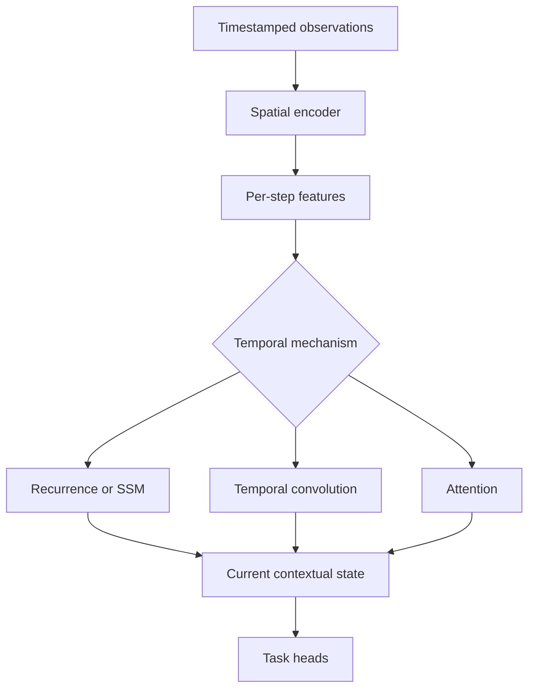

Perception from a single observation answers “what appears to be present now?” A spatial–temporal model also asks “how did it evolve, what is moving, and which earlier evidence remains relevant?”

Time is not simply another channel. It introduces order, motion, state, irregular sampling, and the possibility that older evidence has become invalid.



## Two broad strategies

### Early space-time processing

Stack observations and process them jointly with 3D convolution, space-time attention, or a unified token model. This captures interactions early but can be memory intensive.

### Encode first, aggregate later

Apply a spatial encoder independently, then combine feature maps, tokens, entities, or BEV features across time. This reuses a pretrained backbone and reduces temporal tensor size.

The best aggregation level depends on which information must persist. Pixel-level history preserves detail; entity-level history is compact but depends on earlier detection and association.

## Temporal model families

| Family | Strength | Main concern |
|---|---|---|
| 3D convolution | Local space-time patterns and parallel training | Activation memory and fixed window |
| Temporal convolution | Efficient finite history | Receptive field and causal design |
| ConvLSTM or GRU | Streaming spatial state | Sequential dependency |
| Transformer | Content-dependent long relationships | Token memory and quadratic attention |
| State-space model | Efficient evolving long state | Backend maturity and state semantics |
| Tracking/filtering | Explicit motion and uncertainty | Depends on measurement association |

Hybrids are common because dense feature memory, object tracking, and motion estimation solve different temporal problems.

## Spatial encoder plus GRU

```python
import torch
import torch.nn as nn


class SpatialTemporalEncoder(nn.Module):
    def __init__(self, hidden: int = 128):
        super().__init__()
        self.spatial = nn.Sequential(
            nn.Conv2d(3, 32, 5, stride=2, padding=2),
            nn.ReLU(),
            nn.Conv2d(32, hidden, 3, stride=2, padding=1),
            nn.ReLU(),
            nn.AdaptiveAvgPool2d(1),
        )
        self.temporal = nn.GRU(hidden, hidden, batch_first=True)

    def forward(self, sequence: torch.Tensor, state=None):
        # sequence: [batch, time, channels, height, width]
        batch, time = sequence.shape[:2]
        frames = sequence.flatten(0, 1)
        features = self.spatial(frames).flatten(1)
        features = features.reshape(batch, time, -1)
        contextual, next_state = self.temporal(features, state)
        return contextual, next_state
```

Global pooling makes the code compact but discards spatial detail. Dense tasks normally preserve feature maps or tokens and use ConvGRU, temporal attention, warped fusion, or BEV memory.

## Ego motion and feature alignment

Past features and current features may refer to different coordinates. Temporal fusion can use:

- known pose transforms;
- optical or scene flow;
- learned offsets;
- deformable attention;
- object-level motion compensation;
- explicit map or BEV coordinates.

Simply averaging unaligned features blurs structures and creates false motion evidence.

## Causal versus non-causal models

A non-causal model can use future observations and is useful for offline labelling or analysis. A real-time causal model may only use present and past data. Evaluation must enforce the same information boundary expected at runtime.

## State lifecycle

Streaming state requires explicit behaviour for:

- startup and warm-up;
- timestamp gaps and variable rate;
- dropped or duplicated frames;
- calibration changes;
- scene cuts or sensor restarts;
- state reset and bounded memory;
- concurrent sequences in batched execution.

State is part of the model interface, not an invisible implementation detail.

## How to select

Choose the temporal mechanism after defining:

1. Required history duration.
2. Level of representation to retain.
3. Whether geometry can align history explicitly.
4. Causal latency constraint.
5. Available activation and persistent-state memory.
6. Training sequence length and data diversity.
7. Behaviour under gaps, resets, and changing motion.

Temporal complexity is valuable only when the data, labels, evaluation, and runtime preserve time correctly.
