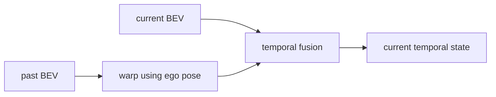

Temporal perception is not “add a few previous frames.” The core problem is that **past evidence was measured from a different vehicle pose, at a different time, while parts of the world were independently moving**.

A useful temporal model therefore has three separate responsibilities:

```text
1. establish a common reference time/frame
2. preserve useful historical evidence
3. distinguish ego motion, object motion and stale information
```

Only after those contracts are explicit does it make sense to choose a GRU, Transformer, temporal convolution or state-space model.

## 1. Time changes the meaning of every spatial feature

Suppose a BEV feature at time `t-1` says that a strong vehicle-like feature exists at cell `(x,y)`. At time `t`, the ego vehicle has moved and rotated. The same static world point will no longer occupy the same ego-frame cell.

If the world-frame ego poses are `T_world<-ego(t-1)` and `T_world<-ego(t)`, the transform that moves past ego-frame coordinates into the current ego frame is:

$$T_{ego_t\leftarrow ego_{t-1}} = T^{-1}_{world\leftarrow ego_t}T_{world\leftarrow ego_{t-1}}$$

That transform aligns **static scene structure**.

A moving vehicle has an additional object-motion transform. Therefore ego warping is necessary but not sufficient.

## 2. Temporal fusion should happen in a representation with stable geometry

Temporal fusion at raw image level is difficult because the same world point moves nonlinearly across different camera views and depths.

Once evidence is represented in metric BEV, static alignment becomes much simpler:



This is one reason BEV has become a strong temporal-memory surface: the coordinate system is aligned with the vehicle/world rather than the image plane.

Temporal image-space models can still be powerful, especially when attention uses calibration-aware projections, but they must solve viewpoint alignment somewhere.

## 3. Sensor capture time and model-state time are different

A feature tensor should retain the timestamp of the measurement that produced it.

```text
camera exposure at      10.000 s
encoder completes at    10.018 s
BEV completes at        10.030 s
```

The BEV evidence still describes the scene near **10.000 s**, not 10.030 s.

Temporal fusion should therefore align state by measurement/reference time. Retimestamping features at inference completion silently creates systematic motion error.

A useful state contract is:

```text
TemporalState
    reference_time
    reference_pose
    feature tensor
    validity / visibility mask
    age map or confidence
    state generation
```

## 4. Fixed-window stacking is the simplest baseline

The simplest temporal model stores `K` recent features:

```text
F(t-K+1), ..., F(t-1), F(t)
```

After alignment, they can be concatenated and processed by convolution/MLP/attention.

Advantages:

- parallel training;
- deterministic memory;
- no hidden persistent state;
- easy replay/debugging.

Costs:

- memory scales with `K`;
- history duration depends on frame rate;
- old evidence is repeatedly reprocessed;
- inference cost grows with window size.

This is often a very good baseline because it makes the temporal contract visible.

## 5. Recurrent memory compresses history into state

A recurrent model maintains:

$$h_t=f(x_t,h_{t-1})$$

For dense BEV, a ConvGRU-style state preserves spatial structure:

```text
current BEV x_t ───────┐
                       ├-> gated update -> h_t
warped previous h_{t-1}┘
```

The benefit is bounded state size independent of history length.

The cost is that `h_t` becomes **path dependent**. To reproduce one output, you need the complete state history or a checkpointed state, not just the current frame.

That has major implications for regression testing and fault recovery.

## 6. Recurrent state must have an explicit reset policy

Reset state when its assumptions become invalid. Examples:

- localization jumps;
- sensor calibration changes;
- a camera restarts;
- timestamps become discontinuous;
- scene sequence changes;
- software/accelerator backend restarts;
- vehicle is teleported in simulation.

A stale state can look numerically valid while representing the wrong world.

A practical implementation attaches a generation counter:

```text
state_generation = 41
sensor_generation = 41
localization_generation = 41
```

Any incompatible generation change invalidates the temporal memory.

## 7. Attention-based temporal memory separates storage from retrieval

Temporal Transformers or deformable-attention models can retain tokens/features and let current queries retrieve relevant historical evidence.

The key advantage is **content-dependent retrieval** rather than fixed recurrence.

A current BEV query can ask past memory for evidence near its expected spatial location.

However, attention does not remove geometry. A temporal key/value should still encode:

```text
spatial position
reference pose/time
camera/sensor identity if relevant
age
```

Otherwise the network must infer coordinate transformations implicitly from training.

## 8. Full attention scales badly with dense space-time tokens

If one BEV has `H×W` tokens and history length is `T`, naive attention can scale roughly with the square of `T·H·W`.

Practical designs therefore use:

- local windows;
- deformable sparse sampling;
- selected memory tokens;
- lower-resolution temporal memory;
- factorized spatial/temporal attention;
- recurrent compression.

The useful metric is not only parameter count. Track **tokens attended per output query and activation memory**.

## 9. State-space models change sequence scaling, not the geometry problem

Selective state-space models can process long sequences with more favorable scaling than dense attention.

They are attractive for:

- long temporal histories;
- streaming execution;
- bounded recurrent state.

But an SSM still needs a meaningful token sequence. If unaligned BEV cells from different ego poses are fed as though they were the same spatial location, sequence efficiency does not fix the coordinate error.

Geometry and model family are orthogonal design choices.

## 10. Temporal convolution provides deterministic finite memory

A causal 1D temporal convolution over each BEV cell can be written as:

$$y_t = \sum_{k=0}^{K-1} W_k x_{t-k}$$

After ego alignment, this is simple and accelerator-friendly.

Dilated temporal convolution increases receptive field without a large kernel:

```text
layer 1 dilation 1
layer 2 dilation 2
layer 3 dilation 4
...
```

Advantages:

- parallel training;
- fixed memory/latency;
- no hidden recurrent state.

Limitation: the temporal weighting is mostly fixed by learned kernels rather than content-dependent retrieval.

## 11. Dynamic objects need residual motion reasoning

After ego-motion warping, a static pole aligns. A moving car does not.

```text
past vehicle position -----> current vehicle position
          ^
          | ego warp aligns world frame only
```

There are several strategies:

### Let the temporal network learn residual motion

Simple but can blur features when displacement is large.

### Use optical/scene flow

Warp dynamic evidence using estimated motion.

### Object-centric memory

Track entities separately and propagate their kinematic state.

### Deformable attention

Allow current queries to sample past locations around a learned motion hypothesis.

Strong systems often combine dense BEV memory for scene context with object tracks for precise dynamic state.

## 12. Feature averaging can destroy information

A naive aligned average:

$$F_t = \alpha F_t^{current} + (1-\alpha)F_{t-1}^{warped}$$

assumes both observations are equally valid representations of the same state.

This fails when:

- an area becomes newly visible;
- old evidence is occluded now;
- a dynamic object moved;
- one sensor degraded;
- calibration/localization uncertainty grew.

Better fusion uses validity/visibility/age gates:

$$F = g_c\odot F_c + g_h\odot F_h$$

where gates depend on feature content and quality metadata.

## 13. Visibility and observation age should be represented explicitly

An empty BEV cell can mean:

```text
observed and free
not observed
occluded
old evidence only
sensor dropout
```

Temporal memory should not treat those states identically.

Useful auxiliary channels include:

- observed mask;
- last-observed age;
- source-modality mask;
- confidence/uncertainty;
- number of contributing observations.

These can be learned or explicitly maintained.

## 14. Irregular sampling must use actual Δt

A temporal model trained at exactly 10 Hz can fail when frames arrive at 7–12 Hz due to load/dropouts.

State transition should know actual elapsed time:

```text
x_t, Δt -> state update
```

For object dynamics:

$$p_t \approx p_{t-1}+v_{t-1}\Delta t$$

The same principle applies to learned state. Encoding `Δt` or using time-aware positional embeddings makes variable-rate behavior explicit.

## 15. Dropped frames are not equivalent to repeated frames

If frame `t` is dropped, two tempting implementations are:

```text
A: repeat previous feature
B: skip update
```

They mean different things.

Repeating previous feature tells the model that an observation occurred again. Skipping says no new evidence arrived.

A correct temporal contract should expose missing-data state explicitly.

## 16. Causal versus acausal evaluation must be separated

Offline models can use future frames to improve current estimates. That is useful for labeling, smoothing and dataset generation.

A real-time driving stack cannot.

If the production model is causal, validation must enforce:

```text
output at t uses only measurements with timestamp <= t
```

Even a subtle future-frame normalization or bidirectional sequence layer can create unrealistic benchmark gains.

## 17. Temporal memory changes latency semantics

A single-frame network has per-frame latency. A temporal network also has **information horizon**.

Example:

```text
5 frames at 10 Hz -> 400 ms span between oldest and newest observation
```

A model may output in 20 ms while still depending on evidence 400 ms old.

Measure both:

- processing latency;
- age distribution of evidence influencing the state.

For fast dynamics, old evidence should decay or be motion-compensated.

## 18. Training sequence policy affects deployed behavior

Important choices include:

```text
sequence length
random starting state vs carried state
truncated BPTT length
frame-drop augmentation
time-jitter augmentation
pose-noise augmentation
state reset frequency
sensor-dropout augmentation
```

If every training sequence starts with zero memory and lasts 2 seconds, the network may behave poorly after 20 minutes of uninterrupted streaming.

Long-run state stability requires explicit testing.

## 19. A compact ego-warp experiment

For a 2D BEV point `(x,y)` and ego motion `(dx,dy,dtheta)`, a simplified transform is:

```python
import numpy as np

def warp_point(p, dx, dy, dtheta):
    c, s = np.cos(-dtheta), np.sin(-dtheta)
    R = np.array([[c,-s],[s,c]])
    return R @ (np.asarray(p) - np.array([dx,dy]))

print(warp_point([15.0, 2.0], dx=1.0, dy=0.0, dtheta=np.deg2rad(5)))
```

A production implementation uses full SE(2)/SE(3) transforms and resamples feature grids with well-defined interpolation. The experiment simply shows why unchanged BEV indices are not temporally stable.

## 20. What to profile

Per temporal update, log:

```text
input reference time
Δt from previous state
pose delta
warp time
memory size / token count
fusion time
state age statistics
state reset events
sensor/source validity
```

Then correlate errors with:

- high yaw rate;
- fast cross traffic;
- long occlusion;
- localization error;
- frame drops;
- sensor restart.

## 21. Selection guide

| Need | Strong starting mechanism |
|---|---|
| simple finite history | aligned stack + temporal convolution |
| compact streaming state | ConvGRU / recurrent BEV |
| content-dependent history | temporal/deformable attention |
| long sequence with bounded state | state-space model |
| precise object kinematics | explicit tracking/filtering + learned features |

The most robust autonomy stack often uses more than one temporal representation: dense scene memory plus object-level kinematic state.

## 22. The key design principle

Temporal perception is a **state-estimation problem over learned representations**.

The model should never have to guess which past cell corresponds to the current world if calibration, ego pose and timestamps already provide that information. Use geometry to remove known motion; use learning to model what remains: dynamic objects, occlusion, uncertainty and long-context semantics.
