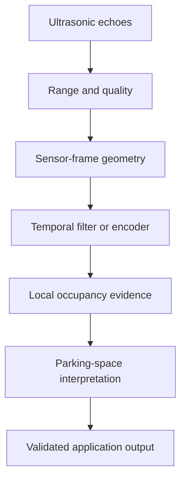

Ultrasonic sensing is often treated as simple distance reporting, but parking environments contain difficult surfaces, oblique reflections, cross-talk, dropouts, narrow objects, and changing vehicle geometry. A robust model begins by preserving measurement quality and sensor geometry.



## What the sensor provides

Depending on the interface, each channel may expose:

- one or more ranges;
- echo amplitude or confidence;
- minimum and maximum validity;
- diagnostic status;
- transducer identity and timestamp;
- temperature or compensation status.

A “no return” is not automatically free space. It may indicate no obstacle, an absorptive surface, an angle that reflects energy away, interference, or a sensor fault.

## Useful model patterns

### Classical filtering

Median filters, outlier rejection, hysteresis, and geometric consistency checks are strong baselines. They are explainable and inexpensive.

### Small MLP

An MLP can combine the ranges, quality indicators, vehicle state, and sensor identity into a compact feature vector.

### Temporal convolution or recurrence

A short history helps distinguish stable surfaces from intermittent echoes and captures how ranges change with vehicle motion.

### Occupancy representation

Each measurement can contribute evidence to a local polar or Cartesian occupancy grid. A small CNN can refine or classify the resulting local map.

### Hybrid model

Geometry constructs candidate occupancy evidence; a learned temporal model estimates confidence or resolves ambiguous patterns.

## Quality-aware encoder

```python
import torch
import torch.nn as nn


class UltrasonicEncoder(nn.Module):
    def __init__(self, sensor_count: int, hidden: int = 64):
        super().__init__()
        # Per sensor: normalised range, echo quality, valid flag.
        self.network = nn.Sequential(
            nn.Linear(sensor_count * 3, hidden),
            nn.ReLU(),
            nn.Linear(hidden, hidden),
            nn.ReLU(),
        )
        self.occupancy_head = nn.Linear(hidden, sensor_count)
        self.confidence_head = nn.Linear(hidden, sensor_count)

    def forward(self, ranges, quality, valid):
        safe_ranges = torch.where(valid, ranges, torch.zeros_like(ranges))
        x = torch.cat([safe_ranges, quality, valid.float()], dim=-1)
        features = self.network(x)
        return {
            "occupancy_logits": self.occupancy_head(features),
            "confidence_logits": self.confidence_head(features),
        }
```

The example keeps validity separate from range. Replacing invalid ranges with zero without a mask would make “unknown” indistinguishable from “very close.”

## Temporal input

A history tensor may use shape `[batch, time, sensors, features]`. It can be processed with:

- per-sensor 1D temporal convolution;
- GRU or state-space memory;
- attention over sensors and time;
- geometric projection followed by 2D convolution.

State handling must define startup, reverse direction, sensor dropout, and manoeuvre changes.

## Selection criteria

- minimum reliable range and resolution;
- narrow or low-reflectivity obstacles;
- walls at oblique angles;
- cross-talk and simultaneous firing policy;
- wet, dirty, icy, or blocked transducers;
- vehicle speed and timestamp accuracy;
- sensor mounting and body geometry;
- false-clear versus false-obstacle consequences;
- diagnostic and fallback behaviour.

Parking assistance should combine learned evidence with explicit plausibility and safety checks. A compact model can improve interpretation, but it should not erase the distinction between measured distance, inferred occupancy, and unknown space.
