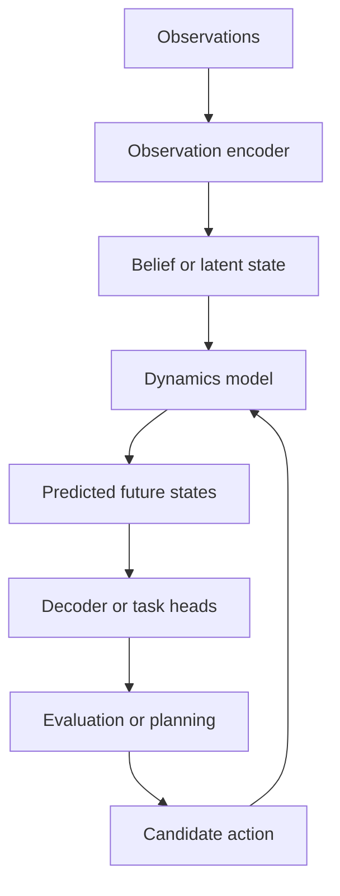

A world model represents how an environment is believed to exist and evolve. Instead of mapping one observation directly to one output, it maintains a state, updates that state with new evidence, and predicts possible futures—often conditioned on actions.

The term covers many designs, from explicit occupancy and object dynamics to learned latent states and generative video models.



## Four essential functions

### Observation model

Convert current measurements into evidence about the environment.

### State update

Combine new evidence with previous belief. The state may be a grid, graph, object set, feature memory, or latent vector.

### Dynamics model

Predict how state evolves, optionally conditioned on an action or external input.

### Output or decoder model

Translate latent state into interpretable quantities: occupancy, objects, motion, images, risk, reward, or other task features.

## Explicit and latent worlds

| Representation | Strength | Limitation |
|---|---|---|
| Occupancy or semantic grid | Interpretable spatial evidence | Resolution and coverage cost |
| Object or agent graph | Compact relational reasoning | Depends on detection and association |
| Dense feature map | Rich task-shared representation | Harder to interpret |
| Latent vector or tokens | Compact and flexible | Meaning and failure modes may be opaque |
| Generative observation model | Rich multimodal future prediction | High compute and evaluation complexity |

Many practical systems maintain more than one state because geometry, agents, uncertainty, and appearance have different needs.

## Deterministic versus probabilistic futures

A deterministic predictor produces one future. Physical environments are often multimodal: another agent may slow, continue, or turn. Averaging these possibilities can create a future that is not itself plausible.

Probabilistic approaches may produce:

- multiple trajectories with probabilities;
- distributions over occupancy or motion;
- latent samples;
- diffusion-based future hypotheses;
- uncertainty conditioned on observation quality.

The system must preserve the difference between uncertainty and randomness. More samples do not automatically mean better calibration.

## Minimal latent world model

```python
import torch
import torch.nn as nn


class LatentWorldModel(nn.Module):
    def __init__(self, obs_dim: int, action_dim: int, state_dim: int):
        super().__init__()
        self.observe = nn.Sequential(
            nn.Linear(obs_dim, state_dim),
            nn.SiLU(),
        )
        self.transition = nn.GRUCell(action_dim, state_dim)
        self.correct = nn.GRUCell(state_dim, state_dim)
        self.decode = nn.Linear(state_dim, obs_dim)

    def update(self, observation, action, previous_state):
        predicted = self.transition(action, previous_state)
        evidence = self.observe(observation)
        corrected = self.correct(evidence, predicted)
        reconstruction = self.decode(corrected)
        return corrected, reconstruction

    def imagine(self, actions, state):
        imagined = []
        for step in range(actions.shape[1]):
            state = self.transition(actions[:, step], state)
            imagined.append(state)
        return torch.stack(imagined, dim=1)
```

This example separates correction with observation from imagination using actions. It omits stochastic state, geometry, multimodal decoding, and task losses to keep the core idea visible.

## Training objectives

A world model may combine:

- observation reconstruction;
- latent consistency across time;
- dynamics prediction;
- semantic, occupancy, or motion supervision;
- uncertainty calibration;
- contrastive representation learning;
- action-conditioned reward or value prediction.

A model can achieve low reconstruction error while learning a state that is poor for planning. Evaluation must test the downstream information that the state preserves.

## Planning interface

Planning can query a world model by rolling forward candidate actions, evaluating predicted outcomes, and selecting an action under constraints. The world model should provide uncertainty or multiple futures so the planner does not treat one imagined rollout as truth.

The safety architecture must remain outside the learned imagination loop. Constraints, fallback, monitoring, and independent validation are system responsibilities.

## Evaluation

Assess more than visual plausibility:

- geometric and temporal consistency;
- multi-step error growth;
- rare-event and interaction behaviour;
- probability calibration and mode coverage;
- sensitivity to missing or degraded observations;
- controllability by candidate actions;
- state reset and long-horizon drift;
- usefulness to downstream tasks;
- inference cost for several possible futures.

## Choosing a world-model perspective

Begin from the consumer of the model:

- A perception memory needs stable evidence and uncertainty.
- A prediction model needs agent interactions and multimodal futures.
- A planner needs action-conditioned consequences and constraints.
- A simulator needs controllable, diverse, and realistic observations.

“World model” should not become a label for an oversized network. Define the state, dynamics, uncertainty, action interface, and evaluation contract before choosing the architecture family.
