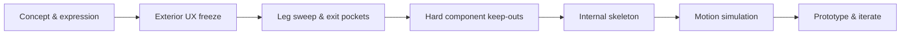

  

    ROBOTICS · CAD · EMBEDDED SYSTEMS
    <h2>Designing personality around real engineering constraints.</h2>
    
Pebble is an expressive desktop companion robot being developed from the outside in: first freezing the character, shell and visible motion language, then fitting the hard constraints—battery, motors, compute, display/camera and structure—inside that experience.

    

      <a href="https://github.com/abhishekkumardwivedi/pebble_sim" target="_blank" rel="noreferrer">Engineering repository ↗</a>
      <a href="#engineering-model">Explore the model ↓</a>
    

  

  <iframe src="/pebble-viewer.html" title="Interactive 3D render of the Pebble robot" loading="eager" allowfullscreen></iframe>

The interactive render above is generated from the **Pebble V3-D dimensional definition** rather than from a generic robot illustration. It follows the current UX-freeze candidate: approximately **165 mm body width**, **150 mm depth**, a **138 mm shell crown**, and **170 mm overall height including antenna tips**.

## Why Pebble exists

Pebble is a user-experience-first robotics project. The intent is not simply to package electronics into a shell; the mechanical architecture must preserve the soft, compact character of the concept while still enabling expressive body and foot motion.

That creates a useful systems-engineering problem: industrial design, mechanism sweep, component keep-outs, structural load paths, embedded control and manufacturability all compete for the same small volume.

## Current design direction

- **Soft pebble shell:** a continuously curved body, widest around the lower-middle rather than a rounded rectangular enclosure.
- **Organic glossy face:** the visor is treated as a second pebble nested into the shell, not as a conventional rectangular display cutout.
- **Character antennae:** the stalks and illuminated tips are part of the expression language rather than decorative afterthoughts.
- **Tucked pebble feet:** visible feet stay soft and compact while the real linkage remains largely concealed inside the shell.
- **Four-bar leg mechanism:** compact crank/coupler/rocker geometry is being evaluated for motion range, packaging and expressive poses.

## Engineering workflow

The current rule is deliberate: **do not change the exterior merely to make packaging easier**. The shell should move only when a hard engineering conflict is demonstrated. This keeps the intended user experience authoritative while the internal architecture evolves.

## What is being engineered

| Area | Current focus |
| --- | --- |
| Exterior | V3-D shell and visor proportions; UX-freeze candidate |
| Legs | Four-bar kinematics, swept volumes, hidden linkage packaging |
| Actuation | Compact geared motor placement and linkage load paths |
| Electronics | Battery, MCU/compute, display/camera, power and audio keep-outs |
| Structure | Internal skeleton around the frozen exterior |
| Motion | Expressive poses first; dynamics and stability validation after geometry |
| Manufacturing | FreeCAD/CadQuery/STEP-oriented workflow for prototype-ready geometry |

## Model controls

Use **drag** to rotate, **wheel/pinch** to zoom, and the view buttons for front, side, top and isometric views. **Mechanism** makes the shell translucent and reveals the current four-bar linkage concept.

> Pebble is an active engineering project. The 3D view represents the current V3-D UX geometry baseline and will evolve as swept-volume, hard-packaging and structural validation progress.

